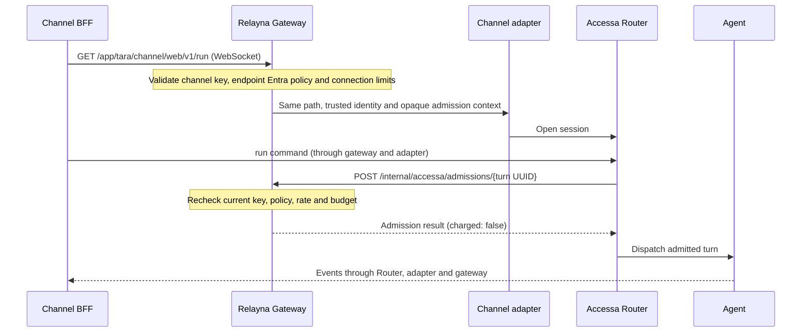

# Accessa channels and endpoint identity

A channel backend (BFF) opens `GET /app/{app}/channel/{channel}/v1/run`
through the gateway. Gateway connects to that channel's adapter; the adapter
connects to Accessa Router, which dispatches the agent. Browser clients connect
to their BFF and never receive the Relayna virtual key.



## Register a channel

Use Services → Edit → Endpoint identity and Accessa, or the existing service
registration API. The `access` field is available on create, patch and read.
Example fragment (alongside the existing name, upstream, credential and methods):

```json
{
  "route_pattern": "/app/tara/channel/web/v1/*",
  "allowed_methods": ["GET", "POST", "DELETE"],
  "access": {
    "entra": {
      "audience": "api://accessa",
      "required_scopes": ["accessa.invoke"],
      "required_roles": [],
      "allowed_groups": [],
      "allow_apigee": false
    },
    "accessa": {
      "app": "tara",
      "channel": "web",
      "idle_timeout_ms": 30000,
      "max_connections": 100,
      "max_connections_per_key": 20,
      "max_frame_bytes": 1048576
    }
  }
}
```

Services and Routes show **HTTP**, **WS**, or **HTTP + WS** labels. An Accessa
prefix supports both when GET is enabled, and the exact WS run path is displayed.
Other endpoints (including SSE) use HTTP. These labels describe saved transport
configuration; the enabled/disabled state is shown separately.

Create a distinct registration for each app/channel binding. Route and binding
must match exactly. For identity discovery, set `app: null` and register exactly
`/channel/{channel}/v1/me`; that registration cannot open a run socket.

The channel key's effective policy must explicitly list the registered service
in `allowed_services`, permit `/services/*` and `internal-service`, and enable
streaming for run sockets. Empty service allowlists do not grant channel access.
Keep keys on the BFF server. Existing `/services/{name}` aliases cannot bypass
an Accessa binding.

## Endpoint-specific Entra requirements

Send the user access token in `Authorization: Bearer ...` and the channel
virtual key in the existing configured Relayna key header (normally
`x-relayna-key`). Global issuer, tenant, algorithm and JWKS configuration still
apply. A service's `access.entra` replaces the global audience, scope, role and
group requirements **for that endpoint only**. Every listed scope and role is
required; any listed group may match. Empty lists add no requirement. Other
endpoints retain their own requirements; audiences are never combined globally.

For an internal service behind Apigee, configure its own audience, for example
`api://internal-service`, and its own scopes/roles. Set `allow_apigee: true` only
for services accepting the existing signed Apigee identity arrangement.
The HMAC-covered identity JSON must now include `audiences` (array of strings)
and `expires_at` (Unix seconds), alongside the existing tenant and identity
claims. The existing global Apigee secret authenticates this payload. Gateway
requires the configured tenant, matching endpoint audience, future expiry and
endpoint authorization claims. Missing claims and forged signatures fail closed.
Unsigned caller headers cannot substitute for this identity.

JWT verification also supports array-valued `aud`. Token expiry bounds the
session; a new token requires reconnecting. Existing services with empty
`access` retain their authentication and path-rewrite behavior.

## Transport contract

Accessa forwarding preserves the full public path, including HTTP conversations,
documents and `POST .../v1/runs` commands. Only `GET .../v1/run` may upgrade.
WebSocket version 13 is required; compression extensions are rejected. Gateway
streams frames without retaining message bodies, enforcing limits on both frames
and assembled fragmented messages. Oversized or invalid frames terminate the
connection. Router remains responsible for command validation, ownership,
conversation state, cancellation, durable deduplication, event ordering and replay.

Gateway overwrites caller and route headers using verified identity and the
registered binding, strips client credentials, and applies the existing upstream
service credential. Adapters receive trusted caller OID, tenant, UPN/groups when
present, app/channel metadata, request correlation and an opaque admission token.
They must never expose the admission token to clients or logs.

`idle_timeout_ms` controls upstream read/write inactivity independently of the
ordinary HTTP timeout. Exchange heartbeat replies before this interval; outbound
traffic alone does not guarantee read activity. Limits apply **per gateway
instance**, with a shared hard ceiling of 4,096 sockets. Size deployment replicas
accordingly. Leases release on disconnect or failed handshake. Pingora owns
shutdown and transport cleanup; gateway never retries or fails over a run socket.

## Fresh admission for every new turn

A trusted adapter passes `x-relayna-admission-context` to Router. Before each new
turn, Router makes an empty-body request:

```http
POST /internal/accessa/admissions/550e8400-e29b-41d4-a716-446655440000
x-relayna-admission-context: <opaque context from gateway>
```

A successful response contains `admission_id`, `key_id`, `service`, `caller_oid`,
`app`, `channel` and `charged: false`. Standard gateway errors reject expired or
missing context, disabled/revoked/expired keys, changed/disabled registration,
policy denial, rate limits and exhausted budgets. Router must wait for success
before dispatch; it must not infer admission from the WebSocket being open.

Redis stores the verified identity and key ID/prefix, never the raw channel key.
The opaque credential is hashed for its Redis key. Context expires at the earlier
of token expiry or one hour and is revoked when the connection/request finishes.
HTTP command handlers must therefore obtain admission before completing their
HTTP response. Expired sockets terminate on their next frame or idle timeout.

Repeated admission for the same turn UUID within a live context does not consume
another request-rate allowance. Concurrent pending admission returns 429; a
failed persistence operation fails closed. A pending marker can remain until
context expiry after an interrupted write; reconnect and let Router resolve its
durable run state. Router owns deduplication across reconnects and must replay
existing events without re-executing an accepted run.

Connection admission and turn admission check eligibility; neither reserves or
charges model usage. Actual downstream model/service calls remain metered using
the existing gateway path. Keep this distinction when designing agent credentials.

## Rollout and verification

Migration `20260916000100_endpoint_access.sql` adds a default-empty JSON column.
Apply migrations before the new binary. Existing rows retain legacy behavior;
configure bindings only after adapter/Router admission support is deployed. For
rollback, first remove these bindings and drain sockets; the additive column can
remain when running the older binary. No production deployment is included here.

Run the multi-hop mock E2E against disposable PostgreSQL and Redis:

```sh
SSL_CERT_FILE=/etc/ssl/cert.pem cargo test -p gateway-api --test accessa_e2e -- --nocapture
```

Set `DATABASE_URL` and `REDIS_URL`; without a database URL the test explicitly
skips. The system certificate override is needed on the tested macOS environment.
The test starts independent mock BFF, adapters, Router, agent and OIDC servers,
plus the real Pingora gateway. It does not use production Entra or providers.
See `internal/test-reports/accessa/` for UI and coverage evidence.

## Entra verification for every request-plane endpoint

Services → Edit → Endpoint identity and Accessa has a **Route authentication mode**
selector. Routes offers **Edit identity** for each built-in route, including
OpenAI, Anthropic, direct OpenAI, LiteLLM passthrough and built-in service aliases.

| Selection | Result |
| --- | --- |
| Use authentication profiles | Select an explicitly assigned profile by Relayna key. Accessa supports Entra + Relayna key profiles only. |
| Require Entra | Verify this endpoint's audience, scopes, roles and groups. |
| No Entra | Skip Entra for this endpoint; retain its credential and policy checks. |
| Use existing gateway setting | Preserve the released gateway-wide behavior. |

An existing endpoint is unchanged until explicitly configured. Tenant, issuer,
OIDC discovery/JWKS, accepted algorithms and the Relayna key header remain shared
trust configuration in Settings. Enable/configure that verifier before selecting
Require Entra. Missing verifier configuration fails closed. The troubleshooting
unverified-bearer switch cannot bypass an explicit endpoint policy.

Use the [illustrated authentication profile guide](operations/authentication-profiles.md)
for profile fields, key assignment and maintenance. Once saved, profiles cannot
be removed by switching back to the other route authentication modes.

For a service without saved profiles, `access: {"skip_entra": true}` selects No Entra. `access: {}` restores
legacy behavior. `access: {"entra": {"audience": "api://service"}}` requires Entra.
`skip_entra` cannot be combined with `entra` or an Accessa binding. Accessa always
requires its own Entra policy. Service aliases use the same saved service policy.

Built-in policies are listed with `GET /admin-ui/admin/route-identities` and
replaced with `PUT /admin-ui/admin/route-identities`, for example:

```json
{
  "route": "/v1/chat/completions",
  "access": {
    "entra": {
      "audience": "api://litellm",
      "required_scopes": ["generate"]
    }
  }
}
```

These admin APIs require the existing read/update scopes and audit policy writes.
Use the exact canonical route from the GET response; aliases such as
`/chat/completions` share `/v1/chat/completions`. `/litellm/*` names the catch-all
LiteLLM route family (its configured allowlist still controls actual paths).
A registered service takes precedence over the generic service route policy.

On Entra-protected canonical LiteLLM routes, send the user JWT in Authorization
and the gateway virtual key in the configured Relayna key header. This applies to
both managed and direct LiteLLM modes; gateway resolves the existing upstream
credential mapping. A raw LiteLLM token cannot substitute for the user JWT.
Explicitly configured trusted-ingress passthrough retains its existing upstream
credential contract but must first pass the endpoint Entra gate. No Entra does
not change those published passthrough modes; gateway-managed traffic still
requires a valid virtual key and passes normal policy/rate/budget checks.

Migration `20260916000200_route_identity.sql` adds the built-in identity table.
No existing endpoint policies are changed. Clear an override with `access: {}`
to restore legacy behavior without dropping persisted configuration.

## Create a service from a type

In **Services → Create service**, choose a **Service type** before completing
registration. Types are editable starting configurations, saved as the existing
service settings rather than a separate server-side type.

| Type | Starting configuration |
| --- | --- |
| Internal HTTP service | GET/POST, gateway identity setting, 60-second timeout |
| Relayna HTTP service | GET/POST, gateway identity setting, 120-second timeout, `/health` check |
| Entra-protected HTTP service | GET/POST with an endpoint-specific Entra audience |
| Apigee-backed HTTP service | Entra-required HTTP, also accepting signed Apigee identity |
| Accessa app/channel | GET/POST, Entra required, HTTP plus the exact WebSocket run endpoint |
| Accessa channel discovery | GET `/channel/{channel}/v1/me`, Entra required, HTTP only |
| Custom configuration | Keep the current settings and adjust them manually |

HTTP presets suggest `/services/{name}/*`. Accessa suggests
`/app/{app}/channel/{channel}/v1/*` from its app and channel fields; discovery has
no app binding. Name/app/channel edits update a suggested route until you edit
that route manually. Choosing another preset replaces the route and the preset's
method, timeout, health and identity defaults. Name, upstream URL, credentials and
pricing stay intact. Entra audiences/scopes are not guessed; supply your actual
application requirements. Accessa virtual keys still need an explicit service
binding. Relayna HTTP forwards to the runtime's HTTP API; the runtime owns task
and agent execution. Generic WebSockets and arbitrary protocol adapters are not
introduced by these presets. Existing services continue to use their saved
settings; editing them does not automatically apply a creation preset.

## Monitor WebSocket sessions and verified identity

Traffic and Usage event tables identify WebSocket requests with a **WS** badge
and directional byte totals. Open **Inspect** in Traffic or **Debug** in Usage
for the shared **WebSocket session** and **Entra verification** sections.

Live Traffic samples include the app/channel, open duration, client/upstream
frame bytes and frame-header counts, average transfer rates, activity times,
configured idle/frame limits and session expiry. Progress is coalesced between
live polls; normal journal/display retention limits still apply. Closed sessions
persist final totals, duration, observed close frames and a fixed close cause in
both Traffic history and Usage diagnostics. Usage remains a terminal event log;
inspect live Traffic for an open session. Older records have no new snapshot.

Bytes are observed at the gateway frame hooks, including WebSocket framing and
excluding HTTP handshake/TLS overhead; they do not prove application receipt and
are not billing tokens. Frame counts mean accepted frame headers, not chatbot
turns. No frame payload or close reason text is retained. Read-idle countdowns
are estimates from the last upstream activity; write timeouts apply while
writing, and session expiry is enforced when processing frames. A reached
estimate does not assert that the connection has already closed.

For endpoint-specific Entra verification, the snapshot includes required audience,
scopes, roles and allowed groups alongside verified audience/scope/role/group
claims, source (JWT or signed Apigee), tenant/object/application IDs, authorized
party, token version and expiry. Gateway-inherited verification records verified
claims but does not snapshot its required policy. Failed verification records the
required endpoint policy and failure outcome without exposing untrusted claims.
Diagnostic claim lists retain at most 32 entries and strings at most 256 characters;
a truncation notice makes omissions explicit. Tokens, signatures, nonce, email,
display name and chat text are not stored in these snapshots. Existing admin and
resource-scoped Usage permissions continue to apply.
