# Admin Portal

The admin portal is a static operator console embedded in `gateway-api`. It is served from the control listener at `/admin-ui` and calls the same `/admin-ui/admin/*` APIs used by automation.

For a current-branch tour of the current Admin UI 2.0 redesign and
related governance, provider intelligence, usage analytics, and supply-chain
features, see [Current Feature Highlights](current-features.md).

## Frontend Source

Admin UI 2.0 source files live in
`crates/gateway-api/admin-ui`. Build the Vite/TypeScript source into the static
assets embedded by `gateway-api` with:

```bash
npm ci
npm run build:admin-ui
```

The generated files remain checked in under
`crates/gateway-api/src/static/admin-ui` so the Rust control-plane binary can
serve `/admin-ui`, `/admin-ui/app.js`, and `/admin-ui/app.css` without a
separate frontend deployment.

The Admin UI 2.0 shell groups operator work into Monitor, Discover, and Govern
navigation domains. Monitor contains overview, health, and usage workflows;
Discover contains providers, services, routes, and projects; Govern contains
keys, guardrails, audit, and settings. The source package owns design-system
tokens, view metadata, templates, and reusable components, while the generated
asset paths stay stable for deployed gateways.

## Authentication

Use the operator token seeded by `GATEWAY_ADMIN_TOKEN` on first startup, or the
generated operator token printed when no env token was set. The token is stored
in browser session storage and sent as:

```http
Authorization: Bearer <operator-token>
```

Rotate the token from the portal after bootstrap or whenever access changes. Rotation returns the new raw token once.

Operator tokens are bound to roles and scopes in PostgreSQL. Bootstrap and
rotated owner tokens keep the existing `op_live_` token format and receive role
`owner` with wildcard scope `*`. Scoped operators may be limited to capability
strings such as `keys:create`, `keys:disable`, `policies:update`,
`guardrails:update`, `usage:read`, `usage:export`, `providers:update`,
`services:update`, `settings:update`, `operators:manage`, and `audit:read`.
Admin APIs return `insufficient_operator_scope` when a valid token lacks the
required scope.

## First-Time Admin Setup Manual

Use this walkthrough after Relayna Gateway is installed, PostgreSQL and Redis
are reachable, and the control listener is serving `/admin-ui`. It shows the
recommended first setup order for an admin who needs to make the portal usable
for one application or team.

The screenshots use the real Admin UI with demo values. Do not paste real
provider keys, service credentials, operator tokens, or raw virtual keys into
screenshots, tickets, or shared documents.

### 1. Sign in to the Admin portal

Open the control-plane URL in a browser:

```text
http://127.0.0.1:8081/admin-ui
```

Enter the bootstrap operator token from `GATEWAY_ADMIN_TOKEN` or the token
printed on first startup. The portal stores it in browser session storage and
uses it only as an Admin API bearer token.

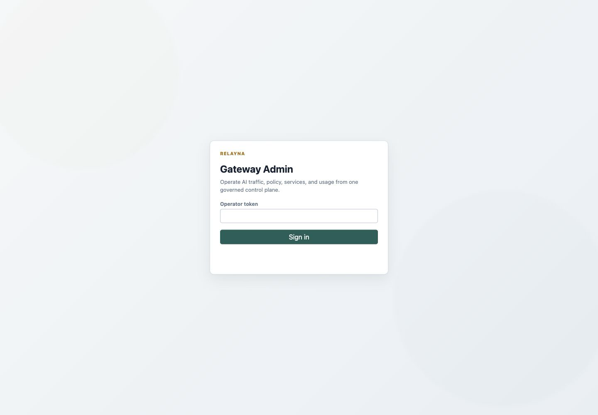

What to check: the page title is `Gateway Admin`, the token field is empty, and
the URL is the control-plane `/admin-ui` path. Keep the operator token private.

### 2. Check Overview and readiness

After sign-in, start on Overview. Confirm `Readiness` is `ready`, OpenAI routes
are enabled as expected, and the active key/service counts match a fresh or
existing installation.

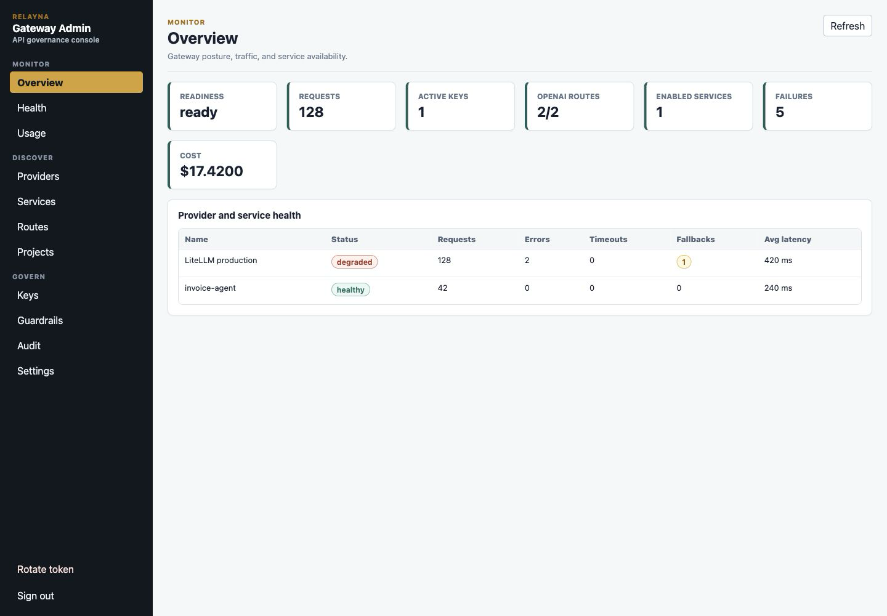

What to check: readiness must be healthy before setup. If it is not ready,
verify the database, Redis, and deployment configuration before creating
providers, services, projects, or keys.

### 3. Configure the Studio connection when imports are used

Open Settings. If Relayna Studio will provide service catalog entries, set the
Studio backend base URL and optional bearer token. Use the backend URL, not the
Studio frontend URL.

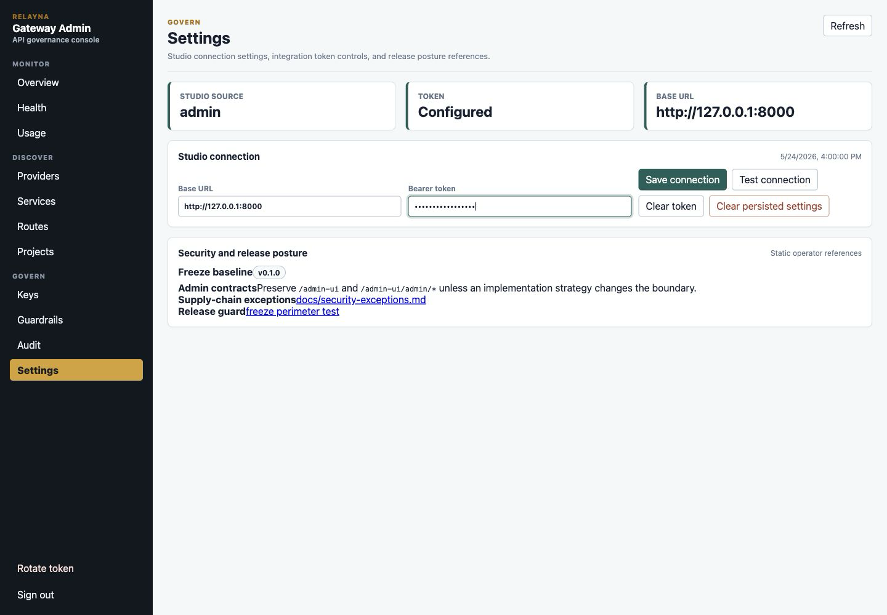

What to check: the token field is write-only. Save the connection, then use
`Test connection` to confirm the gateway can read Studio services. If your
deployment does not use Studio imports, leave these fields unset and create
services manually.

### 4. Create the provider configuration

Open Providers and create the upstream provider entry. For a LiteLLM-backed
installation, choose `litellm`, set the LiteLLM base URL, enter the write-only
service credential, and keep the provider enabled.

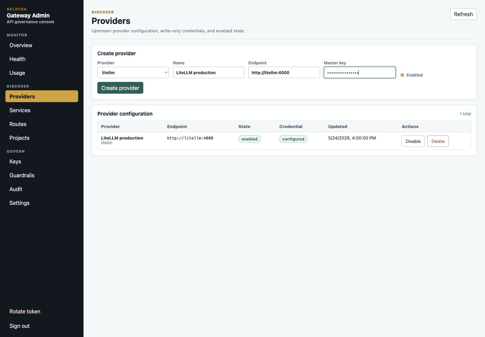

What to check: after saving, the provider row should show `enabled` and
`configured`. The portal should never show the credential value again.

### 5. Create or import services

Open Services. Use `Import from Studio` when Studio is connected, or create a
local service by entering:

- `Name`: stable lowercase service name, such as `invoice-agent`.
- `Route pattern`: usually `/services/<service-name>/*`.
- `Upstream URL`: the service backend reachable by the gateway.
- `Credential`: write-only service credential when the upstream needs one.
- `Methods`: the HTTP methods the gateway may forward.
- `Timeout`, `Max body bytes`, `Cost mode`, and `Estimated cost`: operational
  limits and usage accounting defaults.

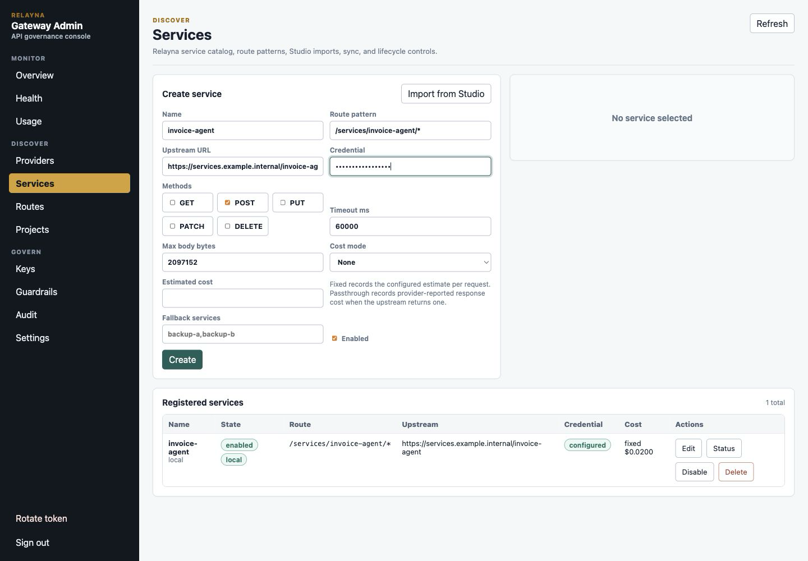

What to check: the saved service should be enabled, have the intended route
pattern, and show credential `configured` when a credential is required. For
Studio imports, preview changes before importing or syncing.

### 6. Confirm exposed routes

Open Routes. Confirm the OpenAI-compatible routes and registered service routes
that clients will call.

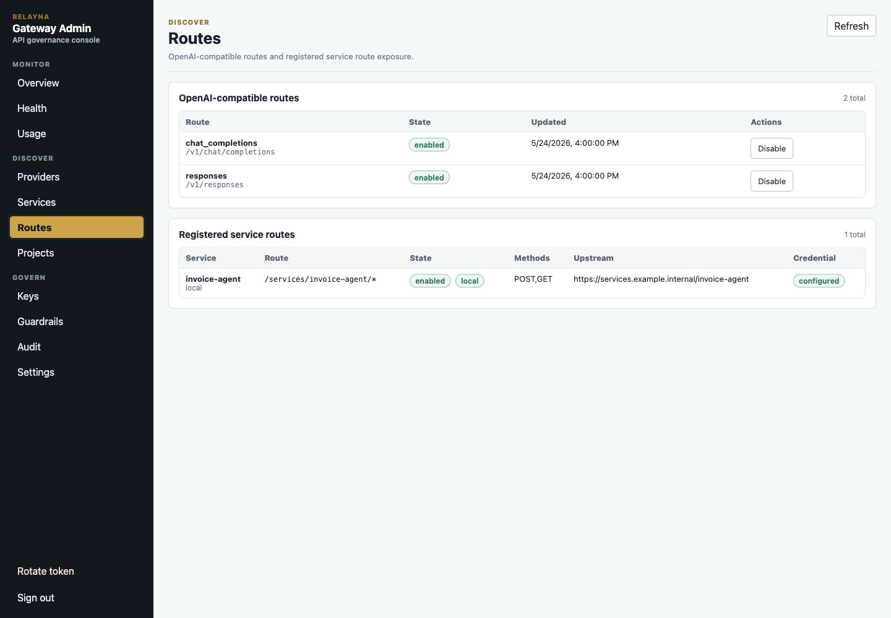

What to check: `/v1/chat/completions` and `/v1/responses` should be enabled
when clients need OpenAI-compatible traffic. Registered service routes should
show the expected route pattern, allowed methods, upstream, and credential
state.

### 7. Create the project

Open Projects and create a project for the application, team, or environment
that will own the first virtual key.

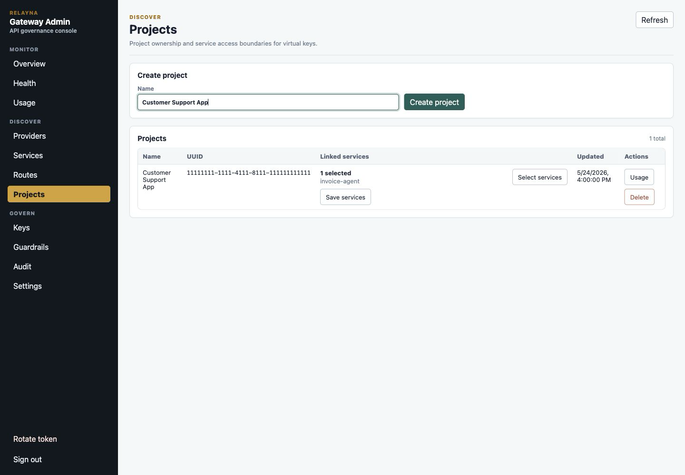

What to check: use a name admins can recognize later in usage, audit, and key
ownership views. Projects are the easiest way to share service access across
multiple keys for the same application.

### 8. Link services to the project

In the project row, open `Select services`, choose the services the project may
call, apply the selection, and save the project services.

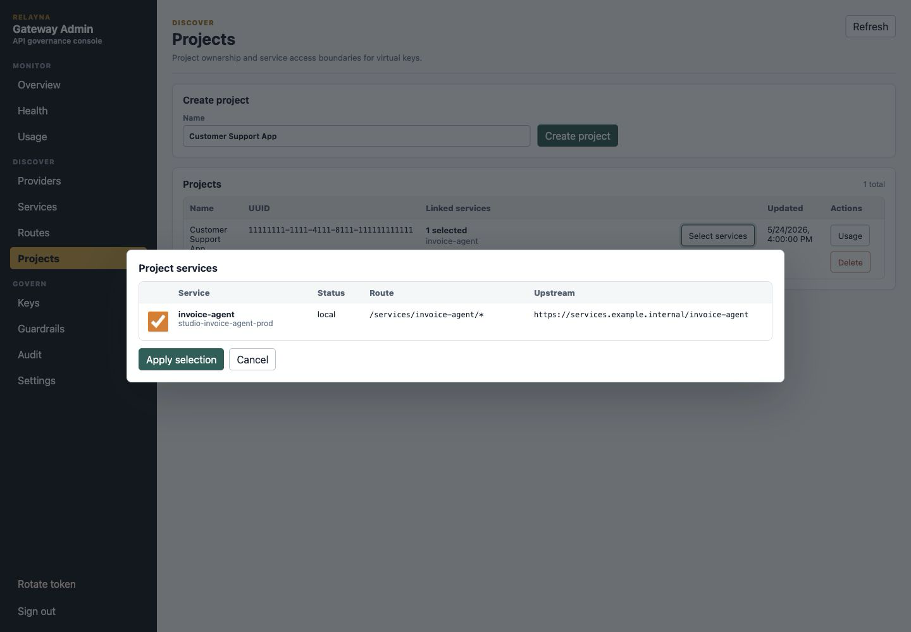

What to check: only link services that this project should be allowed to use.
Project-owned keys inherit these service links, so avoid adding broad access
for temporary testing.

### 9. Configure policy before issuing the key

Open Keys. Configure the policy directly on the key, or create an inherited
policy layer first when the same limits should apply to many keys. For a first
project key, set the routes, models, providers, rate limits, token limits,
budgets, request/response byte limits, streaming/tools settings, allowed UTC
hours, and guardrails that the application needs.

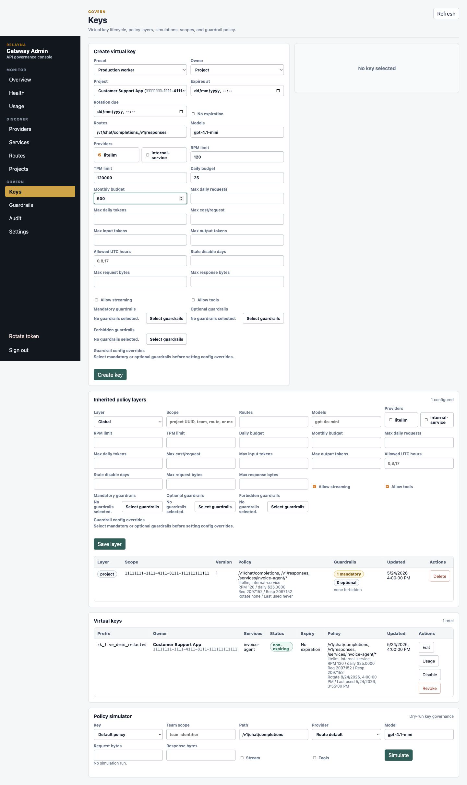

What to check: choose the narrowest route, model, provider, and service access
that still supports the application. Set budgets and rate limits before handing
the key to clients.

### 10. Create the project-owned virtual key

In Keys, keep `Owner` set to `Project`, choose the project, set expiration or
`No expiration` intentionally, then create the key. The raw virtual key is shown
once.

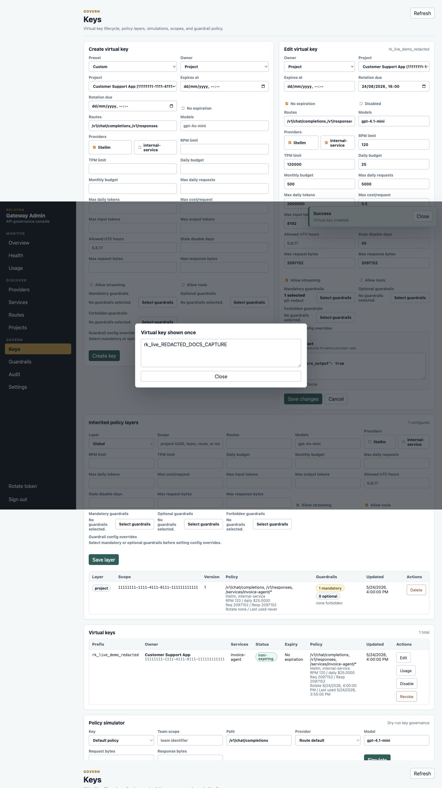

What to check: store the raw key immediately in your secret manager. After the
modal is closed, the portal only shows the key prefix. Do not paste raw
`rk_live_` values into screenshots, chat, issue trackers, or logs.

### 11. Simulate policy before sending traffic

Use the Policy simulator on the Keys view. Select the new key, enter the route,
model, provider, request size, response size, streaming, and tools settings
that the application will use, then run the simulation.

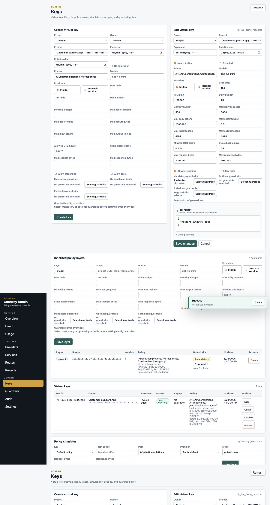

What to check: the result should allow the request and show the expected route
match, provider, policy version, guardrail plan, rate-limit projection, and
budget projection. Fix denials before distributing the key.

### 12. Verify health, usage, and audit

After setup, open Health, Usage, and Audit. Health confirms provider and service
status, Usage confirms traffic and cost reporting once requests start, and
Audit confirms setup actions were recorded without exposing secrets.

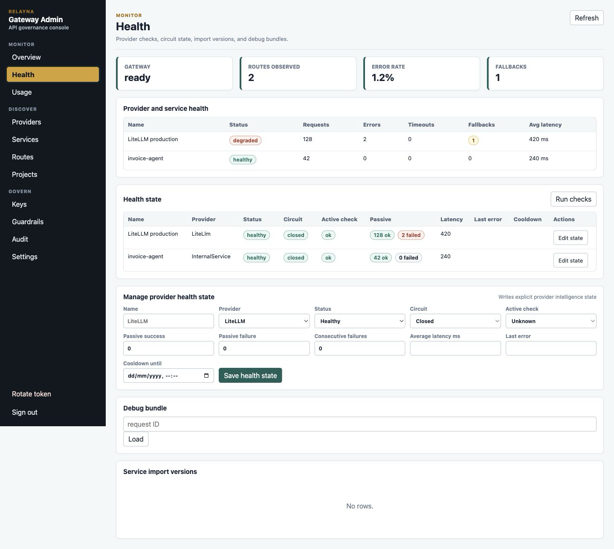

What to check: providers and services should be healthy or intentionally
disabled, usage filters should show the project/key/service once requests run,
and audit rows should include provider, service, project, policy, and key
changes with redacted snapshots.

First-time setup is complete when:

- Provider configuration is enabled and credential status is configured.
- Required services are enabled and reachable by the gateway.
- The project is linked to only the services it needs.
- The virtual key is project-owned and stored in a secret manager.
- Policy simulation allows the intended route, model, provider, and service.
- Health, Usage, and Audit show the expected operational state.

## Views

- Overview shows readiness, request count, active keys, enabled OpenAI routes, enabled services, failures, cost, and provider health.
- Projects creates and lists project UUIDs used to link services and
  project-owned virtual keys. Use `Select services` to open the service picker
  modal and manage a project's linked services.
- Keys creates, edits, disables, enables, revokes, and inspects virtual keys.
  Project-owned keys inherit service access from their selected project.
  Individual keys use `Select services` to open the service picker modal and
  choose services directly. Use `No expiration` for service keys whose rotation
  is managed outside Gateway. The key form includes safe presets for developer,
  production worker, read-only service, external partner, and temporary
  debugging keys; presets seed conservative policy limits and can be tightened
  before creation. Lifecycle fields show rotation due dates and last-used
  metadata when available.
- The Keys view also includes a policy simulator. Operators can dry-run a route,
  model, provider, stream/tools flags, and request/response byte projections
  against a stored key or the default policy before issuing or changing access.
  Simulator output reports auth source, route match, policy version and merge
  summary, guardrail plan, rate/budget projections, and final decision.
- Inherited policy layers can be managed from the Keys view. Global layers use
  no scope. Project, team, route, and model layers use a scope value such as a
  project UUID, team identifier, route string like `/v1/chat/completions`, or
  model name. These layers are additive governance overlays on top of key
  policy and use neutral defaults unless an operator sets a field.
- Providers configures LiteLLM and internal-service endpoints with write-only credentials.
- Routes disables and enables the global OpenAI-compatible LiteLLM routes `/v1/chat/completions` and `/v1/responses`, and lists registered service routes with their allowed methods and credential status.
- Services creates, imports from Relayna Studio, syncs selected Studio catalog
  entries, previews added/changed/removed/invalid import diffs, edits,
  sync-checks, disables, enables, and deletes service registrations. Method
  selection uses explicit checkboxes for `GET`, `POST`, `PUT`, `PATCH`, and
  `DELETE`.
- Usage filters usage by project, virtual key, service, route, provider, model,
  task ID, run ID, trace ID, status, and minimum cost, then shows cost, errors,
  fallback rate, guardrail blocks, project/key/service/provider/model/task
  breakdowns, timeseries rows, unused keys, task drilldowns, and JSON/CSV
  exportable row-level usage data.
- Guardrails shows the gateway guardrail catalog, recent sanitized execution
  events, and execution summaries. Key create/edit forms can set mandatory,
  optional, and forbidden guardrails.
- Audit shows read-only operator audit events with filters for action, target
  type, target ID, operator token ID, and limit. Rows include timestamp, actor,
  request ID, IP/user-agent metadata, target, action, and redacted before/after
  snapshots.
- Health shows provider and service request, error, timeout, fallback, and
  latency status. Provider health state also exposes active check status,
  passive success/failure counters, circuit state, cooldown, and last error
  metadata. Operators with provider update scope can write explicit provider
  health state for degraded, open-circuit, cooldown, and last-error situations.
- Settings includes Studio connection controls and static release/security
  posture references for v0.1.0 freeze boundaries and supply-chain exception
  guidance.

## Security Notes

- The portal never receives provider credentials or LiteLLM service keys.
- Raw virtual keys and operator tokens are shown once.
- Provider and service credentials can be configured, replaced, or cleared, but existing secret values are not displayed.
- Studio import reads catalog metadata only. Gateway preserves local credentials, enabled state, route overrides, limits, fallback services, project links, and cost settings on re-import.
- Disabling an OpenAI route is global and affects every virtual key until the route is enabled again.
- Service wildcard routes can accept `GET` only when the service registration includes `GET` in its allowed methods.
- Guardrail execution records never include raw request bodies, response bodies,
  provider credentials, bearer tokens, or PII mappings.
- Debug bundles are keyed by request ID and contain route, selection, policy,
  guardrail, latency, fallback, and request/response hash data only. They do not
  contain raw prompts, raw responses, bearer tokens, provider credentials, or
  LiteLLM credentials.
- The control listener should be protected by network policy, ingress rules, or private access controls in production.

## Audit Events

Admin mutations write append-only audit events with the operator token ID,
action, target type, target ID when available, before/after JSON snapshots when
safe, request ID, IP, user agent, and timestamp. Audit rows are available to
operators with `audit:read`:

```bash
curl -sS \
  -H "Authorization: Bearer $GATEWAY_OPERATOR_TOKEN" \
  "http://127.0.0.1:8081/admin-ui/admin/audit-events?limit=100"
```

Audit snapshots must not contain raw virtual keys, operator tokens, provider
credentials, LiteLLM credentials, internal service tokens, prompts, or full
provider responses.

## Usage Export

Operators can export usage rows through admin-token-protected endpoints:

```bash
curl -sS \
  -H "Authorization: Bearer $GATEWAY_OPERATOR_TOKEN" \
  "http://127.0.0.1:8081/admin-ui/admin/usage/export.json?status=success&limit=1000"

curl -sS \
  -H "Authorization: Bearer $GATEWAY_OPERATOR_TOKEN" \
  "http://127.0.0.1:8081/admin-ui/admin/usage/export.csv?status=failure&limit=1000"
```

Supported filters match the usage dashboard query model: `from`, `to`,
`project_id`, `key_id`, `route`, `provider`, `service`, `task_id`, `run_id`,
`model`, `status`, `trace_id`, and `min_cost_usd`. Export rows are ordered by
creation time and request ID. `limit` defaults to `1000`, is clamped to
`10000`, and `offset` can be used for pagination.

JSON exports include a `summary` object plus `rows`. CSV exports include the row
fields directly and neutralize spreadsheet formula prefixes before escaping
cells. Summary responses include request, success, failure, token, cost,
latency, fallback, denial, guardrail block, expensive request, and fallback-rate
fields. Row responses include request, key, project, route, model, provider,
status, latency, token, cost, service, task ID, run ID, trace ID, fallback,
guardrail action count, and creation timestamp fields.

Unused keys are available at:

```bash
curl -sS \
  -H "Authorization: Bearer $GATEWAY_OPERATOR_TOKEN" \
  "http://127.0.0.1:8081/admin-ui/admin/usage/unused-keys?limit=100"
```

Usage reads require `usage:read`. JSON and CSV exports require `usage:export`.

## Guardrails

Gateway guardrails are configured by operators and enforced by virtual-key
policy. `pii-redact` is seeded as an opt-in built-in guardrail. Add it to a
key's `mandatory_guardrails` to apply it even when clients omit the
`guardrails` request field, or add it to `optional_guardrails` to let callers
request it explicitly.

The Guardrails view manages the global catalog. Use `New guardrail` to add a
custom HTTP guardrail, or select an existing row to open the detail drawer.
Built-ins such as `pii-redact` allow safe edits to enabled state, modes, failure
policy, schema, and runtime config. Built-ins do not expose endpoint, token, or
delete controls. Custom HTTP guardrails expose endpoint URL, timeout, and
write-only bearer token controls.

Catalog config has two fields with different jobs:

- `config_schema` documents the expected JSON shape for operators.
- `runtime_config` is the actual global default config passed to the guardrail
  when it executes.

For `pii-redact`, `runtime_config` can include `restore_output`. When true,
post-call guardrails restore request-local placeholders before redacting any new
PII generated by the provider. When false, placeholders remain redacted in the
final response.

Key create and edit forms configure how the catalog applies to each virtual
key:

- Mandatory guardrails always run for that key.
- Optional guardrails are allowed for client-requested use.
- Forbidden guardrails are hidden from client discovery and rejected if
  requested.
- Guardrail config overrides tune selected guardrails only for that key.

The Admin portal shows per-key override editors only after a guardrail is
selected as mandatory or optional. This keeps unselected catalog entries out of
the key form and makes the execution rule explicit: an override is dormant until
that guardrail is actually applied.

Example key policy with per-key config:

```json
{
  "guardrail_policy": {
    "mandatory_guardrails": ["pii-redact"],
    "optional_guardrails": ["custom-check"],
    "forbidden_guardrails": [],
    "guardrail_config_overrides": {
      "pii-redact": {
        "restore_output": false
      },
      "custom-check": {
        "threshold": 0.85
      }
    }
  }
}
```

Effective config is a shallow JSON object merge:

```text
effective_config = catalog runtime_config + key guardrail_config_overrides[name]
```

Unknown override guardrails, forbidden override guardrails, and non-object
override values are rejected with stable guardrail error envelopes. HTTP
guardrail endpoint URL, timeout, and bearer token remain catalog-level provider
settings; per-key overrides only tune runtime config.

## Policy and Size Limits

Virtual-key policy is evaluated as an effective policy. Global and project
 layers combine with team, key, route, and model layers when the relevant
 context is present. They use the same deterministic rules:

- Explicit deny wins.
- Route, model, provider, service, and allowed-hour lists intersect. A disjoint
  intersection denies the request.
- Lower-level rate, budget, cost, token, and byte limits can only become
  stricter.
- Streaming and tool permissions are only allowed when every applied layer
  allows them.
- Mandatory guardrails are additive. Forbidden guardrails remove optional
  requests.

Request body limits return `request_body_too_large`. Response body limits return
`response_body_too_large`. Both use the standard structured error envelope and
HTTP 413 status.

Policy layer APIs:

```bash
curl -sS \
  -H "Authorization: Bearer $GATEWAY_OPERATOR_TOKEN" \
  http://127.0.0.1:8081/admin-ui/admin/policy-layers

curl -sS \
  -H "Authorization: Bearer $GATEWAY_OPERATOR_TOKEN" \
  -H "Content-Type: application/json" \
  -X POST http://127.0.0.1:8081/admin-ui/admin/policy-layers \
  -d '{
    "kind": "route",
    "scope_id": "/v1/chat/completions",
    "policy": {
      "max_response_body_bytes": 1048576,
      "allow_streaming": true,
      "allow_tools": true
    }
  }'
```

Operator APIs:

```bash
curl -sS \
  -H "Authorization: Bearer $GATEWAY_OPERATOR_TOKEN" \
  http://127.0.0.1:8081/admin-ui/admin/guardrails

curl -sS \
  -H "Authorization: Bearer $GATEWAY_OPERATOR_TOKEN" \
  "http://127.0.0.1:8081/admin-ui/admin/guardrails/executions?limit=50"

curl -sS \
  -H "Authorization: Bearer $GATEWAY_OPERATOR_TOKEN" \
  http://127.0.0.1:8081/admin-ui/admin/guardrails/summary
```

Client discovery and test APIs use Relayna virtual keys:

```bash
curl -sS \
  -H "Authorization: Bearer rk_live_xxx" \
  http://127.0.0.1:8081/admin-ui/v1/guardrails

curl -sS \
  -H "Authorization: Bearer rk_live_xxx" \
  -H "Content-Type: application/json" \
  -X POST http://127.0.0.1:8081/admin-ui/v1/guardrails/test \
  -d '{"guardrails":["pii-redact"],"mode":"pre_call","input":{"messages":[{"role":"user","content":"email alice@example.com"}]}}'
```

Custom HTTP guardrails can be added through the admin API. Gateway sends a
sanitized JSON payload with `request_id`, `guardrail`, `mode`, `context`,
`config`, and one of `request` or `response`. The provider returns `action`,
optional modified `request` or `response`, optional `reason`, and sanitized
`metadata`.

```bash
curl -sS \
  -H "Authorization: Bearer $GATEWAY_OPERATOR_TOKEN" \
  -H "Content-Type: application/json" \
  -X POST http://127.0.0.1:8081/admin-ui/admin/guardrails \
  -d '{
    "name": "custom-check",
    "description": "Company policy check",
    "endpoint_url": "https://guardrails.example/check",
    "modes": ["pre_call", "post_call", "during_call"],
    "failure_policy": "fail_open",
    "timeout_ms": 1500,
    "bearer_token": "secret-token"
  }'
```

Streaming requests with guarded responses require selected response guardrails
to support `during_call`. `pii-redact` redacts common PII in streaming chunks
with a small holdback window for values split across chunks. If a required
guardrail cannot run during streaming, Gateway fails closed with
`guardrail_unavailable`.

## Import From Studio

Relayna Studio owns the operator-facing service catalog. Relayna Gateway owns
public traffic authentication, policy, route matching, upstream credential
injection, usage, costs, budgets, and fail-closed routing. The import flow copies
Studio catalog metadata into Gateway service registrations; it does not copy
provider credentials or allow Studio metadata to bypass Gateway policy.

Configure the Studio backend in Admin portal Settings, or set
`RELAYNA_STUDIO_BASE_URL` as a deployment fallback. Use the Studio backend base
URL, not the frontend URL. Gateway appends `/studio/gateway/services` when it
fetches the catalog. Admin-saved settings override environment settings until
the persisted base URL is cleared, at which point the environment fallback is
effective again.

Local example:

```bash
export RELAYNA_STUDIO_BASE_URL="http://127.0.0.1:8000"
```

Docker on macOS or Windows when Studio runs on the host:

```bash
export RELAYNA_STUDIO_BASE_URL="http://host.docker.internal:8000"
```

Kubernetes example when Studio is another Service in the same namespace:

```bash
export RELAYNA_STUDIO_BASE_URL="http://relayna-studio-backend:8000"
```

If Studio protects the Gateway export endpoint, set the optional bearer token in
Admin portal Settings or with `RELAYNA_STUDIO_TOKEN`. Gateway sends it as:

```http
Authorization: Bearer <RELAYNA_STUDIO_TOKEN>
```

Gateway expects `GET /studio/gateway/services` to return JSON with a top-level
`services` array. Each row should include `studio_service_id` or `service_id`, a
gateway-safe `name` or `gateway_service_name`, optional `display_name`,
`base_url`, `environment`, `status`, `tags`, optional `allowed_methods`, optional
`default_route_pattern`, and optional pricing hints. A minimal response looks
like this:

```json
{
  "services": [
    {
      "studio_service_id": "payments-api",
      "name": "payments-api",
      "display_name": "Payments API",
      "base_url": "https://payments.example.test",
      "environment": "prod",
      "tags": ["core", "billing"],
      "status": "healthy",
      "default_route_pattern": "/services/payments-api/*"
    }
  ]
}
```

Before opening the Gateway Admin portal, test Studio directly:

```bash
curl -sS "$RELAYNA_STUDIO_BASE_URL/studio/gateway/services"
```

Then test the Gateway-to-Studio connection through Admin portal Settings or the
protected Gateway admin route:

```bash
curl -sS \
  -H "Authorization: Bearer $GATEWAY_OPERATOR_TOKEN" \
  -X POST \
  http://127.0.0.1:8081/admin-ui/admin/studio/connection/test

curl -sS \
  -H "Authorization: Bearer $GATEWAY_OPERATOR_TOKEN" \
  http://127.0.0.1:8081/admin-ui/admin/studio/services
```

The test route returns `ok` and `service_count` when the catalog is reachable.
The services route returns the mapped import preview used by the portal. It
should show `studio_service_id`, `name`, `route_pattern`, and an
`import_request` for each service. If Studio is unreachable, stalls, returns
non-JSON, or returns an invalid service shape, Gateway returns
`studio_unavailable`.

Operator flow:

1. Start Studio backend and verify `/studio/gateway/services`.
2. Start Gateway with optional `RELAYNA_STUDIO_BASE_URL` and
   `RELAYNA_STUDIO_TOKEN`, or configure the connection in Admin Settings.
3. Open `/admin-ui`, sign in with the Gateway operator token, and go to
   Settings.
4. Save or test the Studio connection. Token values are write-only and are never
   returned by the API.
5. Go to Services and click `Import from Studio`.
6. Select one or more services and click `Import selected`.
7. Configure Gateway-owned runtime fields such as credentials, enabled state,
   route overrides, limits, fallback services, project links, and cost mode.

Imported services are created with `source = studio`. They remain disabled or
incomplete until Gateway-owned runtime fields are configured. Re-importing by
`studio_service_id` is idempotent and preserves Gateway-owned fields by default.

For routed traffic, wildcard service aliases subtract the matched prefix before
forwarding upstream. For example:

```text
Gateway route pattern: /services/payments-api/*
Client request:        POST /services/payments-api/charges?trace=1
Upstream receives:     POST /charges?trace=1
```

Exact route patterns do not subtract a prefix. A route pattern of `/charges`
forwards `/charges` as `/charges`.

## Non-Expiring Virtual Keys

Virtual keys can be created or edited with no expiration date. In the Admin
portal, open Keys and select `No expiration` in the create or edit form. Through
the Admin API, send `expires_at: null`. Project-owned keys specify
`owner_type: "project"` and a `project_id`:

```bash
curl -sS -X POST http://127.0.0.1:8081/admin-ui/admin/keys \
  -H "Authorization: Bearer $GATEWAY_OPERATOR_TOKEN" \
  -H "Content-Type: application/json" \
  -d '{
    "owner_type": "project",
    "project_id": "<project-id>",
    "expires_at": null,
    "policy": {
      "allowed_routes": ["/services/*"],
      "allowed_providers": ["internal-service"]
    }
  }'
```

Individual keys specify `owner_type: "individual"` and direct `service_names`:

```bash
curl -sS -X POST http://127.0.0.1:8081/admin-ui/admin/keys \
  -H "Authorization: Bearer $GATEWAY_OPERATOR_TOKEN" \
  -H "Content-Type: application/json" \
  -d '{
    "owner_type": "individual",
    "service_names": ["payments-api"],
    "expires_at": null,
    "policy": {
      "allowed_routes": ["/services/*"],
      "allowed_providers": ["internal-service"]
    }
  }'
```

To clear expiration on an existing key:

```bash
curl -sS -X PATCH http://127.0.0.1:8081/admin-ui/admin/keys/<key-id> \
  -H "Authorization: Bearer $GATEWAY_OPERATOR_TOKEN" \
  -H "Content-Type: application/json" \
  -d '{"expires_at": null}'
```

To set an expiration again:

```bash
curl -sS -X PATCH http://127.0.0.1:8081/admin-ui/admin/keys/<key-id> \
  -H "Authorization: Bearer $GATEWAY_OPERATOR_TOKEN" \
  -H "Content-Type: application/json" \
  -d '{"expires_at": "2030-01-01T00:00:00Z"}'
```

Warning: non-expiring keys are long-lived bearer credentials. Anyone with the
raw key can use it until it is revoked, disabled, or restricted by policy. Use
non-expiring keys only for service-to-service integrations with external
rotation controls, narrow route/provider/service policy, secret-manager storage,
audit coverage, and a documented revocation procedure. Prefer expiring keys for
human users, temporary automation, demos, and CI jobs.

## Cost Modes

`fixed` records the configured estimate on each routed service request. For example, a service with `estimated_cost_usd` set to `0.01` contributes `$0.0100` per recorded request.

`passthrough` records the cost reported by the upstream response when present, such as `usage.total_cost` or LiteLLM response-cost fields. If the provider omits cost data, the usage event has no per-request cost and aggregate summaries treat missing cost as zero.
