# Admin Portal

Monitor → Traffic shows live request timelines, failure reasons and saved history. See [Traffic Monitor](operations/traffic-monitor.md) for operation and retention details.

The admin portal is a static operator console embedded in `gateway-api`. It is served from the control listener at `/admin-ui` and calls the same `/admin-ui/admin/*` APIs used by automation.

For a current-branch tour of the current Admin UI 2.0 redesign and
related governance, provider intelligence, usage analytics, and supply-chain
features, see [Current Feature Highlights](current-features.md).

## Frontend Source

Admin UI 2.0 source files live in
`crates/gateway-api/admin-ui`. Build the Vite/TypeScript source into the static
assets embedded by `gateway-api` with:

```bash
npm ci
npm run build:admin-ui
```

The generated files remain checked in under
`crates/gateway-api/src/static/admin-ui` so the Rust control-plane binary can
serve `/admin-ui`, `/admin-ui/app.js`, and `/admin-ui/app.css` without a
separate frontend deployment.

The `v0.1.31` Admin UI 2.0 shell uses the Aurora Teal visual system and groups
operator work into Monitor, Discover, and Govern navigation domains. Monitor
contains the live operational Overview, health, usage, and debug workflows;
Discover contains providers, services, routes, and projects; Govern contains
keys, guardrails, audit, and settings. Hash-backed navigation supports deep
links and browser history without changing the `/admin-ui` server route.
Command navigation and governed-change shortcuts help operators move directly
to common workflows, while responsive drawer navigation and accessible dialogs
preserve the same capabilities on narrower screens. The source package owns
design-system tokens, view metadata, templates, and reusable components, while
the generated asset paths stay stable for deployed gateways.

The owner workspace includes service and project dashboards with incident charts for error rate and P95
latency, bounded upstream service-version observations, all-request outcome and
status-code filters, offset pagination, and an accessible request-details
drawer. Owner details remain exact-resource scoped and contain only sanitized
usage metadata plus an optional redacted debug bundle. Project dashboards scope
usage by persisted project attribution and add service-level breakdowns.


On narrow screens, the same Monitor, Discover, and Govern structure moves into
an accessible drawer without removing operator workflows.


## Authentication

Normal human access can use Microsoft Entra through the portal's confidential
OIDC BFF flow. Entra tokens stay server-side and the browser receives an opaque
HttpOnly session cookie. Relayna portal roles plus exact service and project
memberships determine whether the user sees the administrator console or only
assigned owner dashboards. Cookie-authenticated mutations require the
session-bound CSRF token returned by the portal session API.

The operator token seeded by `GATEWAY_ADMIN_TOKEN`, or the generated token
printed when no env token was set, remains available from **Emergency operator
access** and is sent as:

```http
Authorization: Bearer <operator-token>
```

Use this break-glass path to approve the first Entra administrator or recover
when the identity provider is unavailable. Rotate the token from the portal
after bootstrap or whenever access changes. Rotation returns the new raw token
once.

Operator tokens are bound to roles and scopes in PostgreSQL. Bootstrap and
rotated owner tokens keep the existing `op_live_` token format and receive role
`owner` with wildcard scope `*`. Scoped operators may be limited to capability
strings such as `keys:create`, `keys:disable`, `policies:update`,
`guardrails:update`, `usage:read`, `usage:export`, `providers:update`,
`services:update`, `settings:update`, `operators:manage`, and `audit:read`.
Admin APIs return `insufficient_operator_scope` when a valid token lacks the
required scope.

For OIDC configuration, member approval, service assignment, workload
identities, and local development personas, see
[Entra Portal and Service-owner Monitoring](operations/entra-portal-and-owner-monitoring.md).

## First-Time Admin Setup Manual

Use this walkthrough after Relayna Gateway is installed, PostgreSQL and Redis
are reachable, and the control listener is serving `/admin-ui`. It shows the
recommended first setup order for an admin who needs to make the portal usable
for one application or team.

The screenshots use the real Admin UI with demo values. Do not paste real
provider keys, service credentials, operator tokens, or raw virtual keys into
screenshots, tickets, or shared documents.

### 1. Sign in to the Admin portal

Open the control-plane URL in a browser:

```text
http://127.0.0.1:8081/admin-ui
```

Sign in with Microsoft Entra when an administrator membership already exists.
For the first administrator, expand **Emergency operator access** and enter the
bootstrap token from `GATEWAY_ADMIN_TOKEN` or the token printed on first
startup. Use **Members** to approve the Entra identity and grant the Admin role,
then return to Entra for normal access.

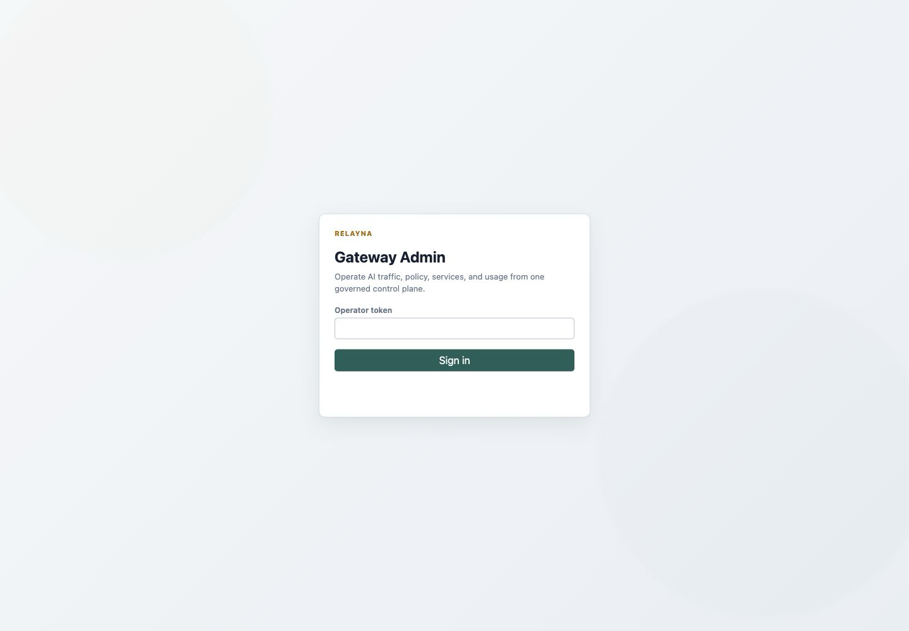

What to check: the URL is the control-plane `/admin-ui` path, Microsoft sign-in
is the primary action when configured, and the operator-token field stays
collapsed under emergency access. Keep the operator token private.

### 2. Check Overview and readiness

After sign-in, start on Overview. Confirm `Readiness` is `ready`, OpenAI routes
are enabled as expected, and the active key/service counts match a fresh or
existing installation.

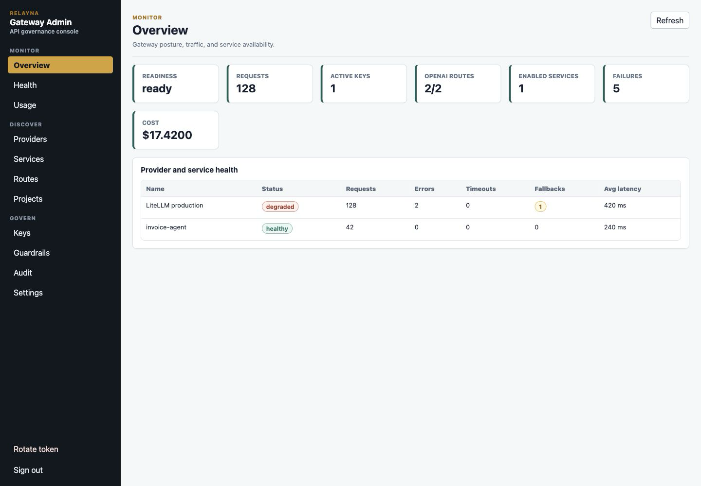

What to check: readiness must be healthy before setup. If it is not ready,
verify the database, Redis, and deployment configuration before creating
providers, services, projects, or keys.

### 3. Configure the Studio connection when imports are used

Open Settings. If Relayna Studio will provide service catalog entries, set the
Studio backend base URL and optional bearer token. Use the backend URL, not the
Studio frontend URL.

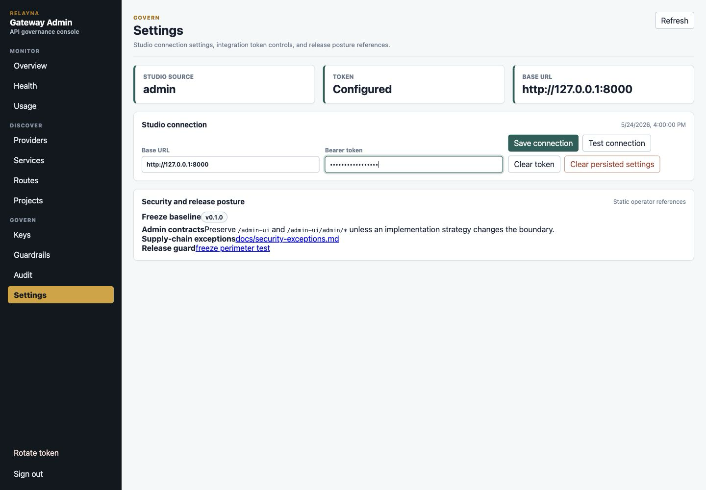

What to check: the token field is write-only. Save the connection, then use
`Test connection` to confirm the gateway can read Studio services. If your
deployment does not use Studio imports, leave these fields unset and create
services manually.

### 4. Create the provider configuration

Open Providers and create the upstream provider entry. For a LiteLLM-backed
installation, choose `litellm`, set the LiteLLM base URL, enter the write-only
service credential, and keep the provider enabled.

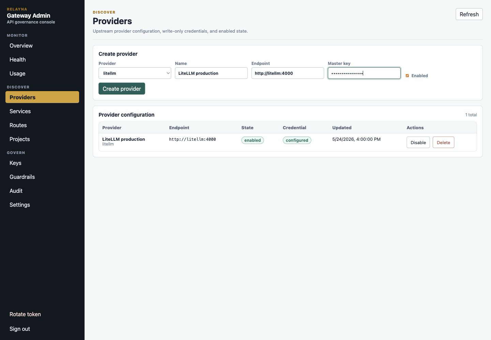

What to check: after saving, the provider row should show `enabled` and
`configured`. The portal should never show the credential value again.

#### LiteLLM custom header and virtual-key mapping

LiteLLM provider rows also control how Gateway authenticates to LiteLLM. Leave
`Credential mode` as `authorization_bearer` when LiteLLM expects
`Authorization: Bearer <key>`. Choose `custom_header` when production LiteLLM
or an API gateway in front of LiteLLM expects a different header, such as
`x-litellm-api-key`.


When `custom_header` is selected, enter the header name in `Custom header` and
choose how Gateway formats the header value. Use `raw` for headers such as
`x-litellm-api-key: <key>`. Use `bearer` for LiteLLM deployments that require
`x-litellm-key: Bearer <key>`. Gateway sends only that configured header to
LiteLLM for the selected internal credential; it does not send `Authorization`
in custom-header mode. Header names are validated as HTTP header names and
reject sensitive or conflicting names such as `host`, `content-length`,
`authorization`, Relayna key headers, Apigee proof headers, and proxy auth
headers.

Use `LiteLLM credential mappings` when different Relayna keys or projects
should use different LiteLLM virtual keys:

1. Choose `key` scope to map one Relayna virtual key to one LiteLLM virtual
   key, or choose `project` scope to map all Relayna keys in a project to one
   LiteLLM virtual key.
2. Select the target key or project.
3. Paste the LiteLLM virtual key into the write-only `LiteLLM virtual key`
   field.
4. Keep `Enabled` checked and save the mapping.

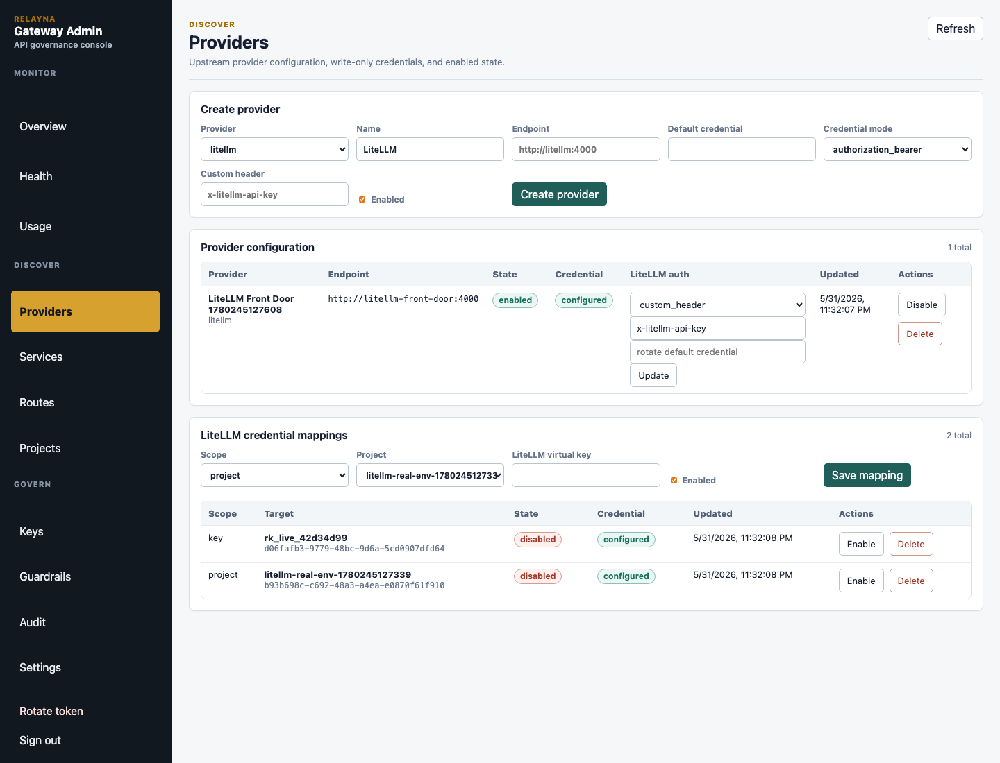

Runtime precedence is key mapping, then project mapping, then the active
LiteLLM provider default credential. If no active provider config exists,
Gateway uses the `LITELLM_SERVICE_KEY` startup fallback. Disabled mappings are
skipped and fall back to the next level. The portal shows mapping state and
whether a credential is configured, but never renders LiteLLM virtual-key
secret values after save.

#### LiteLLM wildcard passthrough settings

The same Providers view includes the `LiteLLM passthrough` panel. Use this
panel when Relayna Gateway should be the public ingress in front of LiteLLM for
LiteLLM-compatible endpoints beyond the canonical generation routes.

Fields:

| Field | Meaning |
| --- | --- |
| Enable wildcard passthrough | Turns on fallback routing for unmatched LiteLLM-bound paths. Relayna-owned service/control routes and canonical OpenAI route matching still take precedence. |
| Allowed paths | Comma-separated allowlist such as `/v1/*`. Add sensitive paths like `/ui` and `/ui/*` only when you have chosen an exposure mode and ingress auth pattern intentionally. |
| Allowed methods | Comma-separated methods, usually `GET,POST`. |
| Timeout ms | Upstream timeout for wildcard LiteLLM passthrough. Default `120000`, maximum `600000`. |
| Max request bytes | Request payload cap for wildcard passthrough. Default `1048576`, maximum `104857600`. |
| Max response bytes | Response payload cap for wildcard passthrough. Default `1048576`, maximum `104857600`. |
| LiteLLM UI exposure | Controls `/ui` and `/ui/*`. Default `disabled` blocks those paths even if allowlisted. |
| LiteLLM admin API exposure | Controls admin-like LiteLLM paths such as key, user/team, config, spend, budget, customer, organization, and global endpoints. Default `disabled` blocks them even if allowlisted. |

Exposure values:

- `disabled`: sensitive paths are rejected before forwarding.
- `operator_only`: sensitive paths require the Gateway Entra or trusted Apigee
  identity layer plus Relayna virtual-key auth on the proxy request.
- `explicitly_exposed`: sensitive paths can be reached by authenticated
  Relayna virtual-key clients when path and method allowlists also match.
- `trusted_ingress`: browser-safe LiteLLM UI access is allowed for trusted
  identity-aware ingress when accessing `/ui` and support endpoints such as
  `/user/info`, `/models`, `/login`, `/logout`, `/litellm/.well-known/litellm-ui-config`,
  and `/get_image`.
  This option applies only to `ui_exposure`; `admin_api_exposure` remains
  limited to `disabled`, `operator_only`, and `explicitly_exposed`.

The portal shows an exposure-risk warning because LiteLLM `/ui` and admin
endpoints can expose key management, spend, config, user, team, and other
operator data. Prefer `operator_only` behind identity-aware ingress for browser
access. A normal browser cannot attach Gateway proxy auth headers by typing the
URL alone.

### 5. Create or import services

Open Services. Use `Import from Studio` when Studio is connected, or create a
local service by entering:

- `Name`: stable lowercase service name, such as `invoice-agent`.
- `Route pattern`: usually `/services/<service-name>/*`.
- `Upstream URL`: the service backend reachable by the gateway.
- `Credential`: write-only service credential when the upstream needs one.
- `Methods`: the HTTP methods the gateway may forward.
- `Timeout`, `Max body bytes`, `Cost mode`, and `Estimated cost`: operational
  limits and usage accounting defaults. Service timeouts accept `1..=600000`
  milliseconds.
- `Pricing rules`: optional JSON rules that override the service default cost
  for matching request bodies. Each rule uses `json_pointer`, which must be a
  JSON Pointer path starting with `/`, not a bare key name. For a top-level
  request field such as `"model"`, use `"/model"`. For nested fields, separate
  object levels with `/`, such as `"/payload/page_count"`.

Example pricing rules:

```json
[
  {
    "name": "ocr-doc-int",
    "json_pointer": "/model",
    "equals": "doct-int",
    "cost_mode": "fixed",
    "estimated_cost_usd": 0.08
  },
  {
    "name": "long-doc",
    "json_pointer": "/payload/page_count",
    "equals": "25",
    "cost_mode": "fixed",
    "estimated_cost_usd": 0.12
  }
]
```

These examples match request bodies like `{"model":"doct-int"}` and
`{"payload":{"page_count":"25"}}`. The request body keeps normal key names; the
pricing rule uses `/...` only because Gateway resolves the selector as a JSON
Pointer.

For `multipart/form-data` requests, Gateway exposes each non-file UTF-8 form
field as a top-level string in the same selector document. A form field named
`engine` with value `docint` therefore matches `json_pointer: "/engine"` and
`equals: "docint"`. File parts are never selector values. Multipart pricing
metadata is bounded to 128 fields, 256 bytes per field name, 16 KiB per field
value, and 64 KiB in total; fields outside those bounds do not match rules.

Gateway cannot know a JSON or multipart body selector before receiving the
request body. For preflight policy and budget enforcement, it therefore uses
the highest configured fixed estimate across the service default and its
pricing rules, then reconciles the reservation to the actual matching rule.
This fail-closed behavior means `max_cost_per_request` must permit the most
expensive fixed variant that the key is allowed to submit.

For services that publish OpenAPI 3.x JSON, edit the service and use **Preview
OpenAPI** with a relative source path such as `/openapi.json`. Preview is
read-only. It lists added and removed method/path operations before the operator
chooses **Sync endpoint pricing**. Sync persists a durable endpoint snapshot;
Gateway never downloads OpenAPI while proxying a client request.

Newly discovered Relayna runtime and operations endpoints default to cost mode
`none`, including `/events/*`, `/status/*`, `/history`, `/dlq/*`,
`/broker/dlq/*`, `/failed-tasks/*`, `/relayna/*`, `/executions/*`, and
`/health`. Other endpoints inherit the service default. Existing explicit
endpoint prices are preserved during later syncs, and operators can change any
endpoint between `none`, `fixed`, and `passthrough` before saving the service.
A matched `none` endpoint does not reserve the maximum price of unrelated body
rules. For a billable endpoint such as `POST /ocr`, the endpoint price becomes
the base and a body selector such as `engine=docint` may still override it.
Because body selectors remain service-wide for compatibility, every billable
endpoint conservatively reserves the service's highest fixed selector price at
preflight; set `max_cost_per_request` high enough for that ceiling or move
selectors to a more narrowly registered service.

OpenAPI discovery is restricted to the registered upstream origin. The source
must be a relative absolute path, redirects are disabled, service credentials
are not forwarded, only bounded JSON documents are accepted, and external
references are not fetched. The action requires `services:update` and sync is
audited. Endpoint billing does not grant endpoint access: virtual-key service
policy and the service method allowlist still apply, so operational DLQ and
failed-task actions should only be enabled for appropriately governed keys.

For the complete UI and Admin API workflow, cost precedence table, OCR
`engine=docint` example, budget guidance, drift behavior, and discovery
security limits, see
[OpenAPI Service Import and Endpoint Pricing](openapi-service-pricing.md).

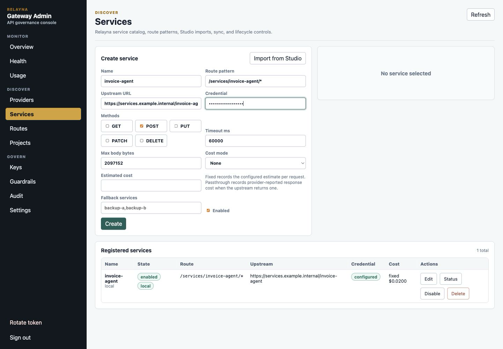

What to check: the saved service should be enabled, have the intended route
pattern, and show credential `configured` when a credential is required. For
Studio imports, preview changes before importing or syncing.

### 6. Confirm exposed routes

Open Routes. Confirm the OpenAI-compatible and rerank routes, Anthropic Claude
routes, and registered service routes that clients will call.

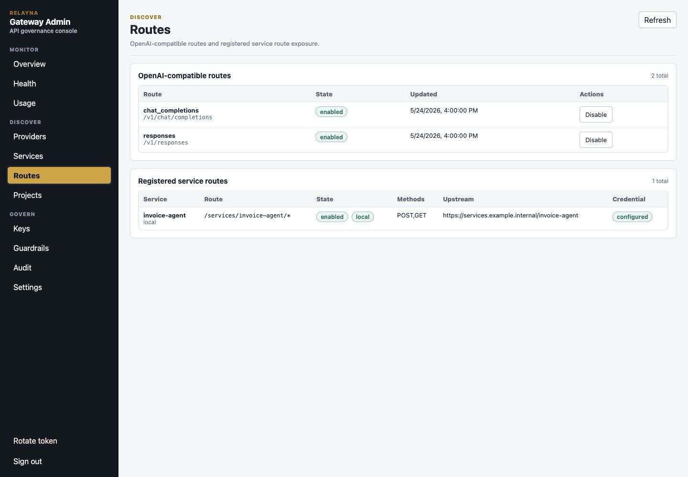

What to check: `/v1/chat/completions`, `/v1/responses`, and the canonical
`/v1/rerank` setting should be enabled when clients need OpenAI-compatible or
rerank traffic. The rerank setting also governs `/rerank` and `/v2/rerank`.
`/v1/messages`,
`/v1/messages/count_tokens`, and `/v1/messages/batches` should be enabled when
clients need Claude or Claude Code traffic. Registered service routes should
show the expected route pattern, allowed methods, upstream, and credential
state.

Each registered service row also shows its effective `Timeout ms`. Operators
with service-update permission can change and save that value inline. Routes
and Services both edit the same persisted `service_registrations.timeout_ms`
field, so reloading either view shows the saved value. The accepted range is
`1..=600000` milliseconds, and Studio re-import or sync preserves this
Gateway-owned runtime override.

When the configured upstream timeout is exhausted before response headers are
committed, Gateway returns HTTP 504 with `Content-Type: application/json` and
the stable `upstream_timeout` error envelope containing the request ID. If a
stream has already committed headers, Gateway terminates the stream instead of
trying to replace the committed response. Increasing a service timeout can
accommodate an upstream operation that is expected to take longer, but it does
not provide upstream backpressure and does not replace asynchronous task
submission for work whose completion should outlive the client request.

Each canonical OpenAI-compatible and Anthropic-compatible route also has a mode
selector and direct-passthrough runtime limits:

- `managed_by_gateway` keeps the full Gateway path: Relayna auth, route/model
  and provider policy, RPM/TPM, budgets, guardrails, provider forwarding, and
  full usage when provider accounting is available.
- `direct_litellm_passthrough` keeps Relayna auth, route enablement, policy,
  RPM/TPM, budgets, and LiteLLM credential translation, but forwards directly
  to LiteLLM without Gateway guardrail rewriting or token accounting. Usage is
  reduced to status/latency/request metadata.
- `Timeout ms`, `Max request bytes`, and `Max response bytes` set route-level
  proxy limits. Defaults are `120000`, `1048576`, and `1048576`. Virtual-key
  policy fields with the same request/response semantics can still be stricter
  for selected keys or policy layers.

Use direct mode only for canonical OpenAI or Anthropic routes that should
behave closest to LiteLLM while still preserving Gateway governance and
credential isolation.

### 7. Create the project

Open Projects and create a project for the application, team, or environment
that will own the first virtual key.

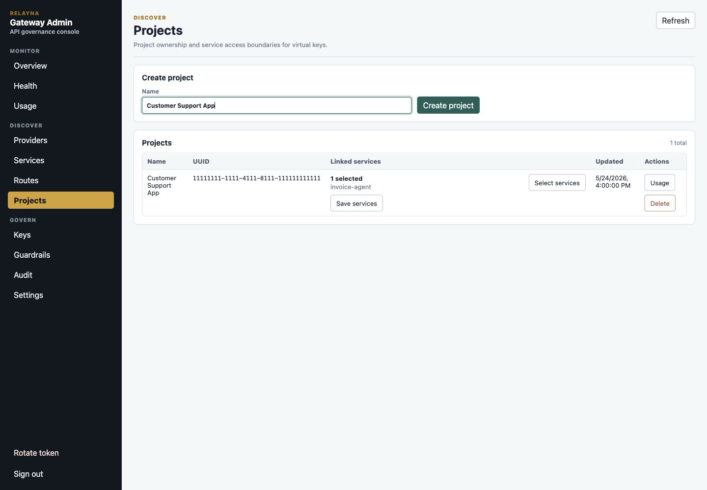

What to check: use a name admins can recognize later in usage, audit, and key
ownership views. Projects are the easiest way to share service access across
multiple keys for the same application.

### 8. Link services to the project

In the project row, open `Select services`, choose the services the project may
call, apply the selection, and save the project services.

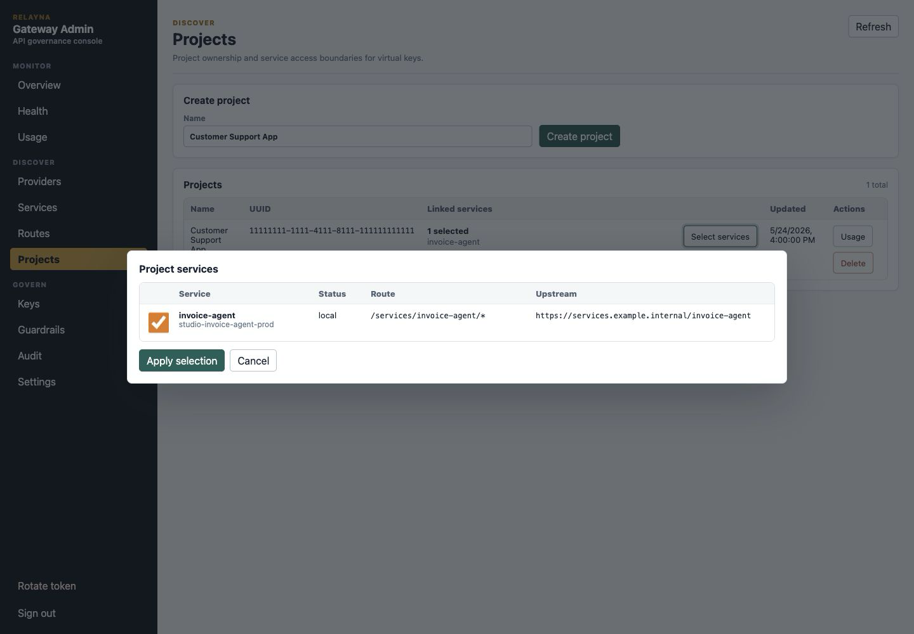

What to check: only link services that this project should be allowed to use.
Project-owned keys inherit these service links, so avoid adding broad access
for temporary testing.

### 9. Configure policy before issuing the key

Open Keys. Configure the policy directly on the key, or create an inherited
policy layer first when the same limits should apply to many keys. For a first
project key, set the routes, models, providers, rate limits, token limits,
budgets, request/response byte limits, streaming/tools settings, allowed UTC
hours, and guardrails that the application needs.

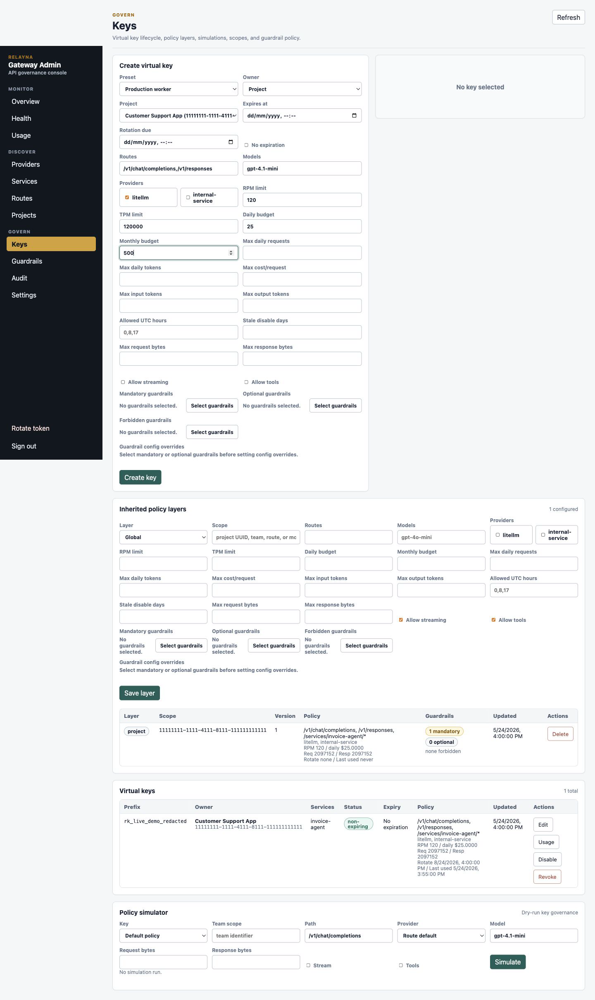

What to check: choose the narrowest route, model, provider, and service access
that still supports the application. Set budgets and rate limits before handing
the key to clients.

### 10. Create the project-owned virtual key

In Keys, keep `Owner` set to `Project`, choose the project, set expiration or
`No expiration` intentionally, then create the key. The raw virtual key is shown
once.

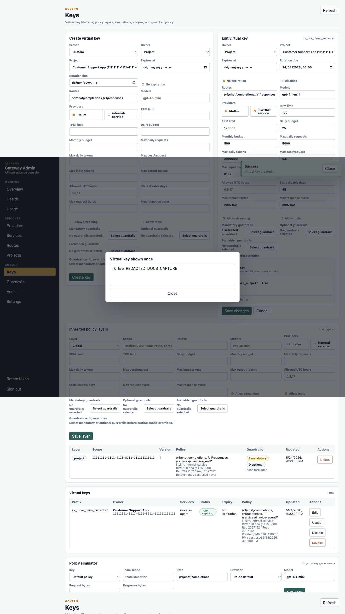

What to check: store the raw key immediately in your secret manager. After the
modal is closed, the portal only shows the key prefix. Do not paste raw
`rk_live_` values into screenshots, chat, issue trackers, or logs.

### 11. Simulate policy before sending traffic

Use the Policy simulator on the Keys view. Select the new key, enter the route,
model, provider, request size, response size, streaming, and tools settings
that the application will use, then run the simulation.

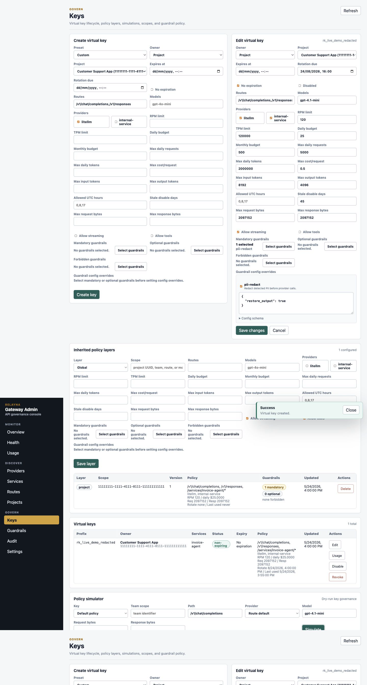

What to check: the result should allow the request and show the expected route
match, provider, policy version, guardrail plan, rate-limit projection, and
budget projection. Fix denials before distributing the key.

### 12. Verify health, usage, and audit

After setup, open Health, Usage, and Audit. Health confirms provider and service
status, Usage confirms traffic and cost reporting once requests start, and
Audit confirms setup actions were recorded without exposing secrets.

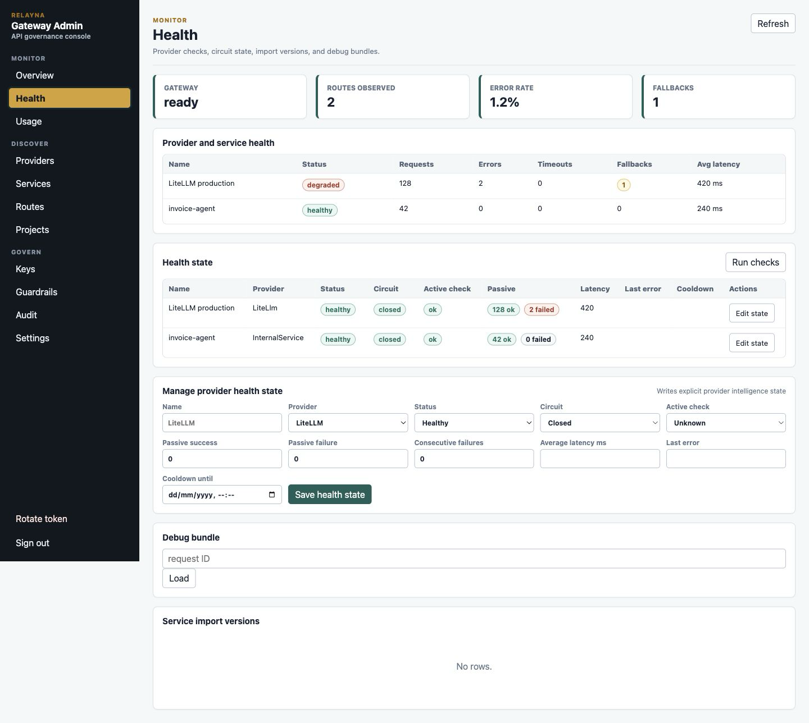

What to check: providers and services should be healthy or intentionally
disabled, usage filters should show the project/key/service once requests run,
and audit rows should include provider, service, project, policy, and key
changes with redacted snapshots.

First-time setup is complete when:

- Provider configuration is enabled and credential status is configured.
- Required services are enabled and reachable by the gateway.
- The project is linked to only the services it needs.
- The virtual key is project-owned and stored in a secret manager.
- Policy simulation allows the intended route, model, provider, and service.
- Health, Usage, and Audit show the expected operational state.

## Views

- Overview shows readiness, request count, active keys, enabled OpenAI routes, enabled services, failures, cost, and provider health.
- Projects creates and lists project UUIDs used to link services and
  project-owned virtual keys. Use `Select services` to open the service picker
  modal and manage a project's linked services.
- Keys creates, edits, disables, enables, revokes, and inspects virtual keys.
  Project-owned keys inherit service access from their selected project.
  Individual keys use `Select services` to open the service picker modal and
  choose services directly. Use `No expiration` for service keys whose rotation
  is managed outside Gateway. The key form includes safe presets for developer,
  production worker, read-only service, external partner, and temporary
  debugging keys; presets seed conservative policy limits and can be tightened
  before creation. Lifecycle fields show rotation due dates and last-used
  metadata when available.
- The Keys view also includes a policy simulator. Operators can dry-run a route,
  model, provider, stream/tools flags, and request/response byte projections
  against a stored key or the default policy before issuing or changing access.
  For registered service traffic, choose an `internal-service` provider or a
  path matching the registered service route pattern, then select the service
  name so service allowlists are evaluated with the same route context used by
  the proxy. Built-in service route patterns such as `/translation` and
  wildcard paths such as `/services/<service-name>/...` are both valid. The
  simulator blocks incomplete paths such as `/services/` and selected-service
  mismatches before sending the dry run.
  Simulator output reports auth source, route match, applied inherited policy
  layers, final intersected allowlists, guardrail plan, rate/budget projections,
  and final decision. When a route, provider, model, or service allowlist
  excludes the simulated request, the result warns which effective allowlist is
  restrictive.
- Inherited policy layers can be managed from the Keys view. Global layers use
  no scope. Project, team, route, and model layers use a scope value such as a
  project UUID, team identifier, route string like `/v1/chat/completions`, or
  model name. These layers are additive governance overlays on top of key
  policy and use neutral defaults unless an operator sets a field.
- Providers configures LiteLLM and internal-service endpoints with write-only credentials.
- Routes disables and enables the global OpenAI-compatible LiteLLM routes `/v1/chat/completions` and `/v1/responses`, and lists registered service routes with their allowed methods and credential status.
- Services creates, imports from Relayna Studio, syncs selected Studio catalog
  entries, previews added/changed/removed/invalid import diffs, edits,
  sync-checks, disables, enables, and deletes service registrations. Method
  selection uses explicit checkboxes for `GET`, `POST`, `PUT`, `PATCH`, and
  `DELETE`. Health path and method fields let operators point active checks at
  a service-specific endpoint when the upstream root is not a valid health
  target.
- Usage filters usage by project, virtual key, service, route, provider, HTTP
  method, effective endpoint, numeric status code, model, task ID, run ID,
  trace ID, status, and minimum cost. It groups the selected top combinations
  as expandable Project → Virtual key → Service disclosures, resolving only
  safe key prefixes and showing request, success, failure, token, latency, and
  cost totals for each service. It also shows endpoint request/success/failure
  breakdowns grouped as `METHOD /path`, plus method, effective endpoint, and
  numeric status in recent rows alongside the existing cost, error, fallback,
  guardrail, timeseries, unused-key, task-drilldown, and export views.
- Guardrails shows the gateway guardrail catalog, recent sanitized execution
  events, and execution summaries. Key create/edit forms can set mandatory,
  optional, and forbidden guardrails.
- Audit shows read-only operator audit events with filters for action, target
  type, target ID, operator token ID, and limit. Rows include timestamp, actor,
  request ID, IP/user-agent metadata, target, action, and redacted before/after
  snapshots.
- Health shows provider and service request, error, timeout, fallback, and
  latency status. Provider health state also exposes active check status,
  passive success/failure counters, circuit state, cooldown, and last error
  metadata. Operators with provider update scope can write explicit provider
  health state for degraded, open-circuit, cooldown, and last-error situations.
- Settings includes Studio connection controls, Entra ID and Apigee front-door
  auth controls, and static release/security posture references for v0.1.7
  freeze boundaries and supply-chain exception guidance.

## Entra ID and Apigee Front-Door Settings

Open **Settings** and use **Entra ID and Apigee front door** to manage the
enterprise-auth front door from the Admin portal. These controls update the
same runtime configuration that can also be supplied by deployment environment
variables in [Entra ID Auth](entra-id-auth.md) and
[Apigee Gateway Path](apigee-gateway-path.md).

The panel shows the current auth source in the Settings summary:

- `unset`: no Entra or Apigee front-door auth is active.
- `environment`: Gateway is using deployment environment variables.
- `persisted`: Gateway is using Admin API settings saved from the portal.

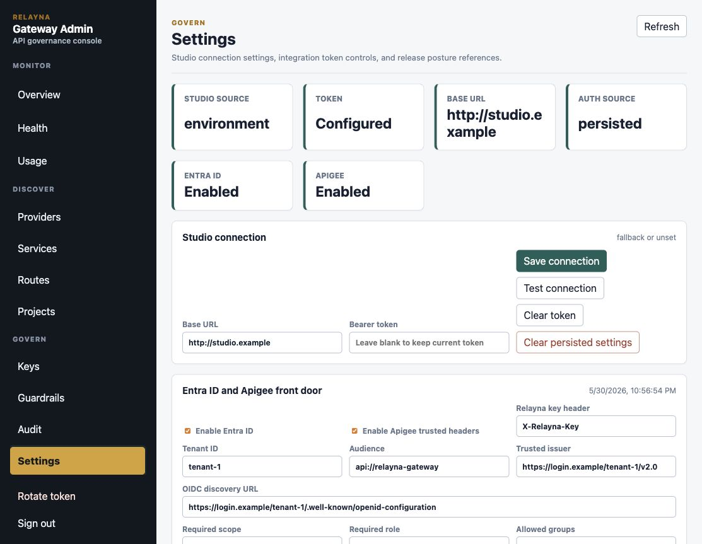

Saved Admin portal settings are applied immediately to proxy traffic. They do
not change Admin UI sign-in; `/admin-ui/*` remains protected by operator
tokens. Existing secret values are write-only and are never rendered back into
the browser.

### Enablement and Relayna key header

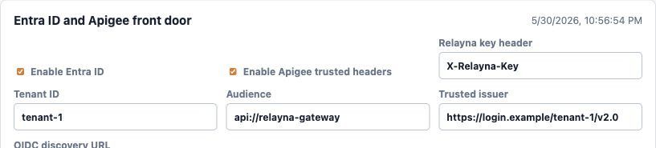

Use the first row to choose which enterprise-auth path is active and which
header carries the Relayna virtual key.

| UI option | Environment variable | What it does | How to set it |
| --- | --- | --- | --- |
| `Enable Entra ID` | `ENTRA_AUTH_ENABLED` | Requires proxy clients to send `Authorization: Bearer <Entra access token>` before Gateway authenticates the Relayna virtual key. | Check it only after tenant, audience, issuer, and OIDC discovery URL are filled. Clear it to return direct proxy traffic to Relayna virtual-key auth unless Apigee trusted headers remain enabled. |
| `Enable Apigee trusted headers` | `APIGEE_TRUSTED_HEADER_ENABLED` | Allows Apigee to send a sanitized identity header and HMAC signature instead of forwarding the original Entra JWT. | Check it only after `Apigee secret` is configured. Clear it to disable trusted-header verification. |
| `Relayna key header` | `ENTRA_RELAYNA_KEY_HEADER` | Names the HTTP header that carries the Relayna `rk_live_...` key when Entra or Apigee front-door auth is used. | Keep `X-Relayna-Key` unless clients and Apigee policies are already updated to a different valid HTTP header name. Gateway strips this header before upstream forwarding. |

When Entra is enabled, clients send:

```http
Authorization: Bearer <Entra access token>
X-Relayna-Key: rk_live_...
```

When Apigee trusted headers are enabled, Gateway expects Apigee to send:

```http
X-Apigee-Entra-Identity: <base64url-json>
X-Apigee-Entra-Signature: <base64url-hmac-sha256>
X-Relayna-Key: rk_live_...
```

### Entra issuer and discovery settings

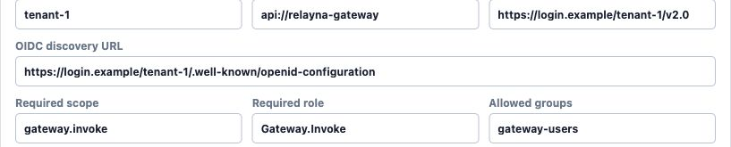

These fields identify the Entra tenant and the API registration Gateway should
trust. They are required when `Enable Entra ID` is checked.

| UI option | Environment variable | What it does | How to set it |
| --- | --- | --- | --- |
| `Tenant ID` | `ENTRA_TENANT_ID` | Matches the token `tid` claim. | Use the tenant GUID or tenant identifier that appears in issued access tokens. |
| `Application ID / token audience` | `ENTRA_APPLICATION_ID` at startup; persisted `audience` at runtime | Matches the token `aud` claim for the shared Relayna Gateway application. | For Microsoft identity platform v2 tokens, use the application ID GUID. Managed identities request `api://<application-id>/.default`, but the issued token's `aud` is the GUID. |
| `Trusted issuer` | `ENTRA_ISSUER` | Matches the token `iss` claim and the OIDC metadata issuer. | For Microsoft identity platform v2 tokens, use `https://login.microsoftonline.com/<tenant-id>/v2.0`. |
| `OIDC discovery URL` | `ENTRA_OIDC_DISCOVERY_URL` | Lets Gateway fetch OIDC metadata and find the JWKS URI used for JWT signature validation. | Use the tenant's `.well-known/openid-configuration` URL. For v2 tokens, it normally ends with `/v2.0/.well-known/openid-configuration`. |

Saving with Entra enabled and any required field empty is rejected. Saving an
empty field while Entra is disabled clears that persisted field.

### Authorization requirements

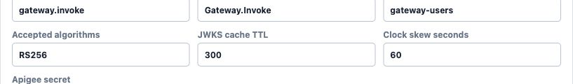

These options are optional authorization gates layered on top of tenant,
issuer, audience, and signature validation. If more than one is set, the token
or trusted Apigee identity must satisfy each configured requirement.

| UI option | Environment variable | What it does | How to set it |
| --- | --- | --- | --- |
| `Required scope` | `ENTRA_REQUIRED_SCOPE` | Requires the delegated scope to appear in the Entra `scp` claim. Apigee trusted-header mode checks the same value against the signed identity scopes. | Use a single scope value such as `gateway.invoke`. Leave blank when only app roles or groups are used. |
| `Required role` | `ENTRA_REQUIRED_ROLE` | Requires an app role to appear in the Entra `roles` claim. Apigee trusted-header mode checks the same value against the signed identity roles. Startup configuration defaults to `gateway.invoke`. | Use `gateway.invoke` for governed request-plane callers. Override it only when the shared application defines a reviewed equivalent role. |
| `Allowed groups` | `ENTRA_ALLOWED_GROUPS` | Requires at least one configured group to appear in the Entra `groups` claim or signed Apigee identity groups. | Enter a comma-separated list of group IDs. Leave blank to skip group authorization. Entra group-overage tokens fail closed. |

### JWT validation, cache, and clock settings

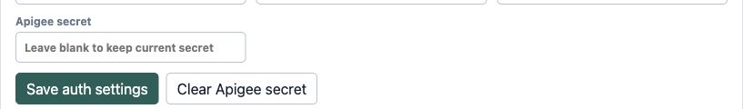

These options control how Gateway validates Entra JWTs after it resolves OIDC
metadata and JWKS keys.

| UI option | Environment variable | What it does | How to set it |
| --- | --- | --- | --- |
| `Accepted algorithms` | `ENTRA_ACCEPTED_ALGORITHMS` | Limits accepted JWT signing algorithms. Gateway currently validates RSA JWKS keys. | Enter a comma-separated list. Use `RS256` unless your Entra setup intentionally issues another supported RSA algorithm. Empty values fall back to `RS256`. |
| `JWKS cache TTL` | `ENTRA_JWKS_CACHE_TTL_SECONDS` | Sets how long Gateway caches fetched JWKS keys. Unknown `kid` values trigger a refresh before the request fails. | Enter seconds. The default is `300`. Use shorter values during key-rotation testing and longer values only when rotation policy allows it. |
| `Clock skew seconds` | `ENTRA_CLOCK_SKEW_SECONDS` | Allows bounded skew when validating `exp`, `nbf`, and `iat` claims. | Enter seconds. The default is `60`. Set to `0` only when all callers and Gateway hosts have tightly synchronized clocks. |

### Apigee secret and actions


Use the Apigee secret when `Enable Apigee trusted headers` is checked. Gateway
uses it to verify `X-Apigee-Entra-Signature`, which must be the unpadded
base64url HMAC-SHA256 of the exact `X-Apigee-Entra-Identity` header value.

| UI option | Environment variable | What it does | How to set it |
| --- | --- | --- | --- |
| `Apigee secret` | `APIGEE_TRUSTED_HEADER_SECRET` | Shared HMAC secret used to verify signed Apigee identity headers. | Paste a high-entropy secret when enabling or rotating trusted-header mode. Leave the field blank to keep the current persisted secret. The current secret is never displayed. |
| `Save auth settings` | Admin API `PATCH /admin-ui/admin/auth/front-door` | Persists the current form and applies it to the runtime auth snapshot. | Save after changing toggles, Entra fields, Relayna key header, authorization requirements, validation settings, or the Apigee secret. |
| `Clear Apigee secret` | Admin API `PATCH /admin-ui/admin/auth/front-door` | Clears the persisted Apigee secret and disables trusted-header mode. | Use before decommissioning Apigee trusted-header mode or after a suspected secret exposure. Re-enter a new secret before enabling trusted headers again. |

For Apigee signed-header mode, Apigee must remove any inbound user-supplied
`X-Apigee-Entra-Identity`, `X-Apigee-Entra-Signature`, and Relayna key headers
before setting its own values. Gateway strips the Apigee proof headers and the
configured Relayna key header before forwarding traffic to LiteLLM, direct
providers, or registered services.

## Security Notes

- The portal never receives provider credentials or LiteLLM service keys.
- Raw virtual keys and operator tokens are shown once.
- Provider and service credentials can be configured, replaced, or cleared, but existing secret values are not displayed.
- Studio import reads catalog metadata only. Gateway preserves local credentials, enabled state, route overrides, limits, fallback services, project links, and cost settings on re-import.
- Disabling an OpenAI route is global and affects every virtual key until the route is enabled again.
- Service wildcard routes can accept `GET` only when the service registration includes `GET` in its allowed methods.
- Guardrail execution records never include raw request bodies, response bodies,
  provider credentials, bearer tokens, or PII mappings.
- Debug bundles are keyed by request ID and contain route, selection, policy,
  guardrail, latency, fallback, and request/response hash data only. They do not
  contain raw prompts, raw responses, bearer tokens, provider credentials, or
  LiteLLM credentials.
- The control listener should be protected by network policy, ingress rules, or private access controls in production.

## Audit Events

Admin mutations write append-only audit events with the operator token ID,
action, target type, target ID when available, before/after JSON snapshots when
safe, request ID, IP, user agent, and timestamp. Audit rows are available to
operators with `audit:read`:

```bash
curl -sS \
  -H "Authorization: Bearer $GATEWAY_OPERATOR_TOKEN" \
  "http://127.0.0.1:8081/admin-ui/admin/audit-events?limit=100"
```

Audit snapshots must not contain raw virtual keys, operator tokens, provider
credentials, LiteLLM credentials, internal service tokens, prompts, or full
provider responses.

## Usage Export

Operators can export usage rows through admin-token-protected endpoints:

```bash
curl -sS \
  -H "Authorization: Bearer $GATEWAY_OPERATOR_TOKEN" \
  "http://127.0.0.1:8081/admin-ui/admin/usage/export.json?status=success&limit=1000"

curl -sS \
  -H "Authorization: Bearer $GATEWAY_OPERATOR_TOKEN" \
  "http://127.0.0.1:8081/admin-ui/admin/usage/export.csv?status=failure&limit=1000"
```

Supported filters match the usage dashboard query model: `from`, `to`,
`project_id`, `key_id`, `route`, `provider`, `service`, `task_id`, `run_id`,
`method`, `endpoint`, `status_code`, `model`, `status`, `trace_id`, and
`min_cost_usd`. Export rows are ordered by creation time, request ID, and the
internal unique usage-event ID so paginated exports have a total order. `limit` defaults to `1000`, is clamped to
`10000`, and `offset` can be used for pagination.

The Admin UI export panel accepts an exact **Export from** and **Export to**
window. When either value is set, the export-specific values replace the Usage
page time window; when both are blank, the active Usage time filter is reused.
Timestamps entered in the browser are sent as ISO 8601 instants, and the end of
the interval is exclusive.

Selecting **All rows (download)** downloads every matching row in ordered
10,000-row batches. A bounded start and end time is required. This mode is
available only for downloads because Preview, Copy URL, and Copy curl each
represent one bounded API request. The server-side maximum remains 10,000 rows
per request; direct API clients should continue paginating with `offset`.

JSON exports include a `summary` object plus `rows`. CSV exports include the row
fields directly and neutralize spreadsheet formula prefixes before escaping
cells. Summary responses include request, success, failure, token, cost,
latency, fallback, denial, guardrail block, expensive request, and fallback-rate
fields. Row responses include request, key, project, route, model, provider,
status, latency, token, cost, service, HTTP method, concrete endpoint path,
matched endpoint template, task ID, run ID, trace ID, fallback, guardrail action
count, and creation timestamp fields. The three endpoint columns are appended
to CSV output so existing column positions remain stable.

Unused keys are available at:

```bash
curl -sS \
  -H "Authorization: Bearer $GATEWAY_OPERATOR_TOKEN" \
  "http://127.0.0.1:8081/admin-ui/admin/usage/unused-keys?limit=100"
```

Usage reads require `usage:read`. JSON and CSV exports require `usage:export`.

## Guardrails

Gateway guardrails are configured by operators and enforced by virtual-key
policy. `pii-redact` is seeded as an opt-in built-in guardrail. Add it to a
key's `mandatory_guardrails` to apply it even when clients omit the
`guardrails` request field, or add it to `optional_guardrails` to let callers
request it explicitly.

The Guardrails view manages the global catalog. Use `New guardrail` to add a
custom HTTP guardrail, or select an existing row to open the detail drawer.
Built-ins such as `pii-redact` allow safe edits to enabled state, modes, failure
policy, schema, and runtime config. Built-ins do not expose endpoint, token, or
delete controls. Custom HTTP guardrails expose endpoint URL, timeout, and
write-only bearer token controls.

Catalog config has two fields with different jobs:

- `config_schema` documents the expected JSON shape for operators.
- `runtime_config` is the actual global default config passed to the guardrail
  when it executes.

For `pii-redact`, `runtime_config` can include `restore_output`. When true,
post-call guardrails restore request-local placeholders before redacting any new
PII generated by the provider. When false, placeholders remain redacted in the
final response.

Key create and edit forms configure how the catalog applies to each virtual
key:

- Mandatory guardrails always run for that key.
- Optional guardrails are allowed for client-requested use.
- Forbidden guardrails are hidden from client discovery and rejected if
  requested.
- Guardrail config overrides tune selected guardrails only for that key.

The Admin portal shows per-key override editors only after a guardrail is
selected as mandatory or optional. This keeps unselected catalog entries out of
the key form and makes the execution rule explicit: an override is dormant until
that guardrail is actually applied.

Example key policy with per-key config:

```json
{
  "guardrail_policy": {
    "mandatory_guardrails": ["pii-redact"],
    "optional_guardrails": ["custom-check"],
    "forbidden_guardrails": [],
    "guardrail_config_overrides": {
      "pii-redact": {
        "restore_output": false
      },
      "custom-check": {
        "threshold": 0.85
      }
    }
  }
}
```

Effective config is a shallow JSON object merge:

```text
effective_config = catalog runtime_config + key guardrail_config_overrides[name]
```

Unknown override guardrails, forbidden override guardrails, and non-object
override values are rejected with stable guardrail error envelopes. HTTP
guardrail endpoint URL, timeout, and bearer token remain catalog-level provider
settings; per-key overrides only tune runtime config.

## Policy and Size Limits

Virtual-key policy is evaluated as an effective policy. Global and project
 layers combine with team, key, route, and model layers when the relevant
 context is present. They use the same deterministic rules:

- Explicit deny wins.
- Route, model, provider, service, and allowed-hour lists intersect. A disjoint
  intersection denies the request.
- Lower-level rate, budget, cost, token, and byte limits can only become
  stricter.
- Streaming and tool permissions are only allowed when every applied layer
  allows them.
- Mandatory guardrails are additive. Forbidden guardrails remove optional
  requests.

Use the policy simulator after saving global or project layers. If a global
layer is intended only for internal services, it will also restrict
OpenAI-compatible LiteLLM keys unless the final intersected route and provider
allowlists still include `/v1/chat/completions` and `litellm`.

Request body limits return `request_body_too_large`. Response body limits return
`response_body_too_large`. Both use the standard structured error envelope and
HTTP 413 status.

Policy layer APIs:

```bash
curl -sS \
  -H "Authorization: Bearer $GATEWAY_OPERATOR_TOKEN" \
  http://127.0.0.1:8081/admin-ui/admin/policy-layers

curl -sS \
  -H "Authorization: Bearer $GATEWAY_OPERATOR_TOKEN" \
  -H "Content-Type: application/json" \
  -X POST http://127.0.0.1:8081/admin-ui/admin/policy-layers \
  -d '{
    "kind": "route",
    "scope_id": "/v1/chat/completions",
    "policy": {
      "max_response_body_bytes": 1048576,
      "allow_streaming": true,
      "allow_tools": true
    }
  }'
```

Operator APIs:

```bash
curl -sS \
  -H "Authorization: Bearer $GATEWAY_OPERATOR_TOKEN" \
  http://127.0.0.1:8081/admin-ui/admin/guardrails

curl -sS \
  -H "Authorization: Bearer $GATEWAY_OPERATOR_TOKEN" \
  "http://127.0.0.1:8081/admin-ui/admin/guardrails/executions?limit=50"

curl -sS \
  -H "Authorization: Bearer $GATEWAY_OPERATOR_TOKEN" \
  http://127.0.0.1:8081/admin-ui/admin/guardrails/summary
```

Client discovery and test APIs use Relayna virtual keys:

```bash
curl -sS \
  -H "Authorization: Bearer rk_live_xxx" \
  http://127.0.0.1:8081/admin-ui/v1/guardrails

curl -sS \
  -H "Authorization: Bearer rk_live_xxx" \
  -H "Content-Type: application/json" \
  -X POST http://127.0.0.1:8081/admin-ui/v1/guardrails/test \
  -d '{"guardrails":["pii-redact"],"mode":"pre_call","input":{"messages":[{"role":"user","content":"email alice@example.com"}]}}'
```

Custom HTTP guardrails can be added through the admin API. Gateway sends a
sanitized JSON payload with `request_id`, `guardrail`, `mode`, `context`,
`config`, and one of `request` or `response`. The provider returns `action`,
optional modified `request` or `response`, optional `reason`, and sanitized
`metadata`.

```bash
curl -sS \
  -H "Authorization: Bearer $GATEWAY_OPERATOR_TOKEN" \
  -H "Content-Type: application/json" \
  -X POST http://127.0.0.1:8081/admin-ui/admin/guardrails \
  -d '{
    "name": "custom-check",
    "description": "Company policy check",
    "endpoint_url": "https://guardrails.example/check",
    "modes": ["pre_call", "post_call", "during_call"],
    "failure_policy": "fail_open",
    "timeout_ms": 1500,
    "bearer_token": "secret-token"
  }'
```

Streaming requests with guarded responses require selected response guardrails
to support `during_call`. `pii-redact` redacts common PII in streaming chunks
with a small holdback window for values split across chunks. If a required
guardrail cannot run during streaming, Gateway fails closed with
`guardrail_unavailable`.

## Import From Studio

Relayna Studio owns the operator-facing service catalog. Relayna Gateway owns
public traffic authentication, policy, route matching, upstream credential
injection, usage, costs, budgets, and fail-closed routing. The import flow copies
Studio catalog metadata into Gateway service registrations; it does not copy
provider credentials or allow Studio metadata to bypass Gateway policy.

Configure the Studio backend in Admin portal Settings, or set
`RELAYNA_STUDIO_BASE_URL` as a deployment fallback. Use the Studio backend base
URL, not the frontend URL. Gateway appends `/studio/gateway/services` when it
fetches the catalog. Admin-saved settings override environment settings until
the persisted base URL is cleared, at which point the environment fallback is
effective again.

Local example:

```bash
export RELAYNA_STUDIO_BASE_URL="http://127.0.0.1:8000"
```

Docker on macOS or Windows when Studio runs on the host:

```bash
export RELAYNA_STUDIO_BASE_URL="http://host.docker.internal:8000"
```

Kubernetes example when Studio is another Service in the same namespace:

```bash
export RELAYNA_STUDIO_BASE_URL="http://relayna-studio-backend:8000"
```

If Studio protects the Gateway export endpoint, set the optional bearer token in
Admin portal Settings or with `RELAYNA_STUDIO_TOKEN`. Gateway sends it as:

```http
Authorization: Bearer <RELAYNA_STUDIO_TOKEN>
```

Gateway expects `GET /studio/gateway/services` to return JSON with a top-level
`services` array. Each row should include `studio_service_id` or `service_id`, a
gateway-safe `name` or `gateway_service_name`, optional `display_name`,
`base_url`, `environment`, `status`, `tags`, optional `allowed_methods`, optional
`default_route_pattern`, and optional pricing hints. A minimal response looks
like this:

```json
{
  "services": [
    {
      "studio_service_id": "payments-api",
      "name": "payments-api",
      "display_name": "Payments API",
      "base_url": "https://payments.example.test",
      "environment": "prod",
      "tags": ["core", "billing"],
      "status": "healthy",
      "default_route_pattern": "/services/payments-api/*"
    }
  ]
}
```

Before opening the Gateway Admin portal, test Studio directly:

```bash
curl -sS "$RELAYNA_STUDIO_BASE_URL/studio/gateway/services"
```

Then test the Gateway-to-Studio connection through Admin portal Settings or the
protected Gateway admin route:

```bash
curl -sS \
  -H "Authorization: Bearer $GATEWAY_OPERATOR_TOKEN" \
  -X POST \
  http://127.0.0.1:8081/admin-ui/admin/studio/connection/test

curl -sS \
  -H "Authorization: Bearer $GATEWAY_OPERATOR_TOKEN" \
  http://127.0.0.1:8081/admin-ui/admin/studio/services
```

The test route returns `ok` and `service_count` when the catalog is reachable.
The services route returns the mapped import preview used by the portal. It
should show `studio_service_id`, `name`, `route_pattern`, and an
`import_request` for each service. If Studio is unreachable, stalls, returns
non-JSON, or returns an invalid service shape, Gateway returns
`studio_unavailable`.

Operator flow:

1. Start Studio backend and verify `/studio/gateway/services`.
2. Start Gateway with optional `RELAYNA_STUDIO_BASE_URL` and
   `RELAYNA_STUDIO_TOKEN`, or configure the connection in Admin Settings.
3. Open `/admin-ui`, sign in with the Gateway operator token, and go to
   Settings.
4. Save or test the Studio connection. Token values are write-only and are never
   returned by the API.
5. Go to Services and click `Import from Studio`.
6. Select one or more services and click `Import selected`.
7. Configure Gateway-owned runtime fields such as credentials, enabled state,
   route overrides, limits, fallback services, project links, and cost mode.

Imported services are created with `source = studio`. They remain disabled or
incomplete until Gateway-owned runtime fields are configured. Re-importing by
`studio_service_id` is idempotent and preserves Gateway-owned fields by default.

For routed traffic, wildcard service aliases subtract the matched prefix before
forwarding upstream. For example:

```text
Gateway route pattern: /services/payments-api/*
Client request:        POST /services/payments-api/charges?trace=1
Upstream receives:     POST /charges?trace=1
```

Exact route patterns do not subtract a prefix. A route pattern of `/charges`
forwards `/charges` as `/charges`.

## Non-Expiring Virtual Keys

Virtual keys can be created or edited with no expiration date. In the Admin
portal, open Keys and select `No expiration` in the create or edit form. Through
the Admin API, send `expires_at: null`. Project-owned keys specify
`owner_type: "project"` and a `project_id`:

```bash
curl -sS -X POST http://127.0.0.1:8081/admin-ui/admin/keys \
  -H "Authorization: Bearer $GATEWAY_OPERATOR_TOKEN" \
  -H "Content-Type: application/json" \
  -d '{
    "owner_type": "project",
    "project_id": "<project-id>",
    "expires_at": null,
    "policy": {
      "allowed_routes": ["/services/*"],
      "allowed_providers": ["internal-service"]
    }
  }'
```

Individual keys specify `owner_type: "individual"` and direct `service_names`:

```bash
curl -sS -X POST http://127.0.0.1:8081/admin-ui/admin/keys \
  -H "Authorization: Bearer $GATEWAY_OPERATOR_TOKEN" \
  -H "Content-Type: application/json" \
  -d '{
    "owner_type": "individual",
    "service_names": ["payments-api"],
    "expires_at": null,
    "policy": {
      "allowed_routes": ["/services/*"],
      "allowed_providers": ["internal-service"]
    }
  }'
```

To clear expiration on an existing key:

```bash
curl -sS -X PATCH http://127.0.0.1:8081/admin-ui/admin/keys/<key-id> \
  -H "Authorization: Bearer $GATEWAY_OPERATOR_TOKEN" \
  -H "Content-Type: application/json" \
  -d '{"expires_at": null}'
```

To set an expiration again:

```bash
curl -sS -X PATCH http://127.0.0.1:8081/admin-ui/admin/keys/<key-id> \
  -H "Authorization: Bearer $GATEWAY_OPERATOR_TOKEN" \
  -H "Content-Type: application/json" \
  -d '{"expires_at": "2030-01-01T00:00:00Z"}'
```

Warning: non-expiring keys are long-lived bearer credentials. Anyone with the
raw key can use it until it is revoked, disabled, or restricted by policy. Use
non-expiring keys only for service-to-service integrations with external
rotation controls, narrow route/provider/service policy, secret-manager storage,
audit coverage, and a documented revocation procedure. Prefer expiring keys for
human users, temporary automation, demos, and CI jobs.

## Cost Modes

`fixed` records the configured estimate on each routed service request. For example, a service with `estimated_cost_usd` set to `0.01` contributes `$0.0100` per recorded request.

`passthrough` records the cost reported by the upstream response when present, such as `usage.total_cost` or LiteLLM response-cost fields. If the provider omits cost data, the usage event has no per-request cost and aggregate summaries treat missing cost as zero.
