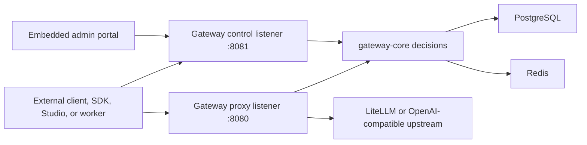

# Architecture

Relayna Gateway is designed as the public governance layer for AI traffic. Clients present Relayna virtual keys; the gateway resolves identity and policy, then translates approved requests to internal provider credentials.

## Request Flow

1. A client sends an OpenAI-compatible or registered service request with `Authorization: Bearer rk_live_...`.
2. The proxy extracts the key prefix and loads the hashed key record from PostgreSQL.
3. Globally disabled OpenAI-compatible LiteLLM routes are rejected before policy, rate-limit, and budget checks.
4. `gateway-core` verifies the key secret, disabled state, revocation state, expiry, allowed route, allowed model, allowed provider, streaming permission, service method permission, rate limit, and budget.
5. Redis counters are checked and updated for rate limit and budget decisions.
6. The proxy strips client credentials and forwards the request with the configured internal upstream credential.
7. A usage event is written for success and failure paths with request, project, route, provider, latency, status, token, and cost fields.

## Control Plane

The control listener exposes:

- `/healthz` for process liveness.
- `/readyz` for PostgreSQL and Redis readiness.
- `/metrics` for Prometheus scraping.
- `/admin/*` APIs for operator actions.
- `/admin-ui` for the embedded operator portal.

Admin APIs require an operator token. On the first startup, the gateway bootstraps one operator token, stores only its hash, and prints the raw token once. Store it in a password manager or secret manager immediately.

## Crate Ownership

- `gateway-api` owns Axum routes, admin API handlers, request IDs, health, readiness, metrics, static admin UI serving, and process startup.
- `gateway-core` owns framework-agnostic authentication, policy, routing, service, rate limit, budget, usage, operator token, and error types.
- `gateway-proxy` owns Pingora proxy behavior, upstream request construction, credential stripping, provider routing, streaming behavior, and proxy usage accounting.
- `gateway-store` owns PostgreSQL migrations, SQLx access, Redis readiness, and Redis control state.
- `gateway-telemetry` owns tracing setup, log formatting, redaction helpers, and Prometheus output.

## Data Stores

PostgreSQL is the source of truth for durable state:

- Virtual key metadata and hashed key material.
- Policy fields for routes, models, providers, services, streaming, tools, rate limits, and budgets.
- Usage events consumed by Relayna Studio and operators.
- Service registrations and Studio sync state.
- Global OpenAI route enablement for `/v1/chat/completions` and `/v1/responses`.
- Operator token hashes.

Registered service routes support wildcard paths under `/services/<service-name>/*`. The route resolver can match `GET` for service wildcard traffic, but forwarding still requires the service registration to include `GET` in its allowed method set. OpenAI-compatible routes, direct provider routes, and legacy named service routes remain `POST` routes.

Redis is the fast mutable state layer:

- Request-per-minute and token-per-minute counters.
- Daily and monthly budget counters.
- Readiness checks used by `/readyz`.

## Trust Boundaries

Provider credentials, LiteLLM service keys, internal service tokens, and operator token hashes stay inside the gateway deployment boundary. Clients should only receive Relayna virtual keys. Logs and error responses must not expose raw credentials, raw virtual keys, request prompts, or upstream secrets.
