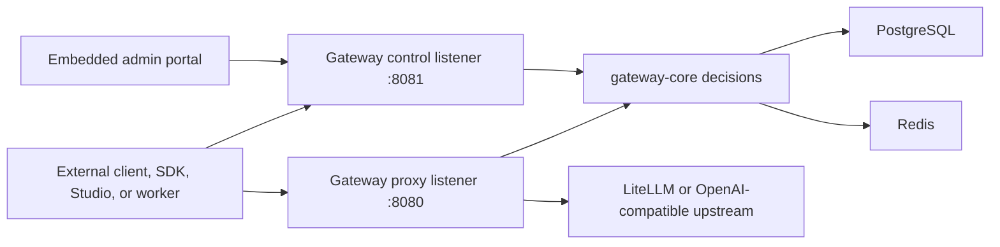

# Architecture

Relayna Gateway is designed as the public governance layer for AI traffic. Clients present Relayna virtual keys; the gateway resolves identity and policy, then translates approved requests to internal provider credentials.

## Request Flow

1. A client sends an OpenAI-compatible or registered service request with `Authorization: Bearer rk_live_...`.
2. The proxy extracts the key prefix and loads the hashed key record from PostgreSQL.
3. Globally disabled OpenAI-compatible LiteLLM routes are rejected before policy, rate-limit, and budget checks.
4. `gateway-core` verifies the key secret, disabled state, revocation state, expiry, allowed route, allowed model, allowed provider, streaming permission, service method permission, rate limit, and budget.
5. Redis request-per-minute, token-per-minute, and budget counters are checked
   and updated for rate limit and budget decisions.
6. The proxy strips client credentials and the downstream `Host`, then forwards
   the request with the configured internal upstream credential and a `Host`
   header derived from the selected upstream.
7. A usage event is written for success and failure paths with request, project, route, provider, latency, status, token, and cost fields.

## Control Plane

The control listener exposes:

- `/admin-ui/healthz` for process liveness.
- `/admin-ui/readyz` for PostgreSQL and Redis readiness.
- `/admin-ui/metrics` for Prometheus scraping.
- `/admin-ui/admin/*` APIs for operator actions.
- `/admin-ui` for the embedded operator portal.

Version `0.1.0` additions after `v0.0.14` extend this control plane with scoped
operator authorization, audit events, policy simulation, policy layers,
provider health state, debug bundles, service import versioning and rollback,
and expanded usage analytics. The public feature overview is in
[Current Feature Highlights](current-features.md).

Admin APIs require an operator token. On the first startup, the gateway bootstraps one operator token and stores only its hash. `GATEWAY_ADMIN_TOKEN` can seed that first token in a fresh database; otherwise the gateway generates and prints one raw token once. After an active token exists, env changes are ignored and rotation through the Admin portal is the supported change path.

Usage export endpoints are part of the admin surface:

- `/admin-ui/admin/usage/export.json`
- `/admin-ui/admin/usage/export.csv`

They use the same usage filters as the dashboard, include summary totals, and
return paginated rows. CSV output is escaped and spreadsheet formula prefixes
are neutralized before the response is sent.

## Crate Ownership

- `gateway-api` owns Axum routes, admin API handlers, request IDs, health, readiness, metrics, static admin UI serving, and process startup.
- `gateway-core` owns framework-agnostic authentication, policy, routing, service, rate limit, budget, usage, operator token, and error types.
- `gateway-proxy` owns Pingora proxy behavior, upstream request construction, credential stripping, provider routing, streaming behavior, and proxy usage accounting.
- `gateway-store` owns PostgreSQL migrations, SQLx access, Redis readiness, and Redis control state.
- `gateway-telemetry` owns tracing setup, log formatting, redaction helpers, and Prometheus output.

## Data Stores

PostgreSQL is the source of truth for durable state:

- Virtual key metadata and hashed key material.
- Policy fields for routes, models, providers, project and individual service
  links, streaming, tools, rate limits, and budgets.
- Usage events consumed by Relayna Studio and operators.
- Service registrations and Studio sync state.
- Global OpenAI route enablement for `/v1/chat/completions` and `/v1/responses`.
- Operator token hashes, roles, scopes, and append-only admin audit events.
- Provider health state, request debug bundles, and service import snapshots.

Registered service routes support wildcard paths under `/services/<service-name>/*`. The route resolver can match `GET` for service wildcard traffic, but forwarding still requires the service registration to include `GET` in its allowed method set. OpenAI-compatible routes, direct provider routes, and legacy named service routes remain `POST` routes.

Redis is the fast mutable state layer:

- Request-per-minute and token-per-minute counters.
- Daily and monthly budget counters.
- In-flight budget reservation keys.
- Readiness checks used by `/admin-ui/readyz`.

PostgreSQL remains the durable usage ledger. On startup and periodic
reconciliation, Gateway can rebuild current daily and monthly Redis budget
counters from PostgreSQL usage events for keys that have configured budgets.

## Trust Boundaries

Provider credentials, LiteLLM service keys, internal service tokens, and operator token hashes stay inside the gateway deployment boundary. Clients should only receive Relayna virtual keys. Logs and error responses must not expose raw credentials, raw virtual keys, request prompts, or upstream secrets.
