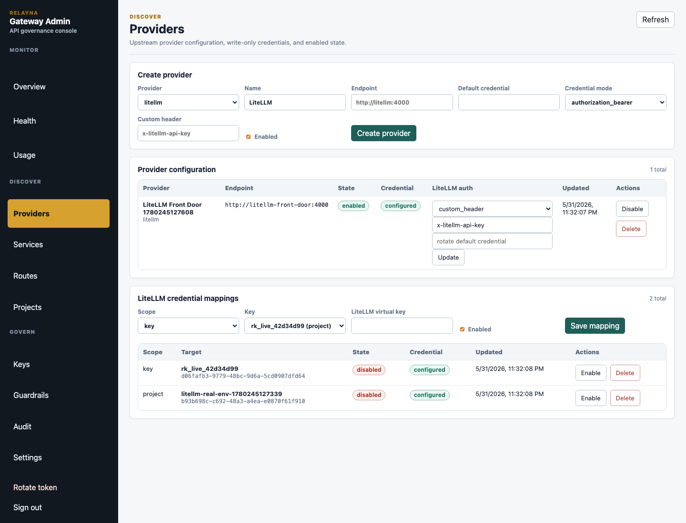

# Current Feature Highlights

This page summarizes the `v0.1.12` feature set.

Screenshots on this page use sanitized seeded demo data captured from a local
Admin UI 2.0 rendering. They are meant to show workflow shape, not live
customer, provider, token, or prompt data.

## Admin UI 2.0

Admin UI 2.0 turns the embedded portal into a denser operator console for
governing AI traffic. The UI is still served from `/admin-ui`, with the static
asset contract preserved at `/admin-ui/app.js` and `/admin-ui/app.css`, but the
source of truth is now the Vite and TypeScript package in
`crates/gateway-api/admin-ui`.

The navigation is grouped by the operator jobs it supports:

- Monitor: overview, health, usage, debug bundles, and operational status.
- Discover: providers, services, routes, and projects.
- Govern: keys, guardrails, audit, and settings.

The redesign adds reusable design-system tokens and components, compact panels,
wide-table scrolling, responsive layouts, and floating message boxes for async
action results. The Rust binary still embeds generated assets, so production
deployments do not need a separate frontend service.

## Operator Governance

Operator tokens now carry roles and scopes. Bootstrap and rotated owner tokens
keep the existing `op_live_` token format, use role `owner`, and receive
wildcard scope `*`. Narrower tokens can be limited to capability strings such
as `keys:create`, `keys:disable`, `policies:update`, `usage:read`,
`usage:export`, `providers:update`, `services:update`, `settings:update`,
`operators:manage`, and `audit:read`.

Admin APIs fail closed with `insufficient_operator_scope` when a valid token
lacks the required scope. Mutating admin operations write append-only audit
events that include actor token ID, action, target, request metadata, and
redacted before/after snapshots.

## Policy Governance

Virtual-key governance now includes safer key creation presets, lifecycle
metadata, policy versioning, policy simulation, and inherited policy layers.
Operators can dry-run route, model, provider, streaming, tools, request-size,
and response-size inputs before issuing or changing a key.

Policy simulation also accepts explicit registered-service context
so operators can dry-run `/services/<service-name>/*` access against stored keys
and service allowlists before issuing or editing credentials.

Effective policy is resolved from global, project, team, key, route, and model
layers when context is available. Layers use neutral defaults so an empty layer
does not accidentally narrow access. Explicit deny wins, allowlists intersect,
and lower-level limits can only become stricter. Request and response byte
limits return stable `request_body_too_large` and `response_body_too_large`
error codes with HTTP 413.

## Provider Intelligence

Provider intelligence adds framework-agnostic routing decisions, health state,
circuit breaker state, fallback traces, and debug bundles. Supported routing
strategies include priority, weighted, least-latency, least-cost, health-aware,
budget-aware, region-affinity, and capability-aware selection.

Fallback remains conservative. Gateway retries only configured safe HTTP status
classes and timeout classes, strips client credentials before upstream calls,
and fails closed when provider state is ambiguous. Debug bundles are keyed by
request ID and store route, provider, policy, guardrail, latency, fallback, and
bounded request/response hash data without raw prompts, raw responses, bearer
tokens, provider credentials, or LiteLLM credentials.

Service import workflows now support preview, activation, version history, and
rollback. Gateway preserves local runtime-owned settings such as credentials,
enabled state, route overrides, limits, fallback services, project links, and
cost settings when Studio metadata is re-imported.

Service health checks can target a service-specific path and method
when the upstream root is not a valid health endpoint. The previous root probe
remains the default for services without explicit health-check settings.

See [Provider Intelligence](provider-intelligence.md) for the deeper routing,
fallback, health, debug bundle, and import rollback reference.

## Entra ID Front-Door Auth

Release `0.1.7` includes opt-in Microsoft Entra ID authorization before Relayna
virtual-key authentication on provider traffic. Existing virtual-key-only
clients continue using `Authorization: Bearer rk_live_...` when
`ENTRA_AUTH_ENABLED=false`. When Entra mode is enabled, `Authorization` carries
the Entra access token and the Relayna virtual key moves to the configured
Relayna key header, defaulting to `X-Relayna-Key`.

Gateway validates OIDC metadata, JWKS, token signature, `kid`, accepted
algorithm, issuer, audience, tenant, token version, timestamps, required
scope, required role, and allowed groups before virtual-key lookup. Group
overage and ambiguous authorization fail closed. Client tokens and Relayna keys
are stripped before upstream forwarding.

Apigee deployments can either forward the original JWT for Gateway
revalidation or use the trusted signed-header path with
`APIGEE_TRUSTED_HEADER_ENABLED=true` and an HMAC proof. Unsigned or tampered
Apigee identity headers are rejected.

The Admin portal Settings page can now manage the same Entra ID and Apigee
front-door controls that can be supplied by deployment environment variables:
enablement, tenant, audience, issuer, OIDC discovery, scope, role, group
allowlist, accepted algorithms, JWKS cache TTL, clock skew, Relayna key header,
and write-only Apigee secret management.

See [Entra ID Auth](entra-id-auth.md) and
[Apigee Gateway Path](apigee-gateway-path.md) for the detailed operator
contracts.

## LiteLLM OpenAI-Compatible And Wildcard Passthrough

Release `0.1.12` lets Gateway sit in front of LiteLLM as the single ingress
target while preserving Relayna-owned identity, policy, and credential
translation for governed traffic. Relayna-owned routes such as `/services/*`,
control-plane routes under `/admin-ui/*`, health, readiness, metrics, and canonical
OpenAI-compatible routes keep explicit precedence before wildcard passthrough.
Only unmatched paths that pass the configured LiteLLM passthrough allowlist are
forwarded to LiteLLM.

Canonical OpenAI-compatible routes are still first-class Gateway routes:

- `POST /v1/chat/completions`
- `POST /v1/responses`
- `POST /v1/embeddings`

Each canonical route has a mode in the Routes page:

| Mode | Behavior |
| --- | --- |
| `managed_by_gateway` | Current governed behavior. Gateway authenticates the Relayna key, evaluates route/model/provider policy, checks request and token rate limits, checks/reserves budgets, runs configured guardrails, forwards to LiteLLM or direct providers, and records full usage when response accounting data is available. |
| `direct_litellm_passthrough` | Relayna `rk_live_...` bearer keys keep the Gateway-authenticated path: route enablement, policy, model/provider allowlists, rate limits, budgets, credential stripping/injection, and status-only usage. Non-Relayna `Authorization: Bearer ...` credentials bypass Relayna key lookup and are delegated to LiteLLM using the configured upstream credential header. Guardrail body rewriting and token accounting are bypassed. |

Wildcard LiteLLM passthrough is configured from Providers. It is disabled by
default. When enabled, the safe default allowlist is `/v1/*` for `GET` and
`POST`, which covers LiteLLM-compatible API endpoints such as `/v1/models`
without opening Relayna service/control routes. Gateway preserves the original
LiteLLM path and query string for wildcard traffic.

Sensitive LiteLLM paths require explicit exposure decisions:

| Exposure value | Meaning |
| --- | --- |
| `disabled` | `/ui` or admin-like LiteLLM paths are blocked even if they appear in `allowed_paths`. This is the default. |
| `operator_only` | The path can be allowlisted, but the proxy request must already have passed the Gateway Entra or trusted Apigee identity layer plus Relayna virtual-key auth. This is intended for identity-aware operator ingress. |
| `explicitly_exposed` | The path can be allowlisted for authenticated Relayna virtual-key clients. Use only behind a deliberate ingress/auth design. |
| `trusted_ingress` | `/ui` support paths can be served to trusted ingress front doors without Relayna credentials for browser workflows. Dashboard/admin API passthrough is allowed only when `ui_exposure` is `trusted_ingress`, `admin_api_exposure` is `explicitly_exposed`, passthrough is enabled, and method/path allowlists match. Other non-ui passthrough paths keep normal Relayna auth requirements. |

Gateway client credentials remain Relayna credentials for governed traffic. When
Entra is disabled, clients use `Authorization: Bearer rk_live_...`. When Entra
is enabled, clients use `Authorization: Bearer <Entra JWT>` plus the configured
Relayna key header. Gateway never forwards those client credentials to LiteLLM.
The direct-mode non-Relayna bearer exception leaves LiteLLM authentication and
authorization to LiteLLM itself.

Operators can manage LiteLLM upstream authentication from Admin portal
Providers. The provider default credential remains write-only, and the
credential header mode can stay on `authorization_bearer` or switch to a
custom header such as `x-litellm-api-key`. Custom headers default to raw
credential values, and operators can set `credential_header_value_format` to
`bearer` for LiteLLM deployments that require `x-litellm-key: Bearer <key>`.

LiteLLM virtual-key mappings can be scoped to a Relayna key or a project.
Gateway resolves LiteLLM credentials by Relayna key mapping, then project
mapping, then active provider default credential, and finally the
`LITELLM_SERVICE_KEY` startup fallback when no active provider config overrides
it. Secrets are write-only in Admin API responses, audit snapshots, and the
portal.

The real LiteLLM verification harness under
`internal/test-reports/litellm-real-passthrough` exercises canonical managed
and direct route modes, wildcard `/v1/models?source=wildcard`, path/query
preservation, sensitive `/ui` blocking by default, client credential stripping,
LiteLLM custom-header injection, direct LiteLLM bearer delegation, and
trusted-ingress dashboard/admin passthrough against a real `litellm/litellm`
container.

## Observability Analytics

Usage analytics now expose richer filters, breakdowns, timeseries rows, unused
key detection, task drilldowns, and JSON/CSV export paths. Filters include time
range, project, key, route, provider, service, task ID, run ID, model, status,
trace ID, and minimum cost.

Usage events and debug bundles can store W3C trace IDs so operators can move
from Studio analytics to gateway logs or provider traces without exposing raw
keys or prompts. CSV exports neutralize spreadsheet formula prefixes before
escaping cells.

Prometheus output also gained bounded operational labels and metrics for
request dimensions, upstream latency, first-token latency, denials, provider
fallbacks, active streams, and circuit breaker state. Metrics intentionally do
not use request IDs, trace IDs, raw keys, prompt text, raw paths, or unbounded
model/user values as labels.

## Supply Chain and Deployment Hardening

The `v0.1.12` release hardens CI and release workflows with strict
dependency, secret, static-analysis, filesystem, and image checks. Release
images publish with SBOM, signature, and provenance artifacts, and release
metadata validation guards tag, workspace version, and changelog alignment.

The Kubernetes example now defaults to restricted pod security settings:
non-root UID/GID `10001`, read-only root filesystem, default seccomp profile,
no privilege escalation, and all Linux capabilities dropped. Proxy and control
plane Services remain separate, and the control plane should stay private or
protected by identity-aware access.

Release checks cover public routes, admin route inventory, error codes, config
names, migrations, Redis key formats, release metadata, and Admin UI endpoint
assumptions.
