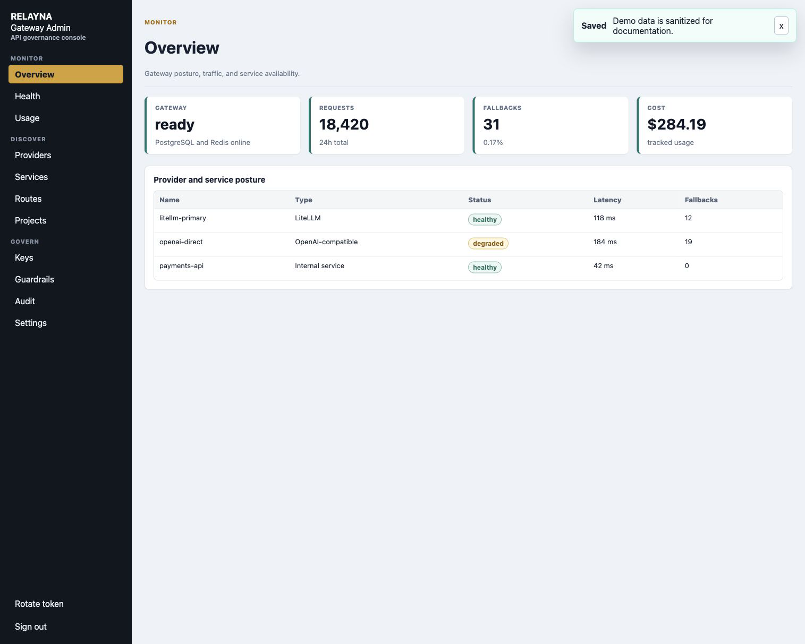
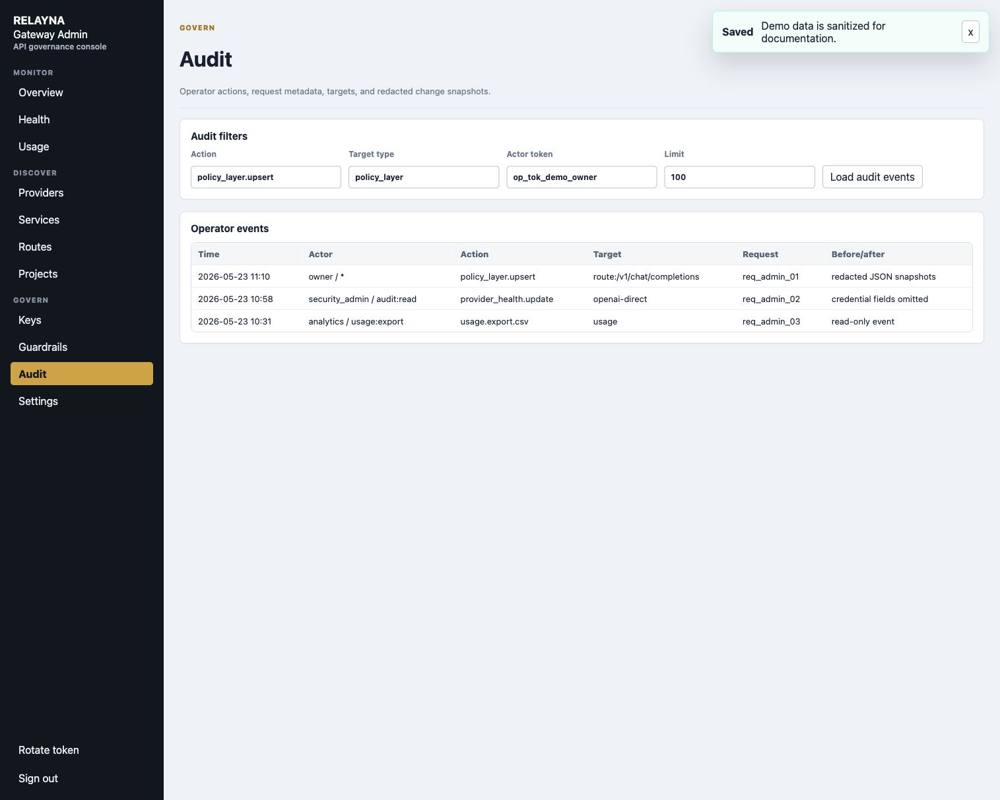
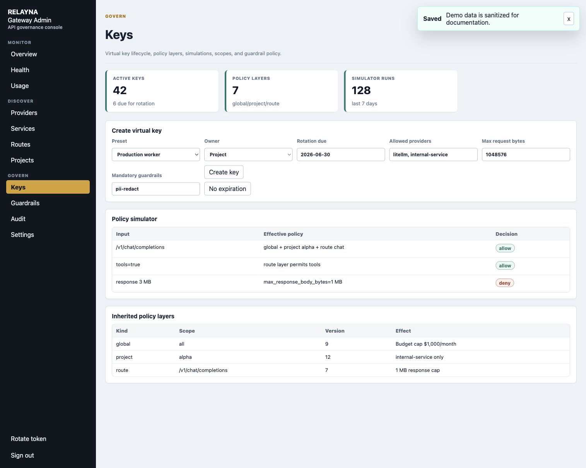
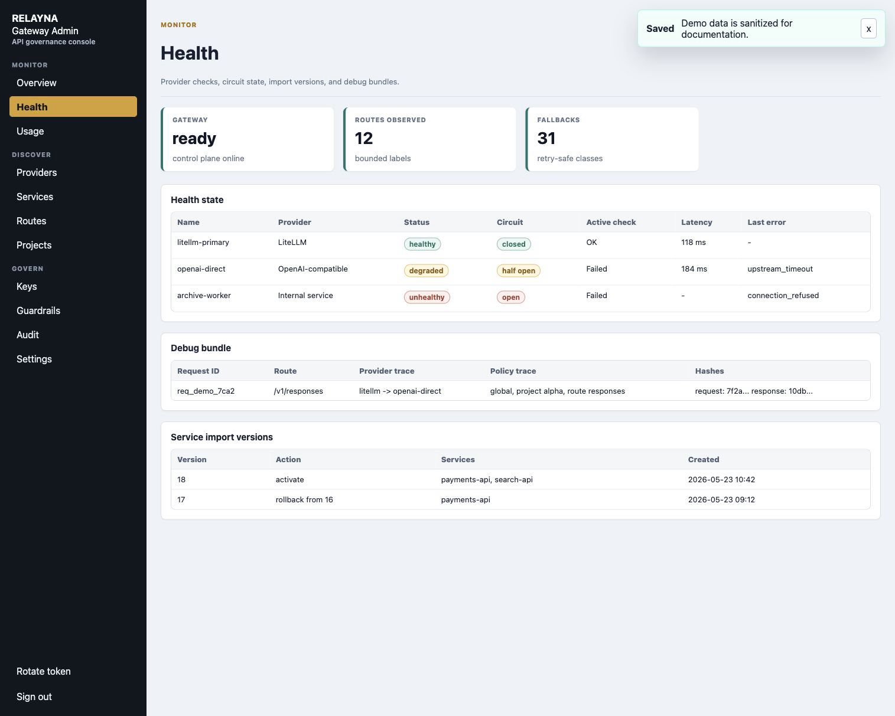
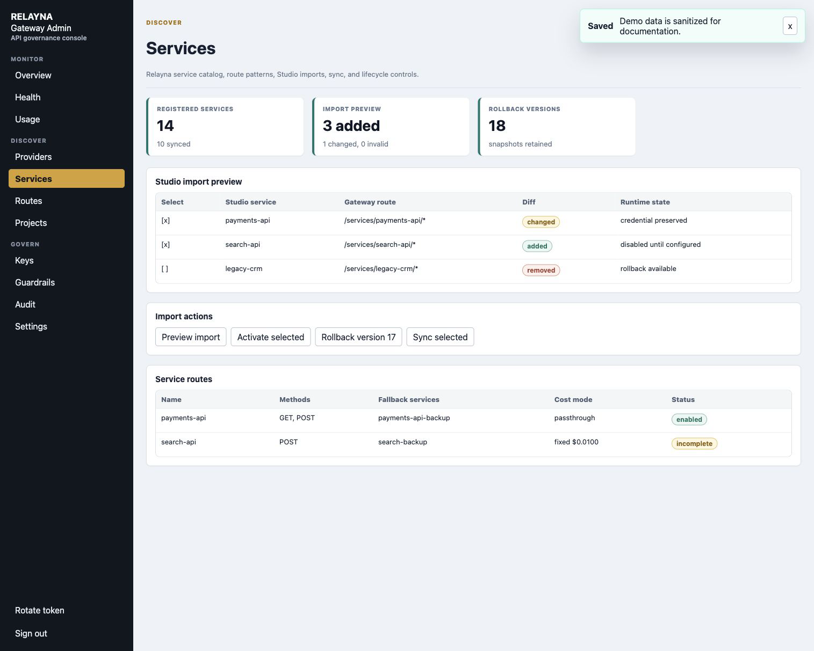
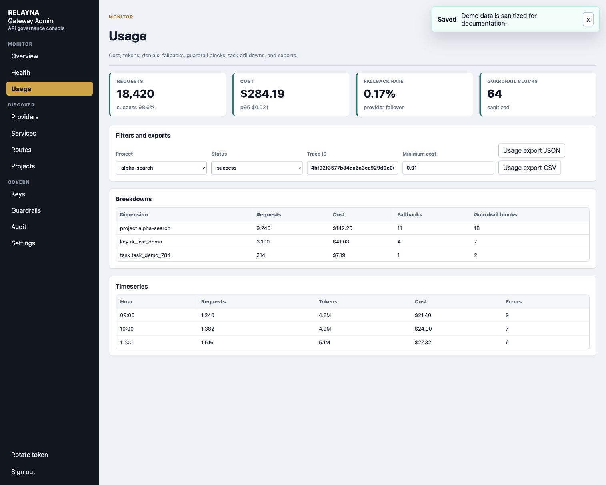

# Current Feature Highlights

This page summarizes the `v0.1.0` feature set added after the `v0.0.14`
production freeze baseline.

Screenshots on this page use sanitized seeded demo data captured from a local
Admin UI 2.0 rendering. They are meant to show workflow shape, not live
customer, provider, token, or prompt data.

## Admin UI 2.0

Admin UI 2.0 turns the embedded portal into a denser operator console for
governing AI traffic. The UI is still served from `/admin-ui`, with the static
asset contract preserved at `/admin-ui/app.js` and `/admin-ui/app.css`, but the
source of truth is now the Vite and TypeScript package in
`crates/gateway-api/admin-ui`.

The navigation is grouped by the operator jobs it supports:

- Monitor: overview, health, usage, debug bundles, and operational status.
- Discover: providers, services, routes, and projects.
- Govern: keys, guardrails, audit, and settings.

The redesign adds reusable design-system tokens and components, compact panels,
wide-table scrolling, responsive layouts, and floating message boxes for async
action results. The Rust binary still embeds generated assets, so production
deployments do not need a separate frontend service.

## Operator Governance

Operator tokens now carry roles and scopes. Bootstrap and rotated owner tokens
keep the existing `op_live_` token format, use role `owner`, and receive
wildcard scope `*`. Narrower tokens can be limited to capability strings such
as `keys:create`, `keys:disable`, `policies:update`, `usage:read`,
`usage:export`, `providers:update`, `services:update`, `settings:update`,
`operators:manage`, and `audit:read`.

Admin APIs fail closed with `insufficient_operator_scope` when a valid token
lacks the required scope. Mutating admin operations write append-only audit
events that include actor token ID, action, target, request metadata, and
redacted before/after snapshots.

## Policy Governance

Virtual-key governance now includes safer key creation presets, lifecycle
metadata, policy versioning, policy simulation, and inherited policy layers.
Operators can dry-run route, model, provider, streaming, tools, request-size,
and response-size inputs before issuing or changing a key.

Effective policy is resolved from global, project, team, key, route, and model
layers when context is available. Layers use neutral defaults so an empty layer
does not accidentally narrow access. Explicit deny wins, allowlists intersect,
and lower-level limits can only become stricter. Request and response byte
limits return stable `request_body_too_large` and `response_body_too_large`
error codes with HTTP 413.

## Provider Intelligence

Provider intelligence adds framework-agnostic routing decisions, health state,
circuit breaker state, fallback traces, and debug bundles. Supported routing
strategies include priority, weighted, least-latency, least-cost, health-aware,
budget-aware, region-affinity, and capability-aware selection.

Fallback remains conservative. Gateway retries only configured safe HTTP status
classes and timeout classes, strips client credentials before upstream calls,
and fails closed when provider state is ambiguous. Debug bundles are keyed by
request ID and store route, provider, policy, guardrail, latency, fallback, and
bounded request/response hash data without raw prompts, raw responses, bearer
tokens, provider credentials, or LiteLLM credentials.

Service import workflows now support preview, activation, version history, and
rollback. Gateway preserves local runtime-owned settings such as credentials,
enabled state, route overrides, limits, fallback services, project links, and
cost settings when Studio metadata is re-imported.

See [Provider Intelligence](provider-intelligence.md) for the deeper routing,
fallback, health, debug bundle, and import rollback reference.

## Observability Analytics

Usage analytics now expose richer filters, breakdowns, timeseries rows, unused
key detection, task drilldowns, and JSON/CSV export paths. Filters include time
range, project, key, route, provider, service, task ID, run ID, model, status,
trace ID, and minimum cost.

Usage events and debug bundles can store W3C trace IDs so operators can move
from Studio analytics to gateway logs or provider traces without exposing raw
keys or prompts. CSV exports neutralize spreadsheet formula prefixes before
escaping cells.

Prometheus output also gained bounded operational labels and metrics for
request dimensions, upstream latency, first-token latency, denials, provider
fallbacks, active streams, and circuit breaker state. Metrics intentionally do
not use request IDs, trace IDs, raw keys, prompt text, raw paths, or unbounded
model/user values as labels.

## Supply Chain and Deployment Hardening

The `v0.1.0` release hardens CI and release workflows with strict dependency,
secret, static-analysis, filesystem, and image checks. Release images publish
with SBOM, signature, and provenance artifacts, and release metadata validation
guards tag, workspace version, and changelog alignment.

The Kubernetes example now defaults to restricted pod security settings:
non-root UID/GID `10001`, read-only root filesystem, default seccomp profile,
no privilege escalation, and all Linux capabilities dropped. Proxy and control
plane Services remain separate, and the control plane should stay private or
protected by identity-aware access.

The v0.0.14 freeze perimeter test pins the production baseline for public
routes, admin route inventory, error codes, config names, migrations, Redis key
formats, release metadata, and Admin UI endpoint assumptions. Future changes
should keep that perimeter passing unless a compatibility decision explicitly
updates it.
