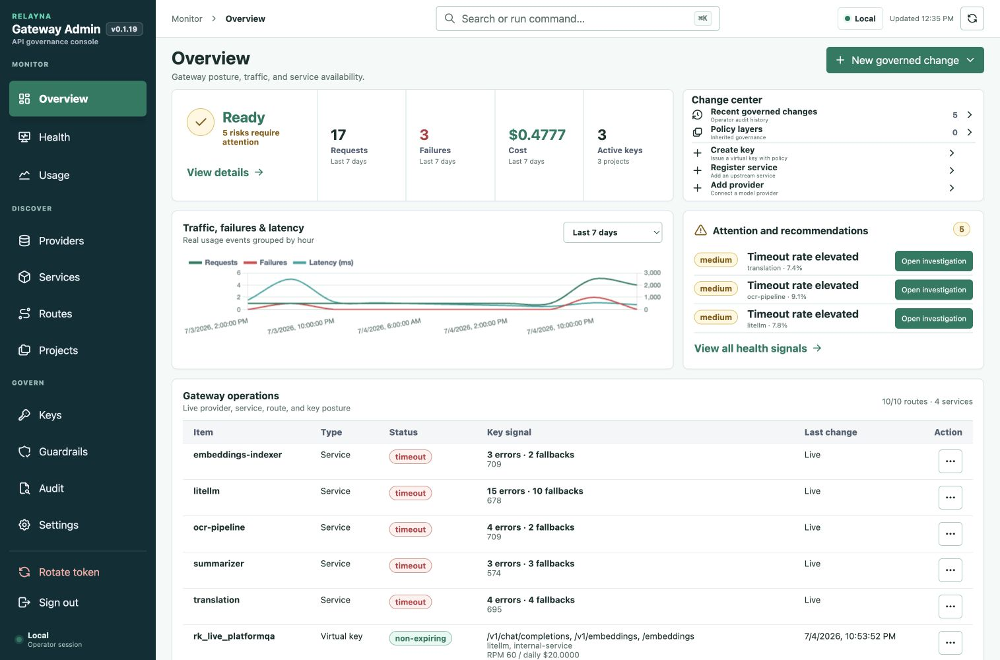
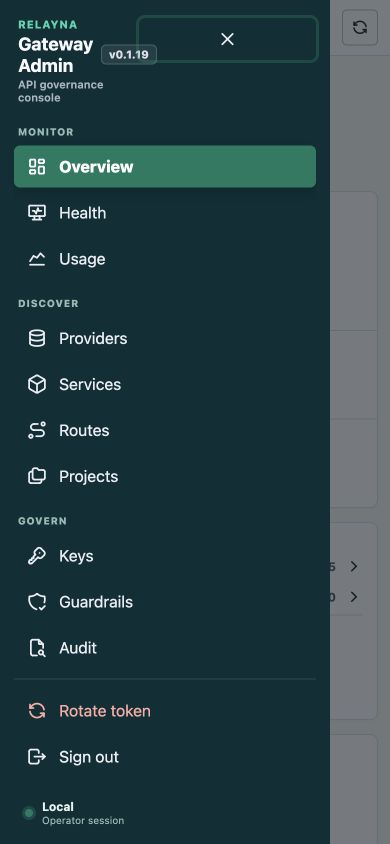
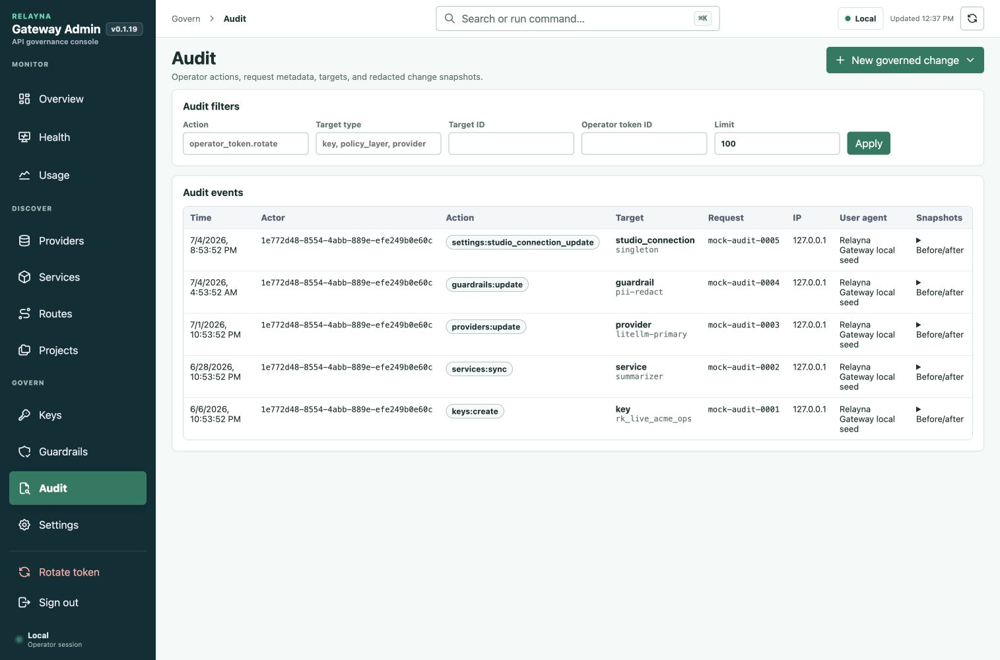
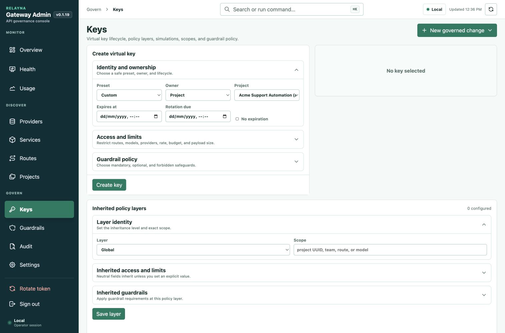
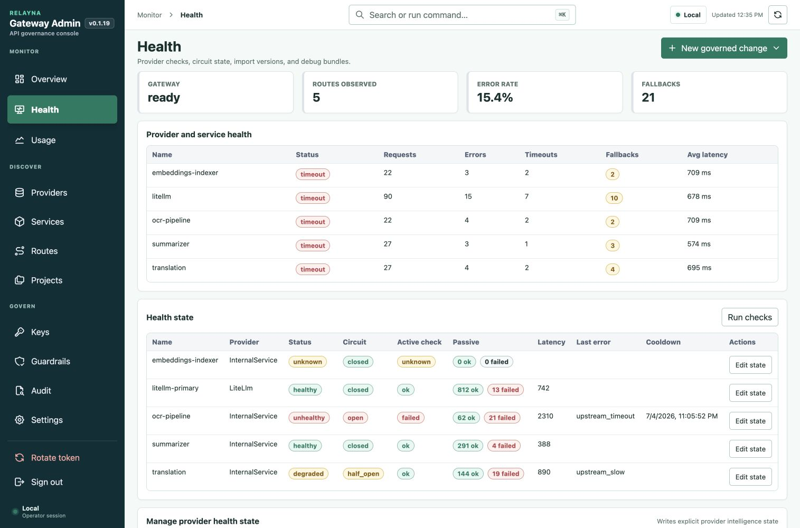
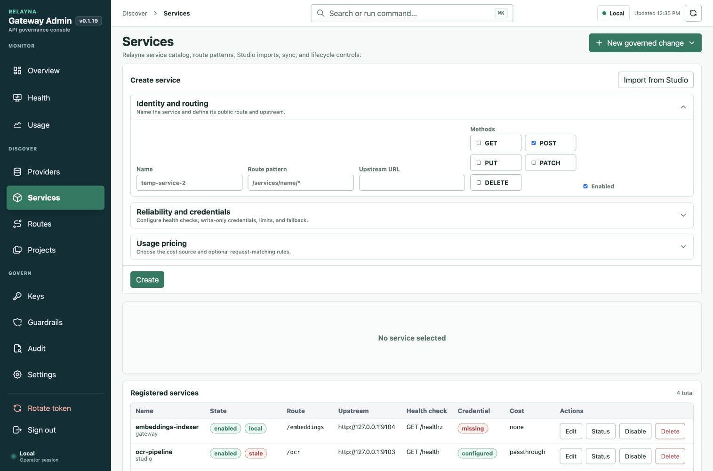
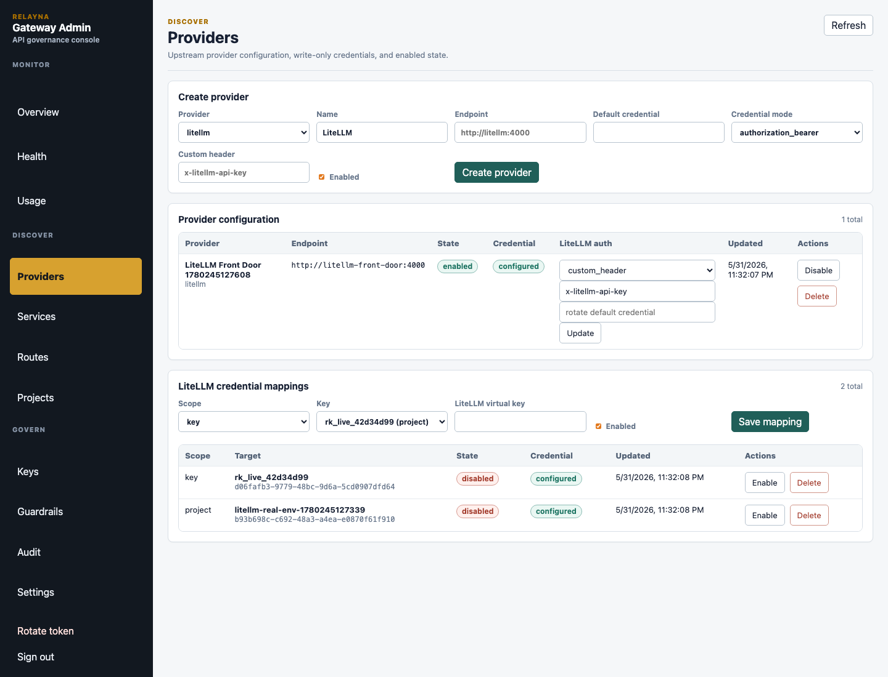
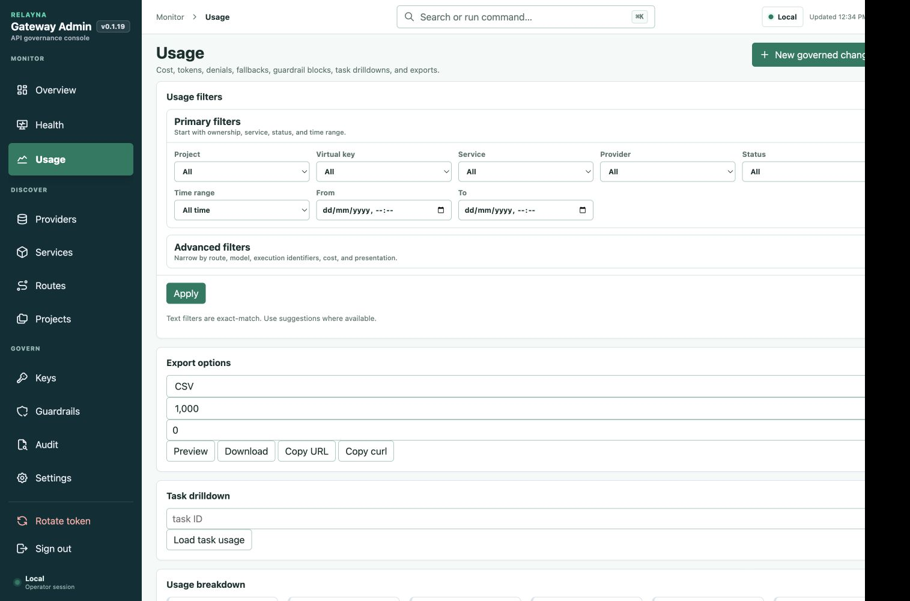

# Current Feature Highlights

This page summarizes the `v0.1.25` feature set.

Screenshots on this page use sanitized seeded demo data captured from a local
Admin UI 2.0 rendering. They are meant to show workflow shape, not live
customer, provider, token, or prompt data.

## Admin UI 2.0

Admin UI 2.0 turns the embedded portal into a compact operator console for
governing AI traffic. The Aurora Teal redesign introduced in `v0.1.19` remains
the visual foundation in `v0.1.25`, including a live Overview with usage
charts, gateway posture, provider-health attention signals, recent operations,
and governed-change shortcuts backed by existing Admin APIs. The UI is still
served from
`/admin-ui`, with the static asset contract preserved at `/admin-ui/app.js` and
`/admin-ui/app.css`, but the source of truth is the Vite and TypeScript package
in `crates/gateway-api/admin-ui`.

Administrator navigation is grouped by the operator jobs it supports:

- Monitor: overview, health, usage, debug bundles, and operational status.
- Discover: providers, services, routes, and projects.
- Govern: keys, guardrails, audit, and settings.

## Entra Portal and Service Ownership

Administrators and registered service owners can sign in with Microsoft Entra
through a confidential-client OIDC BFF flow. Entra identity tokens stay on the
server; the browser receives an opaque HttpOnly session and uses a
session-bound CSRF token for mutations. First-time users remain pending until
an administrator approves them. On first deployment, the ConfigMap may
bootstrap administrators only when the verified tenant, immutable Entra object
ID, and email match configured allowlists. The confidential client signs PS256
`private_key_jwt` assertions with a mounted certificate instead of using a
client secret.

Administrators can assign exact Owner or Viewer access from **Members** and can
register managed identities for workload monitoring. Service owners see only
**My services** and **Service dashboard**, with scoped usage, failures,
sanitized request logs, endpoint breakdowns, and exports for their assigned
services. Server-side membership and workload-binding checks enforce the same
boundary for `/owner/v1/services/{service_name}/*` APIs.

The service dashboard charts error rate and P95 latency, marks validated
service-version transitions at the time Gateway first observes them, and keeps
a usage table fallback. Owners can choose 6-hour, 24-hour, or 7-day windows;
filter All, Success, or Failure outcomes and exact HTTP status codes; page
through results; and open sanitized request details. Details include an
optional redacted debug bundle and remain useful when no bundle was captured.

Existing operator tokens remain available under **Emergency operator access**
for first-administrator bootstrap and recovery. Pending or blocked members can
also sign out and switch accounts without clearing browser cookies manually.
See [Entra Portal and Service-owner Monitoring](operations/entra-portal-and-owner-monitoring.md)
for deployment configuration and local personas, and
[Entra Integration Requirements](operations/entra-integration-requirements.md)
for the DevOps application, role, identity, and certificate handoff.

The redesign adds reusable design-system tokens and components, command
navigation, hash-backed deep links, accessible modal focus handling, compact
panels, progressive disclosure for long forms, wide-table scrolling,
responsive drawer navigation, and floating message boxes for async action
results. The Rust binary still embeds generated assets, so production
deployments do not need a separate frontend service.

Registered services can preview and sync OpenAPI 3.x JSON from a same-origin
relative path such as `/openapi.json`. The service editor displays the durable
endpoint catalog and lets operators assign `none`, `fixed`, or `passthrough`
billing per method/path operation. Relayna runtime, status, events, DLQ,
failed-task, execution, and health endpoints default to `none`, while billable
service endpoints inherit the service default and retain body selector
overrides. Discovery is an audited control-plane workflow with no redirects,
credential forwarding, external reference fetching, or request-path
dependency.

See [OpenAPI Service Import and Endpoint Pricing](openapi-service-pricing.md)
for preview/sync API examples, cost precedence, multipart OCR selectors,
budget ceilings, drift handling, and security requirements.

## Operator Governance

Operator tokens now carry roles and scopes. Bootstrap and rotated owner tokens
keep the existing `op_live_` token format, use role `owner`, and receive
wildcard scope `*`. Narrower tokens can be limited to capability strings such
as `keys:create`, `keys:disable`, `policies:update`, `usage:read`,
`usage:export`, `providers:update`, `services:update`, `settings:update`,
`operators:manage`, and `audit:read`.

Admin APIs fail closed with `insufficient_operator_scope` when a valid token
lacks the required scope. Mutating admin operations write append-only audit
events that include actor token ID, action, target, request metadata, and
redacted before/after snapshots.

## Policy Governance

Virtual-key governance now includes safer key creation presets, lifecycle
metadata, policy versioning, policy simulation, and inherited policy layers.
Operators can dry-run route, model, provider, streaming, tools, request-size,
and response-size inputs before issuing or changing a key.

Policy simulation also accepts explicit registered-service context
so operators can dry-run `/services/<service-name>/*` access against stored keys
and service allowlists before issuing or editing credentials. The Admin UI
requires concrete paths that match the selected service route pattern, such as
`/translation` or `/services/service-name/test`, and blocks mismatched service
selections before running a simulation.

Effective policy is resolved from global, project, team, key, route, and model
layers when context is available. Layers use neutral defaults so an empty layer
does not accidentally narrow access. Explicit deny wins, allowlists intersect,
and lower-level limits can only become stricter. Request and response byte
limits return stable `request_body_too_large` and `response_body_too_large`
error codes with HTTP 413.

## Provider Intelligence

Provider intelligence adds framework-agnostic routing decisions, health state,
circuit breaker state, fallback traces, and debug bundles. Supported routing
strategies include priority, weighted, least-latency, least-cost, health-aware,
budget-aware, region-affinity, and capability-aware selection.

Fallback remains conservative. Gateway retries only configured safe HTTP status
classes and timeout classes, strips client credentials before upstream calls,
and fails closed when provider state is ambiguous. Debug bundles are keyed by
request ID and store route, provider, policy, guardrail, latency, fallback, and
bounded request/response hash data without raw prompts, raw responses, bearer
tokens, provider credentials, or LiteLLM credentials.

Service import workflows now support preview, activation, version history, and
rollback. Gateway preserves local runtime-owned settings such as credentials,
enabled state, route overrides, limits, fallback services, project links, and
cost settings when Studio metadata is re-imported.

Service health checks can target a service-specific path and method
when the upstream root is not a valid health endpoint. The previous root probe
remains the default for services without explicit health-check settings.

Registered service rows in Routes now expose the persisted service timeout
inline. Operators with `services:update` can save values from 1 through 600000
milliseconds through the existing service PATCH API, and the same value is
shown in Services and preserved across Studio re-imports. A timeout before
response headers are committed returns the stable JSON `upstream_timeout`
error with HTTP 504. A timeout after a stream commits leaves the original
response status intact and records terminal timeout evidence in the request
debug bundle.

Service cost overrides now use structured pricing-rule rows instead of raw JSON
textareas. Operators can configure a rule name, JSON Pointer selector, match
value, cost mode, and optional estimated cost in the Services form. The stored
API payload still uses `pricing_rules` with `json_pointer` fields; a top-level
request key such as `model` is selected as `/model`, while nested request data
such as `payload.page_count` is selected as `/payload/page_count`.

The same rules support `multipart/form-data` service requests. Non-file UTF-8
form fields are exposed as top-level string selectors, so `/engine` matches an
`engine=docint` form field while uploaded files remain excluded from pricing
metadata. Preflight cost policy and budget reservation use the highest fixed
service or rule estimate and final accounting reconciles to the matched rule.

See [Provider Intelligence](provider-intelligence.md) for the deeper routing,
fallback, health, debug bundle, and import rollback reference.

## Entra ID Front-Door Auth

Release `0.1.7` includes opt-in Microsoft Entra ID authorization before Relayna
virtual-key authentication on provider traffic. Existing virtual-key-only
clients continue using `Authorization: Bearer rk_live_...` when
`ENTRA_AUTH_ENABLED=false`. When Entra mode is enabled, `Authorization` carries
the Entra access token and the Relayna virtual key moves to the configured
Relayna key header, defaulting to `X-Relayna-Key`.

Gateway validates OIDC metadata, JWKS, token signature, `kid`, accepted
algorithm, issuer, audience, tenant, token version, timestamps, required
scope, required role, and allowed groups before virtual-key lookup. Group
overage and ambiguous authorization fail closed. Client tokens and Relayna keys
are stripped before upstream forwarding.

Apigee deployments can either forward the original JWT for Gateway
revalidation or use the trusted signed-header path with
`APIGEE_TRUSTED_HEADER_ENABLED=true` and an HMAC proof. Unsigned or tampered
Apigee identity headers are rejected.

The Admin portal Settings page can now manage the same Entra ID and Apigee
front-door controls that can be supplied by deployment environment variables:
enablement, tenant, audience, issuer, OIDC discovery, scope, role, group
allowlist, accepted algorithms, JWKS cache TTL, clock skew, Relayna key header,
and write-only Apigee secret management.

See [Entra ID Auth](entra-id-auth.md) and
[Apigee Gateway Path](apigee-gateway-path.md) for the detailed operator
contracts.

## LiteLLM OpenAI-Compatible And Wildcard Passthrough

Release `0.1.25` lets Gateway sit in front of LiteLLM as the single ingress
target while preserving Relayna-owned identity, policy, and credential
translation for governed traffic. Relayna-owned routes such as `/services/*`,
control-plane routes under `/admin-ui/*`, health, readiness, metrics, and
canonical OpenAI-compatible and Anthropic-compatible routes keep explicit
precedence before wildcard passthrough.
Only unmatched paths that pass the configured LiteLLM passthrough allowlist are
forwarded to LiteLLM.

Canonical OpenAI-compatible routes are still first-class Gateway routes:

- `POST /v1/chat/completions`
- `POST /v1/responses`
- `POST /v1/embeddings`

Canonical Anthropic-compatible routes are also first-class Gateway routes for
Claude and Claude Code clients:

- `POST /v1/messages`
- `POST /v1/messages/count_tokens`
- `GET` and `POST /v1/messages/batches`
- `GET /v1/messages/batches/*`
- `GET /v1/messages/batches/*/results`
- `POST /v1/messages/batches/*/cancel`
- `GET /v1/models`

Each canonical route has a mode in the Routes page under its OpenAI or
Anthropic section, plus timeout, request payload, and response payload limits:

| Mode | Behavior |
| --- | --- |
| `managed_by_gateway` | Current governed behavior. Gateway authenticates the Relayna key, evaluates route/model/provider policy, checks request and token rate limits, checks/reserves budgets, runs configured guardrails, forwards to LiteLLM or direct providers, and records full usage when response accounting data is available. |
| `direct_litellm_passthrough` | Relayna `rk_live_...` bearer keys keep the Gateway-authenticated path: route enablement, policy, model/provider allowlists, rate limits, budgets, credential stripping/injection, and status-only usage. Non-Relayna `Authorization: Bearer ...` credentials bypass Relayna key lookup and are delegated to LiteLLM using the configured upstream credential header. Guardrail body rewriting and token accounting are bypassed. |

Route limits default to `timeout_ms = 120000`,
`max_request_body_bytes = 1048576`, and
`max_response_body_bytes = 1048576`. Operators can raise them for long-context
direct passthrough traffic such as Codex `/v1/responses`, while virtual-key and
policy-layer request/response byte limits can remain stricter for individual
keys.

Wildcard LiteLLM passthrough is configured from Providers. It is disabled by
default. When enabled, the safe default allowlist is `/v1/*` for `GET` and
`POST`, which covers LiteLLM-compatible API endpoints such as `/v1/models`
without opening Relayna service/control routes. Gateway preserves the original
LiteLLM path and query string for wildcard traffic. Wildcard passthrough also
has timeout, request byte, and response byte settings with the same defaults
and upper bounds as canonical direct passthrough routes.

Sensitive LiteLLM paths require explicit exposure decisions:

| Exposure value | Meaning |
| --- | --- |
| `disabled` | `/ui` or admin-like LiteLLM paths are blocked even if they appear in `allowed_paths`. This is the default. |
| `operator_only` | The path can be allowlisted, but the proxy request must already have passed the Gateway Entra or trusted Apigee identity layer plus Relayna virtual-key auth. This is intended for identity-aware operator ingress. |
| `explicitly_exposed` | The path can be allowlisted for authenticated Relayna virtual-key clients. Use only behind a deliberate ingress/auth design. |
| `trusted_ingress` | `/ui` support paths can be served to trusted ingress front doors without Relayna credentials for browser workflows. Dashboard/admin API passthrough is allowed only when `ui_exposure` is `trusted_ingress`, `admin_api_exposure` is `explicitly_exposed`, passthrough is enabled, and method/path allowlists match. Other non-ui passthrough paths keep normal Relayna auth requirements. |

Gateway client credentials remain Relayna credentials for governed traffic. When
Entra is disabled, clients use `Authorization: Bearer rk_live_...`. When Entra
is enabled, clients use `Authorization: Bearer <Entra JWT>` plus the configured
Relayna key header. Gateway never forwards those client credentials to LiteLLM.
The direct-mode non-Relayna bearer exception leaves LiteLLM authentication and
authorization to LiteLLM itself.

Operators can manage LiteLLM upstream authentication from Admin portal
Providers. The provider default credential remains write-only, and the
credential header mode can stay on `authorization_bearer` or switch to a
custom header such as `x-litellm-api-key`. Custom headers default to raw
credential values, and operators can set `credential_header_value_format` to
`bearer` for LiteLLM deployments that require `x-litellm-key: Bearer <key>`.

LiteLLM virtual-key mappings can be scoped to a Relayna key or a project.
Gateway resolves LiteLLM credentials by Relayna key mapping, then project
mapping, then active provider default credential, and finally the
`LITELLM_SERVICE_KEY` startup fallback when no active provider config overrides
it. Secrets are write-only in Admin API responses, audit snapshots, and the
portal.

The real LiteLLM verification harness under
`internal/test-reports/litellm-real-passthrough` exercises canonical managed
and direct route modes, Anthropic `/v1/messages` direct passthrough, wildcard
`/v1/models?source=wildcard`, path/query preservation, sensitive `/ui` blocking
by default, client credential stripping, LiteLLM custom-header injection,
direct LiteLLM bearer delegation, and trusted-ingress dashboard/admin
passthrough against a real `litellm/litellm` container.

## Memory-Safe Body Processing

Release `0.1.25` bounds complete request and response buffering with one
process-wide admission controller. By default, at most eight managed requests
or post-call responses may retain complete bodies, and their aggregate
serialized reservations may not exceed 512 MiB. Operators can tune these
limits with `GATEWAY_MAX_BUFFERED_REQUESTS` and
`GATEWAY_MAX_INFLIGHT_BUFFER_BYTES`; admission exhaustion returns the stable,
retryable `503 gateway_overloaded` response before forwarding begins or
downstream response headers are committed.

Managed JSON analysis now reads only the top-level routing, policy, and usage
metadata it needs instead of repeatedly materializing ignored payload fields.
When guardrails require a JSON document, Gateway reuses the existing parsed
value. Unchanged buffered bodies are moved into Pingora without another
full-body copy.

Registered non-JSON service requests stream directly when neither pricing nor
effective pre-call guardrails depend on the complete body. Route byte limits
remain enforced incrementally, and requests that require complete inspection
continue through bounded buffering. Prometheus metrics report current buffered
requests and bytes plus admission rejections without high-cardinality labels.

## Observability Analytics

Usage analytics now expose richer filters, breakdowns, timeseries rows, unused
key detection, task drilldowns, and JSON/CSV export paths. Registered-service
requests record uppercase HTTP method, query-free concrete path, and the
most-specific synced OpenAPI template independently of pricing. The endpoint
breakdown groups rows as `METHOD /path`, using the template when matched and
the concrete path otherwise; historical rows without endpoint metadata and
non-service traffic are excluded. Recent requests,
Timeseries, and Service timeseries each page independently so operators can
inspect large usage logs without rendering every row at once. Filters include
time range, project, key, route, provider, service, HTTP method, effective
endpoint, numeric status code, task ID, run ID, model, status, trace ID, and
minimum cost.

Every authenticated routed status of 400 or greater counts as an endpoint
failure regardless of whether Gateway enforcement or the upstream produced it.
Usage events and debug bundles can store W3C trace IDs so operators can move
from Studio analytics to gateway logs or provider traces without exposing raw
keys or prompts. Endpoint metadata never contains query strings, credentials,
bodies, or prompt data. CSV exports neutralize spreadsheet formula prefixes
before escaping cells.

Prometheus output also gained bounded operational labels and metrics for
request dimensions, upstream latency, first-token latency, denials, provider
fallbacks, active streams, and circuit breaker state. Metrics intentionally do
not use request IDs, trace IDs, raw keys, prompt text, raw paths, or unbounded
model/user values as labels.

## Supply Chain and Deployment Hardening

The `v0.1.25` release retains CI and release workflow hardening with strict
dependency, secret, static-analysis, filesystem, and image checks. Release
images publish with SBOM, signature, and provenance artifacts, and release
metadata validation guards tag, workspace version, and changelog alignment.

The Kubernetes example now defaults to restricted pod security settings:
non-root UID/GID `10001`, read-only root filesystem, default seccomp profile,
no privilege escalation, and all Linux capabilities dropped. Proxy and control
plane Services remain separate, and the control plane should stay private or
protected by identity-aware access.

Release checks cover public routes, admin route inventory, error codes, config
names, migrations, Redis key formats, release metadata, and Admin UI endpoint
assumptions.
