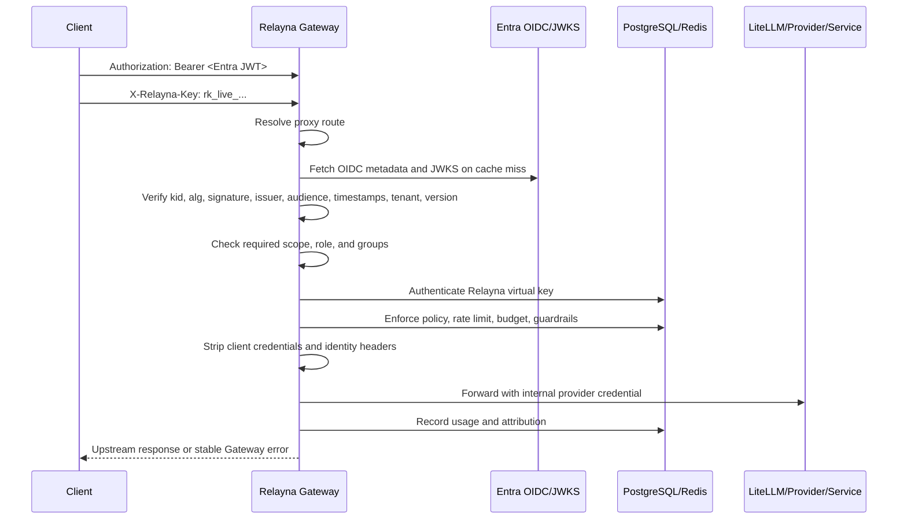

# Microsoft Entra ID Front-Door Auth

Relayna Gateway releases `0.1.7` and later can put Microsoft Entra ID in front of provider
traffic while keeping Relayna virtual keys as the policy, budget, rate-limit,
guardrail, and usage anchor.

The feature is opt-in. With `ENTRA_AUTH_ENABLED=false`, which is the default,
existing clients keep using:

```http
Authorization: Bearer rk_live_...
```

With `ENTRA_AUTH_ENABLED=true`, provider traffic must use a two-credential
contract:

```http
Authorization: Bearer <Entra access token>
X-Relayna-Key: rk_live_...
```

`X-Relayna-Key` is the default Relayna key header. Operators can change it with
`ENTRA_RELAYNA_KEY_HEADER`. Earlier review builds used `X-AIH-API-Key`; Gateway
still strips `X-AIH-API-Key` before upstream forwarding as a legacy sensitive
header, but the documented default is now `X-Relayna-Key`.

## Scope

Entra front-door auth applies to provider/proxy traffic handled by the Pingora
proxy plane:

- `POST /v1/chat/completions`
- `POST /v1/responses`
- `POST /providers/openai/*`
- Built-in internal service routes such as `/summary`, `/translation`, `/ocr`,
  and `/embeddings`
- Registered service wildcard routes under `/services/<service-name>/*`

The control plane remains protected by operator tokens on `/admin-ui/*`.
Entra front-door auth does not replace `GATEWAY_ADMIN_TOKEN` or scoped operator
tokens.

## Why Two Credentials

Entra and Relayna keys answer different questions.

| Layer | Credential | Purpose |
| --- | --- | --- |
| Enterprise front door | Entra access token | Proves tenant identity, application identity, user identity, scope, role, and group entitlement. |
| Relayna control plane | Relayna virtual key | Selects project, owner, policy, route permissions, model permissions, rate limits, budgets, guardrails, and usage attribution. |

This lets enterprise identity teams manage tenant-level access without giving
up Relayna's per-project metering and policy controls.

## Request Flow



## Configuration

Front-door auth can be configured from the Admin portal Settings page or from
deployment environment variables. Admin-saved settings are useful for operator
changes after deployment; environment variables remain useful for bootstrap,
GitOps, and immutable deployments. See [Admin Portal](admin-portal.md) for the
field-by-field UI walkthrough and screenshots.

The environment variables are listed below. Empty strings are treated as unset.

| Variable | Required | Default | Description |
| --- | --- | --- | --- |
| `ENTRA_AUTH_ENABLED` | No | `false` | Enables direct Entra JWT validation for proxy traffic. |
| `ENTRA_TENANT_ID` | When enabled | none | Expected `tid` claim. Use the tenant GUID or tenant identifier your app tokens carry. |
| `ENTRA_AUDIENCE` | When enabled | none | Expected `aud` claim for the Gateway API registration, for example `api://relayna-gateway`. |
| `ENTRA_ISSUER` | When enabled | none | Expected token issuer. For v2 tokens this is usually `https://login.microsoftonline.com/<tenant-id>/v2.0`. |
| `ENTRA_OIDC_DISCOVERY_URL` | When enabled | none | OIDC metadata URL that returns `issuer` and `jwks_uri`. |
| `ENTRA_REQUIRED_SCOPE` | No | none | Optional required delegated scope from the `scp` claim. |
| `ENTRA_REQUIRED_ROLE` | No | none | Optional required app role from the `roles` claim. |
| `ENTRA_ALLOWED_GROUPS` | No | none | Optional comma-separated group IDs. At least one must appear in `groups`. |
| `ENTRA_ACCEPTED_ALGORITHMS` | No | `RS256` | Comma-separated accepted JWT algorithms. Gateway currently validates RSA JWKS keys. |
| `ENTRA_RELAYNA_KEY_HEADER` | No | `X-Relayna-Key` | Header that carries the Relayna `rk_live_...` key in Entra and Apigee modes. |
| `ENTRA_JWKS_CACHE_TTL_SECONDS` | No | `300` | JWKS cache lifetime. Unknown `kid` triggers a refresh before failing. |
| `ENTRA_CLOCK_SKEW_SECONDS` | No | `60` | Allowed clock skew for `exp`, `nbf`, and `iat`. |

Minimal direct Entra configuration:

```bash
export ENTRA_AUTH_ENABLED="true"
export ENTRA_TENANT_ID="00000000-0000-0000-0000-000000000000"
export ENTRA_AUDIENCE="api://relayna-gateway"
export ENTRA_ISSUER="https://login.microsoftonline.com/00000000-0000-0000-0000-000000000000/v2.0"
export ENTRA_OIDC_DISCOVERY_URL="https://login.microsoftonline.com/00000000-0000-0000-0000-000000000000/v2.0/.well-known/openid-configuration"
export ENTRA_REQUIRED_SCOPE="gateway.invoke"
export ENTRA_RELAYNA_KEY_HEADER="X-Relayna-Key"
```

Application-role configuration:

```bash
export ENTRA_AUTH_ENABLED="true"
export ENTRA_TENANT_ID="00000000-0000-0000-0000-000000000000"
export ENTRA_AUDIENCE="api://relayna-gateway"
export ENTRA_ISSUER="https://login.microsoftonline.com/00000000-0000-0000-0000-000000000000/v2.0"
export ENTRA_OIDC_DISCOVERY_URL="https://login.microsoftonline.com/00000000-0000-0000-0000-000000000000/v2.0/.well-known/openid-configuration"
export ENTRA_REQUIRED_ROLE="Gateway.Invoke"
```

Group allowlist configuration:

```bash
export ENTRA_AUTH_ENABLED="true"
export ENTRA_ALLOWED_GROUPS="11111111-1111-1111-1111-111111111111,22222222-2222-2222-2222-222222222222"
```

## Client Contract

When Entra mode is enabled, a successful proxy request needs both credentials:

```bash
curl -sS http://127.0.0.1:8080/v1/chat/completions \
  -H "Authorization: Bearer $ENTRA_ACCESS_TOKEN" \
  -H "X-Relayna-Key: $RELAYNA_VIRTUAL_KEY" \
  -H "Content-Type: application/json" \
  -d '{
    "model": "gpt-4o-mini",
    "messages": [{"role": "user", "content": "Say hello"}]
  }'
```

If `ENTRA_RELAYNA_KEY_HEADER` is set to another valid HTTP header name, clients
must use that header instead:

```bash
export ENTRA_RELAYNA_KEY_HEADER="X-Company-Relayna-Key"

curl -sS http://127.0.0.1:8080/v1/responses \
  -H "Authorization: Bearer $ENTRA_ACCESS_TOKEN" \
  -H "X-Company-Relayna-Key: $RELAYNA_VIRTUAL_KEY" \
  -H "Content-Type: application/json" \
  -d '{"model":"gpt-4o-mini","input":"Summarize this request"}'
```

Do not send the Relayna key in `Authorization` while Entra mode is enabled.
`Authorization` is reserved for the Entra JWT in this mode.

## Validation Behavior

Gateway validates the token and claims before it looks up the Relayna virtual
key. This prevents invalid enterprise identities from consuming virtual-key,
policy, rate-limit, or budget resources.

Direct JWT validation checks:

- `Authorization` exists and uses the `Bearer ` scheme.
- JWT header is parseable.
- `kid` exists.
- `alg` is in `ENTRA_ACCEPTED_ALGORITHMS`.
- OIDC metadata fetch succeeds.
- OIDC metadata `issuer` equals `ENTRA_ISSUER`.
- JWKS fetch succeeds and contains a matching `kid`.
- JWKS key type is RSA.
- JWKS key `alg`, when present, matches the JWT header algorithm.
- Signature validates against JWKS modulus and exponent.
- `iss` equals `ENTRA_ISSUER`.
- `tid` equals `ENTRA_TENANT_ID`.
- `aud` contains `ENTRA_AUDIENCE`.
- `exp` is not expired after allowed clock skew.
- `nbf`, when present, is not in the future after allowed clock skew.
- `iat`, when present, is not in the future after allowed clock skew.
- `ver` is `1.0` or `2.0`.
- Group overage claims fail closed.
- `scp` contains `ENTRA_REQUIRED_SCOPE` when configured.
- `roles` contains `ENTRA_REQUIRED_ROLE` when configured.
- `groups` intersects `ENTRA_ALLOWED_GROUPS` when configured.

The sanitized identity context can include tenant ID, subject, object ID, app
ID, authorized party, scopes, roles, groups, token version, and source. Gateway
does not retain or forward the raw Entra JWT.

## Stable Error Codes

Entra failures use stable Gateway error codes:

| Error code | Typical cause |
| --- | --- |
| `missing_entra_authorization` | Entra mode is enabled but no `Authorization` header is present. |
| `malformed_entra_authorization` | Header is not `Bearer <token>` or token header cannot be parsed. |
| `invalid_entra_token` | Unknown `kid`, invalid signature, unsupported algorithm, invalid JWKS, invalid `nbf`/`iat`, unsupported token version, or malformed token body. |
| `expired_entra_token` | `exp` is expired after clock skew. |
| `invalid_entra_audience` | `aud` does not contain `ENTRA_AUDIENCE`. |
| `invalid_entra_issuer` | `iss`, `tid`, or OIDC metadata issuer does not match config. |
| `insufficient_entra_authorization` | Missing required scope, role, or group, or token uses group overage. |
| `missing_authorization` | Entra passed, but the configured Relayna key header is missing. |
| `invalid_virtual_key`, `disabled_virtual_key`, `revoked_virtual_key`, `expired_virtual_key` | Entra passed, but Relayna key validation failed under existing rules. |

## Header Stripping

Gateway strips client credentials before forwarding to LiteLLM, direct
providers, and registered services:

- `Authorization`
- The configured `ENTRA_RELAYNA_KEY_HEADER`
- `X-Relayna-Key`
- `X-AIH-API-Key`
- `Proxy-Authorization`
- `X-Apigee-Entra-Identity`
- `X-Apigee-Entra-Signature`

Provider credentials are injected only from Gateway-owned configuration or
service registration data.

## Route Behavior

The auth contract is identical across proxy routes. The route resolver still
decides policy, upstream type, body limits, and timeouts after Entra succeeds.

| Route family | Entra behavior |
| --- | --- |
| `/v1/chat/completions` | Entra first, Relayna key second, then existing OpenAI-compatible policy and LiteLLM/direct routing. |
| `/v1/responses` | Same two-step auth and credential stripping. |
| `/providers/openai/*` | Same auth, then direct OpenAI-compatible upstream credential injection. |
| Built-in internal routes | Same auth, then configured internal service credential injection. |
| `/services/<service-name>/*` | Same auth, then service registry lookup, service policy, and registered service upstream credential injection. |

## Kubernetes Rollout

1. Deploy the current Gateway release with Entra disabled first.
2. Confirm the existing `Authorization: Bearer rk_live_...` path still works.
3. Add Entra config to your secret manager or deployment environment.
4. Enable `ENTRA_AUTH_ENABLED=true` on one staging replica.
5. Send requests with `Authorization: Bearer <Entra JWT>` and
   `X-Relayna-Key: rk_live_...`.
6. Confirm invalid JWTs fail before virtual-key validation.
7. Confirm upstream services never receive Entra JWTs or Relayna keys.
8. Roll out to production after rate-limit, budget, policy, and usage
   attribution match the virtual-key-only baseline.

The example Kubernetes manifest keeps Entra disabled by default and includes
empty placeholders for required Entra values.

## Verification Commands

Useful local checks after changing Entra configuration or code:

```bash
python3 scripts/validate-release-metadata.py v0.1.9
node tests/freeze-v0.1.9-perimeter.test.mjs
cargo test -p gateway-core entra::tests --all-features
cargo test -p gateway-proxy relayna_key_header_is_available_for_apigee_only_mode --all-features
cargo test --workspace --all-features
```

For a full real-environment review with Postgres, Redis, Gateway, mock OIDC,
mock Apigee, and mock upstreams:

```bash
internal/test-reports/entra-front-door-real-env/run.sh
```

The harness verifies success and failure cases for direct Entra JWT validation,
configured Relayna key headers, `/v1/chat/completions`, `/v1/responses`,
`/providers/openai/*`, built-in internal service routes, `/services/*`, Apigee
JWT revalidation, trusted Apigee HMAC identity proof, header stripping, and
usage attribution.
