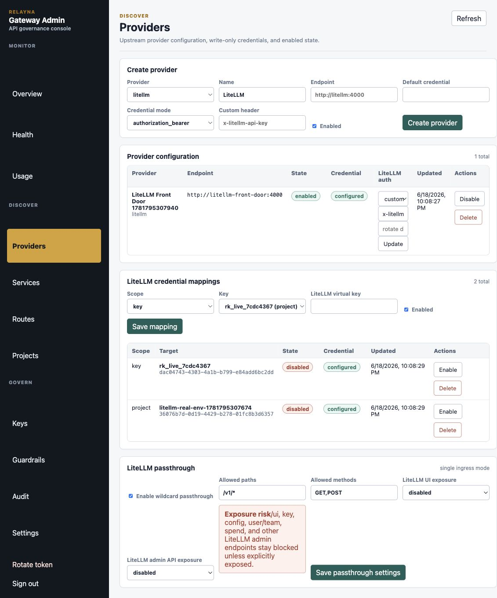
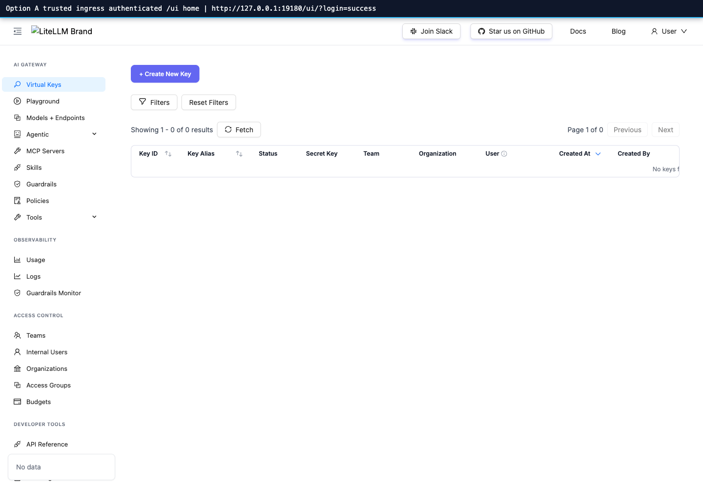
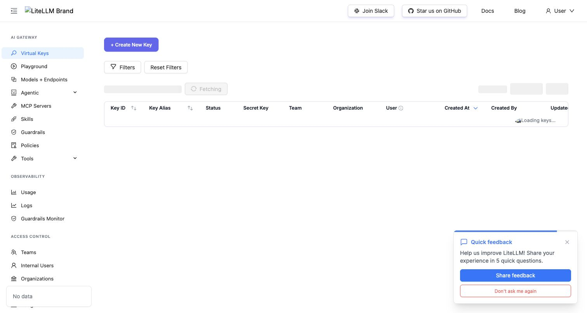
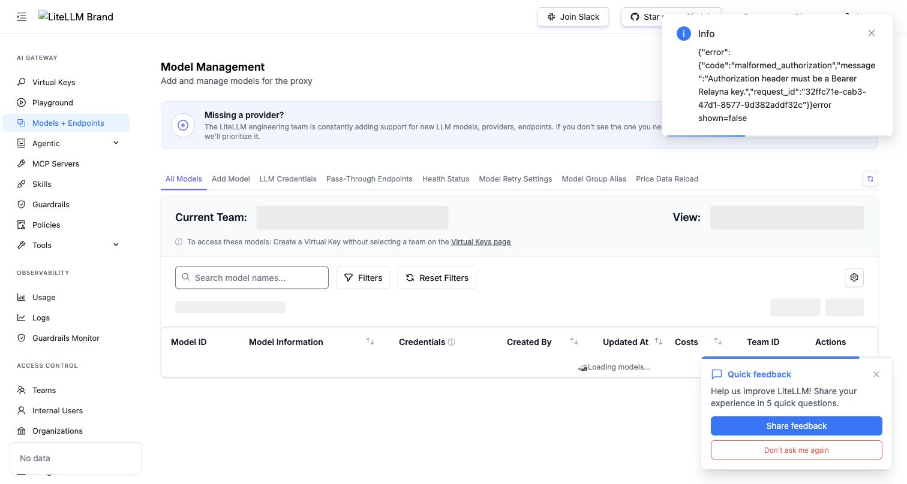

# LiteLLM Passthrough

LiteLLM passthrough lets Relayna Gateway sit in front of LiteLLM as the single
public ingress while keeping Relayna identity, policy, usage, and credential
ownership for governed traffic. Clients normally authenticate to Gateway with
Relayna credentials. Gateway then strips client credentials and injects the
internal LiteLLM credential selected by operator configuration.

This page covers the `0.1.12` behavior.

## Request Model

Gateway-managed traffic never treats a LiteLLM master key or LiteLLM virtual key
as a Relayna client credential. Those keys are upstream credentials managed by
Gateway.

Client request contracts:

| Gateway auth mode | Client headers |
| --- | --- |
| Entra disabled | `Authorization: Bearer <Relayna rk_live_... key>` |
| Entra enabled | `Authorization: Bearer <Entra JWT>` and `X-Relayna-Key: <Relayna rk_live_... key>` unless the Relayna key header has been renamed. |
| Trusted Apigee mode | Signed Apigee identity headers plus the configured Relayna key header. |

Canonical routes set to `direct_litellm_passthrough` have one intentional
exception: a non-Relayna `Authorization: Bearer ...` credential is treated as a
LiteLLM credential and translated to the configured upstream LiteLLM header.
Relayna `rk_live_...` bearer keys are not consumed as LiteLLM credentials; they
continue through the Relayna-authenticated direct passthrough path.

Gateway strips the following before forwarding to LiteLLM:

- `Authorization`
- the configured Relayna key header
- `X-Relayna-Key`
- legacy `X-AIH-API-Key`
- Entra/Apigee identity proof headers
- `Proxy-Authorization`
- `X-API-Key`
- client-supplied LiteLLM credential headers
- worker-token headers

Gateway then injects the resolved LiteLLM credential using the active LiteLLM
provider's header mode and value format:

```http
Authorization: Bearer <resolved LiteLLM credential>
```

or:

```http
x-litellm-api-key: <resolved LiteLLM credential>
x-litellm-key: Bearer <resolved LiteLLM credential>
```

The header name is configurable on the LiteLLM provider row and must pass
Gateway's sensitive-header validation. For custom headers, the
`credential_header_value_format` setting controls whether Gateway sends the raw
credential value or a bearer-prefixed value. The default is `raw` to preserve
existing deployments. Set it to `bearer` for LiteLLM deployments that require a
custom header such as `x-litellm-key: Bearer <key>`.

## Credential Resolution

Gateway resolves LiteLLM credentials in this order:

1. Enabled LiteLLM mapping for the authenticated Relayna key.
2. Enabled LiteLLM mapping for the authenticated key's project.
3. Active LiteLLM provider default credential from `provider_configs`.
4. `LITELLM_SERVICE_KEY` startup fallback.

All LiteLLM credential values are write-only. Admin API responses, audit
snapshots, frontend state, logs, and test reports must show only configured or
missing state, never the raw credential.

## Route Precedence

When a request reaches the proxy listener, routing is evaluated in this order:

1. Relayna service/control/operational routes, where applicable.
2. Registered service routes such as `/services/<service-name>/*`.
3. Canonical OpenAI-compatible routes:
   - `POST /v1/chat/completions`
   - `POST /v1/responses`
   - `POST /v1/embeddings`
4. LiteLLM wildcard passthrough for remaining allowed paths.

This means `/services/*` and the Admin/control API cannot accidentally fall
through to LiteLLM wildcard passthrough.

## Canonical Route Modes

Open the Admin portal Routes page to choose a mode for each canonical
OpenAI-compatible endpoint.

| Mode | Behavior |
| --- | --- |
| `managed_by_gateway` | Full Gateway governance path. Gateway authenticates the Relayna key, checks global route enablement, evaluates policy, enforces model/provider allowlists, checks RPM/TPM and budgets, runs configured guardrails, forwards upstream, and records full usage when accounting data is available. |
| `direct_litellm_passthrough` | Direct LiteLLM forwarding. Relayna bearer keys keep Gateway governance: route enablement, policy, model/provider allowlists, RPM/TPM, budgets, credential stripping/injection, and status-only usage. Non-Relayna bearer credentials bypass Relayna key lookup and are delegated to LiteLLM using the configured upstream credential header. Guardrail body rewriting and token accounting are bypassed. |

Use direct mode when a canonical route must behave closest to LiteLLM. Relayna
keys still preserve Relayna access control and credential isolation; non-Relayna
bearer credentials leave authentication and authorization to LiteLLM.

Example direct LiteLLM bearer call:

```bash
curl -sS -X POST http://127.0.0.1:8080/v1/responses \
  -H "Authorization: Bearer $LITELLM_VIRTUAL_KEY" \
  -H "Content-Type: application/json" \
  --data '{"model":"gpt-4o-mini","input":"hello"}'
```

If the LiteLLM provider header mode is `authorization_bearer`, Gateway forwards
the credential as `Authorization: Bearer <LiteLLM credential>`. If the header
mode is `custom_header`, Gateway removes downstream `Authorization` and forwards
the credential in the configured header name. Custom header values default to
the raw credential, such as `x-litellm-api-key: <credential>`. Set
`credential_header_value_format` to `bearer` when the upstream expects
`x-litellm-key: Bearer <credential>`.

## LiteLLM Passthrough Setup (All Options)

This section documents every LiteLLM passthrough option in one flow.

### 1) Wildcard passthrough option set

In **Providers → LiteLLM passthrough**, set these foundational fields first:

- `Enable wildcard passthrough`: turns on fallback routing once service routes and
  canonical OpenAI routes are not matched.
- `Allowed paths`: array patterns. `/v1/*` and `GET,POST` keep canonical LiteLLM
  discovery/query patterns covered while staying narrow.
- `Allowed methods`: list of HTTP methods that may route to LiteLLM fallback.
- `LiteLLM UI exposure`: controls `/ui` and `/ui` support paths.
- `LiteLLM admin API exposure`: controls admin-like paths (e.g. `/key`, `/user`,
  `/team`, `/config`, `/spend`, `/global`, `/budget`, `/customer`,
  `/organization`).



Recommended safe default when starting:

```json
{
  "enabled": true,
  "allowed_paths": ["/v1/*"],
  "allowed_methods": ["GET", "POST"],
  "ui_exposure": "operator_only",
  "admin_api_exposure": "disabled"
}
```

Wildcard passthrough preserves path and query strings:

`GET /v1/models?source=operator` stays
`GET /v1/models?source=operator` at LiteLLM.

### 2) Canonical route mode options

Canonical route mode is controlled from Routes, not by wildcard settings:

| Route mode | Scope | Effect |
| --- | --- | --- |
| `managed_by_gateway` | `chat-completions`, `responses`, `embeddings` | Full Gateway policy path: full validation, route/model/provider allowlists, budgets/rate limits, guardrails, and standard accounting. |
| `direct_litellm_passthrough` | `chat-completions`, `responses`, `embeddings` | Relayna auth and policy gates remain, but request is forwarded directly to LiteLLM with credential translation and without guardrail rewriting/token accounting. |

Canonical non-matching routes still honor route-mode behavior exactly as before.

### 3) Sensitive exposure options

`allowed_paths` matching these groups are sensitive and need explicit mode
selection:

- `/ui`, `/ui/*`
- `/key`, `/key/*`, `/keys`, `/keys/*`
- `/user`, `/user/*`
- `/team`, `/team/*`
- `/config`, `/config/*`
- `/spend`, `/spend/*`
- `/global`, `/global/*`
- `/budget`, `/budget/*`
- `/customer`, `/customer/*`
- `/organization`, `/organization/*`

Exposure semantics:

| Mode | `ui_exposure` behavior | `admin_api_exposure` behavior |
| --- | --- | --- |
| `disabled` | No `/ui` access. | No admin-like access. |
| `operator_only` | Requires Entra/Apigee identity context plus Relayna virtual-key auth for `/ui` and LiteLLM sensitive paths. | Requires Entra/Apigee identity context plus Relayna virtual-key auth for admin-like paths when allowlist methods/path are met. |
| `explicitly_exposed` | Allows `/ui` for authenticated Relayna virtual-key callers when allowlist methods/path are met. | Allows admin-like paths for authenticated Relayna virtual-key callers when allowlist methods/path are met. |
| `trusted_ingress` | Lets trusted ingress deliver browser-safe `/ui` and support endpoints without Relayna credentials (for example `/ui`, `/models`, `/user/info`, `/login`, `/logout`, `/get_image`, `/litellm/.well-known/litellm-ui-config`). | Not a valid `admin_api_exposure` value. Trusted-ingress admin/dashboard API passthrough is allowed only when `ui_exposure` is `trusted_ingress`, `admin_api_exposure` is `explicitly_exposed`, passthrough is enabled, and the method/path allowlists match. |

`trusted_ingress` should be used only when the network ingress is known, trusted,
and already constrains browser-facing access patterns.

### 4) Two browser access patterns

#### Option A: operator-authenticated UI proxy

For operator-only flows, route browsers through the operator proxy path:

- Keep `ui_exposure` at `operator_only` or `disabled` depending on whether you
  want passthrough only, or operator-only browser-safe exposure.
- `/admin-ui/litellm-ui/...` remains available to operators with a valid
  operator token even when `ui_exposure` is `disabled`.
- Use `GET /admin-ui/litellm-ui/...` in browser address bar.
- This path always requires a valid operator token in `Authorization` headers.

Unauthenticated LiteLLM UI call through this path is rejected; authenticated
calls receive LiteLLM with Gateway-injected credentials.




#### Option B: trusted-ingress passthrough

For AKS ingress / WAF flows that already authenticate browser users:

- Set `ui_exposure` to `trusted_ingress`.
- Keep `admin_api_exposure` at `disabled` unless those endpoints are intentionally
  exposed. If the LiteLLM dashboard must call admin-like API paths directly,
  set `admin_api_exposure` to `explicitly_exposed` and keep the allowlist narrow.
- Retain `allowed_methods` for the exact UI methods your ingress sends.

With `trusted_ingress`, LiteLLM `/ui` and its support endpoints can be opened to
the trusted browser ingress without Relayna headers, while normal non-UI
wildcard paths still require normal Relayna proxy auth behavior.


If the trusted ingress allows sessionless browser transitions, the final UI state
and models listing should look like this:





## Admin API

Read settings:

```bash
curl -sS \
  -H "Authorization: Bearer $GATEWAY_OPERATOR_TOKEN" \
  http://127.0.0.1:8081/admin-ui/admin/providers/litellm-passthrough
```

Enable `/v1/*` wildcard passthrough:

```bash
curl -sS -X PATCH \
  -H "Authorization: Bearer $GATEWAY_OPERATOR_TOKEN" \
  -H "Content-Type: application/json" \
  --data '{
    "enabled": true,
    "allowed_paths": ["/v1/*"],
    "allowed_methods": ["GET", "POST"],
    "ui_exposure": "disabled",
    "admin_api_exposure": "disabled"
  }' \
  http://127.0.0.1:8081/admin-ui/admin/providers/litellm-passthrough
```

Set a canonical route to direct LiteLLM passthrough:

```bash
curl -sS -X PATCH \
  -H "Authorization: Bearer $GATEWAY_OPERATOR_TOKEN" \
  -H "Content-Type: application/json" \
  --data '{"mode":"direct_litellm_passthrough"}' \
  http://127.0.0.1:8081/admin-ui/admin/openai-routes/chat-completions/mode
```

Return it to managed mode:

```bash
curl -sS -X PATCH \
  -H "Authorization: Bearer $GATEWAY_OPERATOR_TOKEN" \
  -H "Content-Type: application/json" \
  --data '{"mode":"managed_by_gateway"}' \
  http://127.0.0.1:8081/admin-ui/admin/openai-routes/chat-completions/mode
```

All mutating calls require operator auth and write audit events.

## Verification

Focused local checks:

```bash
cargo test -p gateway-core route_settings --all-features
cargo test -p gateway-proxy passthrough --all-features
```

Real LiteLLM harness:

```bash
bash internal/test-reports/litellm-real-passthrough/run.sh
```

That harness starts PostgreSQL, Redis, Gateway, a real `litellm/litellm`
container, and the mock upstream provider behind LiteLLM. Gateway connects
directly to LiteLLM, matching production topology. It verifies canonical
managed and direct modes, wildcard `/v1/models` passthrough, `/ui` default
blocking, credential stripping at the downstream mock provider, custom LiteLLM
header injection against real LiteLLM, direct LiteLLM bearer delegation, and
trusted-ingress dashboard/admin passthrough.
