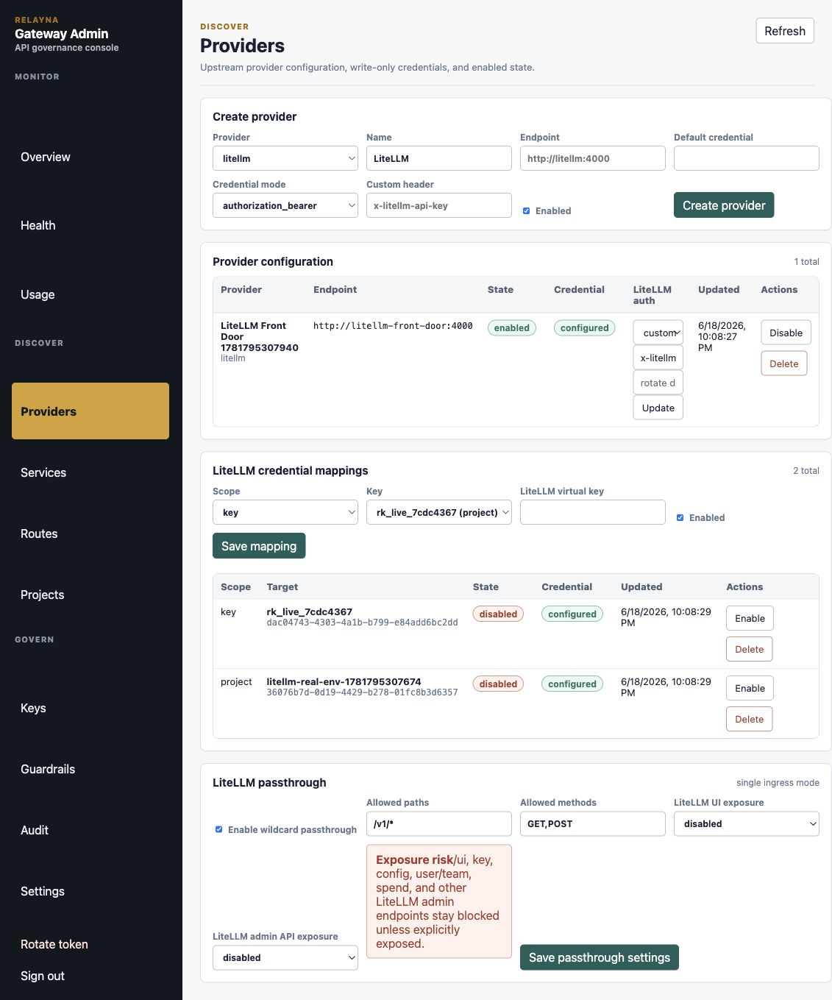
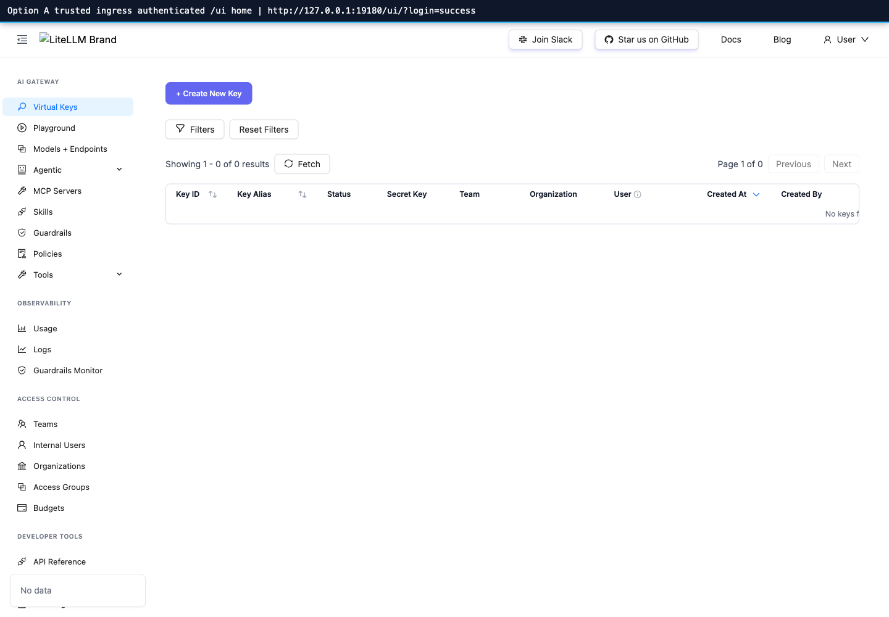
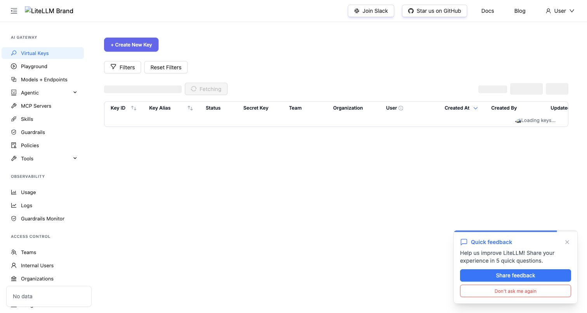
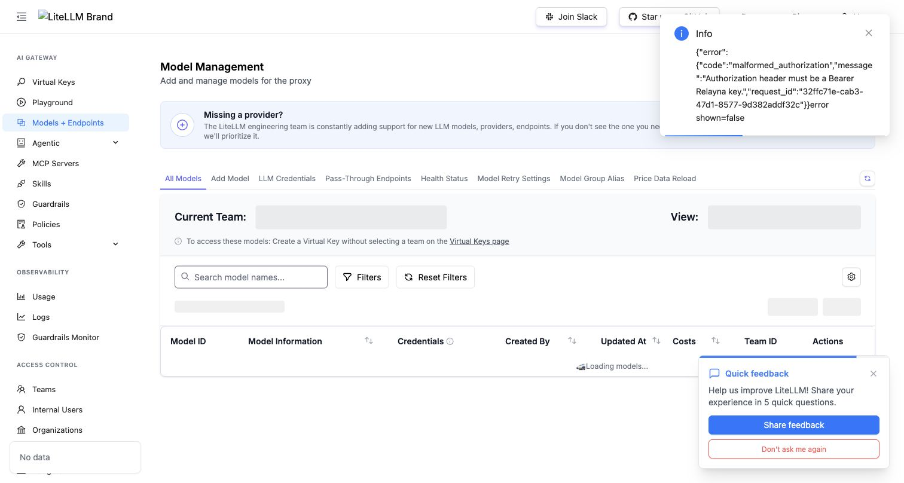

# LiteLLM Passthrough

LiteLLM passthrough lets Relayna Gateway sit in front of LiteLLM as the single
public ingress while keeping Relayna identity, policy, usage, and credential
ownership for governed traffic. Clients normally authenticate to Gateway with
Relayna credentials. Gateway then strips client credentials and injects the
internal LiteLLM credential selected by operator configuration.

This page covers the `0.1.40` behavior.

## Caller-key APIs with the dashboard disabled (0.1.40)

In **Providers → LiteLLM passthrough**, select **Caller LiteLLM key**, disable UI exposure, and explicitly expose the admin API paths you need.
Applications send their existing `Authorization: Bearer <LiteLLM key>`; no Relayna
virtual key is required. LiteLLM alone decides whether that key may call the API.
Gateway never substitutes a mapped key, provider credential or service key, and
never retries an auth failure using a more privileged credential. Header
translation still uses the configured LiteLLM provider header mode. Requests go
only to the configured LiteLLM upstream; Gateway does not follow redirects.

GET/PATCH `/admin-ui/admin/providers/litellm-passthrough` exposes the same fields:

```json
{
  "enabled": true,
  "authentication_mode": "litellm_bearer",
  "ui_exposure": "disabled",
  "admin_api_exposure": "explicitly_exposed",
  "allowed_paths": ["/*"],
  "allowed_methods": ["GET", "POST"],
  "blocked_paths": ["/ui", "/ui/*", "/key/delete", "/config", "/config/*"]
}
```

Use narrower allows where possible. `authentication_mode` defaults to `gateway`,
which preserves the released Relayna authentication and trusted-ingress behavior.
Changing exposure alone never opts a deployment into caller-key authentication.

Policy precedence is:

1. Control-plane and registered-service routing retains precedence and is outside
   this setting. The separately authenticated `/admin-ui/litellm-ui/...` operator
   proxy retains its own contract; Gateway's Admin UI and health APIs stay usable.
2. Explicit `blocked_paths` deny before all wildcard passthrough shortcuts,
   including trusted ingress. Canonical routes in `direct_litellm_passthrough`
   mode share these denies, even when wildcard forwarding is disabled. Managed
   canonical routes retain their existing policy. Match each requested alias
   explicitly (for example `/responses` and `/v1/responses`).
3. Wildcard requests must pass enabled, method and path allows, then UI/admin
   exposure gates. `/ui` and `/ui/*` are blocked by disabled UI exposure.
   `/login` and `/models` are support APIs, not UI-only paths: block them
   explicitly if required. Admin exposure disabled still blocks admin APIs;
   `operator_only` cannot be satisfied by a LiteLLM key. Canonical direct routes
   retain their own enabled/mode/method/limit settings.
4. In `litellm_bearer` mode, mandatory route profiles or endpoint Entra policy
   conflict and fail closed with **503 `litellm_authentication_conflict`**.
   Inherited gateway Entra, Apigee and unverified-bearer requirements also conflict
   unless the wildcard route explicitly skips inherited identity. This override
   does not bypass saved profiles. Use a separate route/deployment when both
   identity contracts are needed. Supplying the configured Relayna-key header or
   Apigee proof headers is rejected as malformed rather than selecting an alternate identity.
5. A missing or malformed bearer yields the existing **401** authentication
   error. Duplicate Authorization headers and whitespace inside credentials are
   malformed. A syntactically valid key reaches LiteLLM, whose **401/403** status
   and body pass through unchanged. UI exposure does not select the API credential.

Path policy matches the URL path without its query. Patterns are exact paths or
prefixes with a single trailing `*`; they are not regular expressions or arbitrary
globs. `/ui/*` covers `/ui/` and descendants, not `/ui` or `/uinfo`. Include `/ui`
and `/ui/*` to cover the root and subtree. Exact denies conservatively cover a
terminal slash too: `/key/delete` also denies `/key/delete/`, preventing a slash
redirect from bypassing the restriction. Percent escapes (including double
encoding), repeated slashes, backslashes, semicolons and `.`/`..` segments are
rejected in passthrough scope, rather than interpreted differently by upstream
routers. Clean paths and query strings are forwarded unchanged. A denial returns
**403 `policy_denied`** without an upstream request. An empty deny list removes
explicit denies, while exposure/authentication and unambiguous-path rules remain.

Settings persist in PostgreSQL and are read for subsequent requests on all
upgraded pods without restarting. Saving settings does not cancel in-flight
requests. Audit records contain configuration only. Caller-key traffic is recorded
in Traffic with request correlation, upstream status and timings, no fabricated
Relayna key identity and no Gateway token/cost accounting or per-key usage row.
Gateway authentication/policy errors are distinct from LiteLLM upstream status in
request diagnostics. Credentials are excluded from header diagnostics and logs.
Existing timeout, body-limit, streaming and cancellation handling applies.

Migration `20260929000100_litellm_caller_policy.sql` adds `authentication_mode`
(default `gateway`) and `blocked_paths` (default empty) to the singleton settings
row. Upgrade every replica before enabling either feature: old binaries ignore
these fields and cannot enforce denies. Before rollback, disable caller mode and
clear denies only after equivalent ingress restrictions are in place; retain the
additive columns. Existing settings need no data rewrite.

## Request Model

Gateway-managed traffic never treats a LiteLLM master key or LiteLLM virtual key
as a Relayna client credential. Those keys are upstream credentials managed by
Gateway.

Client request contracts:

| Gateway auth mode | Client headers |
| --- | --- |
| Entra disabled | `Authorization: Bearer <Relayna rk_live_... key>` |
| Entra enabled | `Authorization: Bearer <Entra JWT>` and `X-Relayna-Key: <Relayna rk_live_... key>` unless the Relayna key header has been renamed. |
| Trusted Apigee mode | Signed Apigee identity headers plus the configured Relayna key header. |

Canonical routes set to `direct_litellm_passthrough` **without authentication
profiles** support a caller-credential exception: a non-Relayna `Authorization: Bearer ...` credential is treated as a
LiteLLM credential and translated to the configured upstream LiteLLM header.
Relayna `rk_live_...` bearer keys are not consumed as LiteLLM credentials; they
continue through the Relayna-authenticated direct passthrough path.

### Authentication profiles with direct forwarding

**Direct LiteLLM passthrough does not bypass a saved authentication profile.**
The forwarding mode selects the upstream path; the profile selects the caller's
credentials. Every caller on a profile-enabled route needs an active Relayna key
assigned to an enabled profile:

| Profile authentication | Client credentials |
| --- | --- |
| Relayna key only | Relayna key in `Authorization: Bearer <key>` **or** the configured Relayna key header, never both. No Entra token. |
| Entra + Relayna key | Entra JWT in `Authorization: Bearer <JWT>` plus the assigned Relayna key in the configured key header (normally `X-Relayna-Key`). |

A native LiteLLM key alone is rejected on profile-enabled routes. Unassigned keys
and disabled profiles are denied; there is no fallback to native LiteLLM or
another profile. Upstream credential mapping still applies after authentication.
See [profile setup and examples](operations/authentication-profiles.md).

Gateway strips the following before forwarding to LiteLLM:

- `Authorization`
- the configured Relayna key header
- `X-Relayna-Key`
- legacy `X-AIH-API-Key`
- Entra/Apigee identity proof headers
- `Proxy-Authorization`
- `X-API-Key`
- client-supplied LiteLLM credential headers
- worker-token headers

Gateway then injects the resolved LiteLLM credential using the active LiteLLM
provider's header mode and value format:

```http
Authorization: Bearer <resolved LiteLLM credential>
```

or:

```http
x-litellm-api-key: <resolved LiteLLM credential>
x-litellm-key: Bearer <resolved LiteLLM credential>
```

The header name is configurable on the LiteLLM provider row and must pass
Gateway's sensitive-header validation. For custom headers, the
`credential_header_value_format` setting controls whether Gateway sends the raw
credential value or a bearer-prefixed value. The default is `raw` to preserve
existing deployments. Set it to `bearer` for LiteLLM deployments that require a
custom header such as `x-litellm-key: Bearer <key>`.

## Credential Resolution

For Gateway-authenticated traffic, Gateway resolves LiteLLM credentials in this order:

1. Enabled LiteLLM mapping for the authenticated Relayna key.
2. Enabled LiteLLM mapping for the authenticated key's project.
3. Active LiteLLM provider default credential from `provider_configs`.
4. `LITELLM_SERVICE_KEY` startup fallback.

All LiteLLM credential values are write-only. Admin API responses, audit
snapshots, frontend state, logs, and test reports must show only configured or
missing state, never the raw credential.

## Route Precedence

When a request reaches the proxy listener, routing is evaluated in this order:

1. Relayna service/control/operational routes, where applicable.
2. Registered service routes such as `/services/<service-name>/*`.
3. Canonical OpenAI-compatible routes:
   - `POST /chat/completions` and `POST /v1/chat/completions`
   - `POST /responses` and `POST /v1/responses`
   - `POST /embeddings` and `POST /v1/embeddings`
4. Canonical LiteLLM rerank aliases, governed by one `/v1/rerank` route
   setting:
   - `POST /rerank`
   - `POST /v1/rerank`
   - `POST /v2/rerank`
5. Canonical Anthropic-compatible routes:
   - `POST /v1/messages`
   - `POST /v1/messages/count_tokens`
   - `GET` and `POST /v1/messages/batches`
   - `GET /v1/messages/batches/*`
   - `GET /v1/messages/batches/*/results`
   - `POST /v1/messages/batches/*/cancel`
   - `GET /v1/models`
6. LiteLLM wildcard passthrough for remaining allowed paths.

This means `/services/*` and the Admin/control API cannot accidentally fall
through to LiteLLM wildcard passthrough.

Both embeddings paths use the `/v1/embeddings` policy, route mode, limits, and
usage identity, preserving the requested path upstream. `/embeddings` no longer
falls back to an unregistered internal embeddings service. Explicit registered
service routes retain the precedence described above and keep their legacy
`/embeddings` service policy identity.

For Gateway-authenticated alias requests, permit `/v1/embeddings` in the key
policy and every applicable restrictive inherited allowlist. Adding it to the key
alone does not override a global or project restriction. Use the key policy
simulator to inspect the final allowed routes if the request returns
`policy_denied`.

## Canonical Route Modes

Open the Admin portal Routes page to choose a mode for each canonical
OpenAI-compatible or Anthropic-compatible endpoint.

| Mode | Behavior |
| --- | --- |
| `managed_by_gateway` | Full Gateway governance path. Gateway authenticates the Relayna key, checks global route enablement, evaluates policy, enforces model/provider allowlists, checks RPM/TPM and budgets, runs configured guardrails, forwards upstream, and records full usage when accounting data is available. |
| `direct_litellm_passthrough` | Direct LiteLLM forwarding. Relayna bearer keys keep Gateway governance: route enablement, policy, model/provider allowlists, RPM/TPM, budgets, credential stripping/injection, and status-only usage. Only routes without authentication profiles delegate non-Relayna bearer credentials to LiteLLM. Profile-enabled routes always authenticate an assigned Relayna key first. Guardrail body rewriting and token accounting are bypassed. |

Use direct mode when a canonical route must behave closest to LiteLLM. Relayna
keys still preserve Relayna access control and credential isolation; non-Relayna
bearer credentials leave authentication and authorization to LiteLLM only when
the route has no authentication profiles.

The unversioned `/chat/completions` and `/responses` aliases share the same
canonical route settings, policy paths, runtime limits, and usage identities as
their `/v1/...` counterparts. As with the rerank aliases, Gateway preserves the
path selected by the client when forwarding the request to LiteLLM.

Example native LiteLLM bearer call, for a direct route **without authentication profiles**:

```bash
curl -sS -X POST http://127.0.0.1:8080/responses \
  -H "Authorization: Bearer $LITELLM_VIRTUAL_KEY" \
  -H "Content-Type: application/json" \
  --data '{"model":"gpt-4o-mini","input":"hello"}'
```

If the LiteLLM provider header mode is `authorization_bearer`, Gateway forwards
the credential as `Authorization: Bearer <LiteLLM credential>`. If the header
mode is `custom_header`, Gateway removes downstream `Authorization` and forwards
the credential in the configured header name. Custom header values default to
the raw credential, such as `x-litellm-api-key: <credential>`. Set
`credential_header_value_format` to `bearer` when the upstream expects
`x-litellm-key: Bearer <credential>`.

## LiteLLM Passthrough Setup (All Options)

This section documents every LiteLLM passthrough option in one flow.

### 1) Wildcard passthrough option set

In **Providers → LiteLLM passthrough**, set these foundational fields first:

- `Enable wildcard passthrough`: turns on fallback routing once service routes and
  canonical OpenAI routes are not matched.
- `Allowed paths`: array patterns. `/v1/*` and `GET,POST` keep canonical LiteLLM
  discovery/query patterns covered while staying narrow.
- `API authentication`: `gateway` (default) or explicit `litellm_bearer`.
- `Blocked paths`: deny list overriding allows, including canonical direct routes.
- `Allowed methods`: list of HTTP methods that may route to LiteLLM fallback.
- `Timeout ms`: wildcard passthrough upstream timeout. Default `120000`, maximum
  `600000`.
- `Max request bytes`: wildcard passthrough request payload cap. Default
  `1048576`, maximum `104857600`.
- `Max response bytes`: wildcard passthrough response payload cap. Default
  `1048576`, maximum `104857600`.
- `LiteLLM UI exposure`: controls `/ui` and `/ui/*`. In legacy trusted-ingress
  mode it also enables support endpoints; caller-key API mode is independent.
- `LiteLLM admin API exposure`: controls admin-like paths (e.g. `/key`, `/user`,
  `/team`, `/config`, `/provider`, `/guardrails`, `/mcp-rest`, `/prompts`,
  `/utils`, `/spend`, `/global`, `/budget`, `/customer`, `/organization`).



Recommended safe default when starting:

```json
{
  "enabled": true,
  "allowed_paths": ["/v1/*"],
  "allowed_methods": ["GET", "POST"],
  "timeout_ms": 120000,
  "max_request_body_bytes": 1048576,
  "max_response_body_bytes": 1048576,
  "ui_exposure": "operator_only",
  "admin_api_exposure": "disabled"
}
```

Wildcard passthrough preserves path and query strings:

`GET /v1/models?source=operator` stays
`GET /v1/models?source=operator` at LiteLLM.

### 2) Canonical route mode options

Canonical route mode is controlled from Routes, not by wildcard settings:

| Route mode | Scope | Effect |
| --- | --- | --- |
| `managed_by_gateway` | OpenAI and Anthropic route IDs | Full Gateway policy path: full validation, route/model/provider allowlists, budgets/rate limits, guardrails, and standard accounting. |
| `direct_litellm_passthrough` | OpenAI and Anthropic route IDs | Relayna auth and policy gates remain, but request is forwarded directly to LiteLLM with credential translation and without guardrail rewriting/token accounting. |

Canonical non-matching routes still honor route-mode behavior exactly as before.

Each canonical route also has `timeout_ms`, `max_request_body_bytes`, and
`max_response_body_bytes` settings on the Routes page. These defaults are
120000 ms, 1048576 bytes, and 1048576 bytes. Raise
`max_request_body_bytes` for long Codex harness context on `/v1/responses`, and
use virtual-key or policy-layer `max_request_body_bytes` /
`max_response_body_bytes` when a specific key should remain stricter than the
route default.

### 3) Sensitive exposure options

`allowed_paths` matching these groups are sensitive and need explicit mode
selection:

- `/ui`, `/ui/*`
- `/key`, `/key/*`, `/keys`, `/keys/*`
- `/user`, `/user/*`
- `/team`, `/team/*`
- `/api`, `/api/*`
- `/audit`, `/audit/*`
- `/config`, `/config/*`
- `/config_overrides`, `/config_overrides/*`
- `/credentials`, `/credentials/*`
- `/files`, `/files/*`
- `/guardrails`, `/guardrails/*`
- `/health`, `/health/*`
- `/mcp`, `/mcp/*`, `/mcp-rest`, `/mcp-rest/*`
- `/model_hub`, `/model_hub/*`, `/model_hub_table`, `/model_hub_table/*`
- `/prompts`, `/prompts/*`
- `/provider`, `/provider/*`
- `/spend`, `/spend/*`
- `/global`, `/global/*`
- `/budget`, `/budget/*`
- `/customer`, `/customer/*`
- `/organization`, `/organization/*`
- `/utils`, `/utils/*`
- `/v2`, `/v2/*`

Exposure semantics:

| Mode | `ui_exposure` behavior | `admin_api_exposure` behavior |
| --- | --- | --- |
| `disabled` | No `/ui` access. | No admin-like access. |
| `operator_only` | Requires Entra/Apigee identity context plus Relayna virtual-key auth for `/ui` and LiteLLM sensitive paths. | Requires Entra/Apigee identity context plus Relayna virtual-key auth for admin-like paths when allowlist methods/path are met. |
| `explicitly_exposed` | Allows `/ui` for authenticated Relayna virtual-key callers when allowlist methods/path are met. | Allows admin-like paths for authenticated Relayna virtual-key callers when allowlist methods/path are met. |
| `trusted_ingress` | Lets trusted ingress deliver browser-safe `/ui` and support endpoints without Relayna credentials (for example `/ui`, `/models`, `/user/info`, `/login`, `/logout`, `/get_image`, `/litellm/.well-known/litellm-ui-config`). | Not a valid `admin_api_exposure` value. Trusted-ingress admin/dashboard API passthrough is allowed only when `ui_exposure` is `trusted_ingress`, `admin_api_exposure` is `explicitly_exposed`, passthrough is enabled, and the method/path allowlists match. |

`trusted_ingress` should be used only when the network ingress is known, trusted,
and already constrains browser-facing access patterns.

### 4) Two browser access patterns

#### Option A: operator-authenticated UI proxy

For operator-only flows, route browsers through the operator proxy path:

- Keep `ui_exposure` at `operator_only` or `disabled` depending on whether you
  want passthrough only, or operator-only browser-safe exposure.
- `/admin-ui/litellm-ui/...` remains available to operators with a valid
  operator token even when `ui_exposure` is `disabled`.
- Use `GET /admin-ui/litellm-ui/...` in browser address bar.
- This path always requires a valid operator token in `Authorization` headers.

Unauthenticated LiteLLM UI call through this path is rejected; authenticated
calls receive LiteLLM with Gateway-injected credentials.




#### Option B: trusted-ingress passthrough

For AKS ingress / WAF flows that already authenticate browser users:

- Set `ui_exposure` to `trusted_ingress`.
- Keep `admin_api_exposure` at `disabled` unless those endpoints are intentionally
  exposed. If the LiteLLM dashboard must call admin-like API paths directly,
  set `admin_api_exposure` to `explicitly_exposed` and keep the allowlist narrow.
- Retain `allowed_methods` for the exact UI methods your ingress sends.

With `trusted_ingress`, LiteLLM `/ui` and its support endpoints can be opened to
the trusted browser ingress without Relayna headers, while normal non-UI
wildcard paths still require normal Relayna proxy auth behavior.


If the trusted ingress allows sessionless browser transitions, the final UI state
and models listing should look like this:





## Admin API

Read settings:

```bash
curl -sS \
  -H "Authorization: Bearer $GATEWAY_OPERATOR_TOKEN" \
  http://127.0.0.1:8081/admin-ui/admin/providers/litellm-passthrough
```

Enable `/v1/*` wildcard passthrough:

```bash
curl -sS -X PATCH \
  -H "Authorization: Bearer $GATEWAY_OPERATOR_TOKEN" \
  -H "Content-Type: application/json" \
  --data '{
    "enabled": true,
    "allowed_paths": ["/v1/*"],
    "allowed_methods": ["GET", "POST"],
    "timeout_ms": 120000,
    "max_request_body_bytes": 8388608,
    "max_response_body_bytes": 4194304,
    "ui_exposure": "disabled",
    "admin_api_exposure": "disabled"
  }' \
  http://127.0.0.1:8081/admin-ui/admin/providers/litellm-passthrough
```

Set a canonical route to direct LiteLLM passthrough:

```bash
curl -sS -X PATCH \
  -H "Authorization: Bearer $GATEWAY_OPERATOR_TOKEN" \
  -H "Content-Type: application/json" \
  --data '{
    "mode":"direct_litellm_passthrough",
    "timeout_ms":240000,
    "max_request_body_bytes":8388608,
    "max_response_body_bytes":4194304
  }' \
  http://127.0.0.1:8081/admin-ui/admin/openai-routes/responses/config
```

Return it to managed mode:

```bash
curl -sS -X PATCH \
  -H "Authorization: Bearer $GATEWAY_OPERATOR_TOKEN" \
  -H "Content-Type: application/json" \
  --data '{"mode":"managed_by_gateway"}' \
  http://127.0.0.1:8081/admin-ui/admin/openai-routes/responses/config
```

All mutating calls require operator auth and write audit events.

## Verification

Focused local checks:

```bash
cargo test -p gateway-core route_settings --all-features
cargo test -p gateway-proxy passthrough --all-features
```

Real LiteLLM harness:

```bash
bash internal/test-reports/litellm-real-passthrough/run.sh
```

That harness starts PostgreSQL, Redis, Gateway, a real `litellm/litellm`
container, and the mock upstream provider behind LiteLLM. Gateway connects
directly to LiteLLM, matching production topology. It verifies canonical
managed and direct modes, Anthropic `/v1/messages` direct passthrough, wildcard
`/v1/models` passthrough, `/ui` default blocking, credential stripping at the
downstream mock provider, custom LiteLLM header injection against real LiteLLM,
direct LiteLLM bearer delegation, and trusted-ingress dashboard/admin
passthrough.

## Request labels and metering in Admin UI

Usage and Traffic display a **Routing mode** badge from the mode recorded for
each request: **LiteLLM passthrough** or **Gateway managed**. Request investigation
shows the same mode. The JSON field is `diagnostics.routing_mode`, with values
`litellm_passthrough` and `managed_by_gateway`; terminal structured logs include
`relayna.routing_mode`. Missing mode is `unknown` in logs and **Not recorded** in
the UI. Older records are not classified from current settings.

Canonical passthrough requests retain their normal route, such as
`/v1/chat/completions`; wildcard passthrough retains `/litellm/*`. Both still use
provider `litellm`. The mode badge distinguishes them from managed requests using
the same route and provider.

For LiteLLM passthrough, per-request tokens and cost display **Not metered by
gateway**. This does not mean the upstream request is free. Numeric API/export
fields remain null and cost source remains `none`. Managed measured zeros still
display as zero, while absent measurements display **Not recorded**.

Requests authenticated only with a LiteLLM credential, or accepted through trusted
ingress without a Relayna key, can appear in Traffic without a Usage row. Their
investigation still shows the passthrough mode and metering explanation. This
change does not introduce billing identities or change Usage recording rules.
Service `cost_mode: passthrough` means reading upstream cost and is separate from
LiteLLM passthrough routing; it does not receive this unmetered label.
