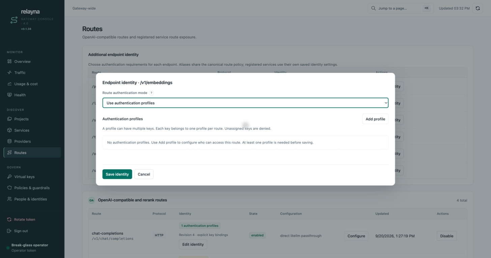
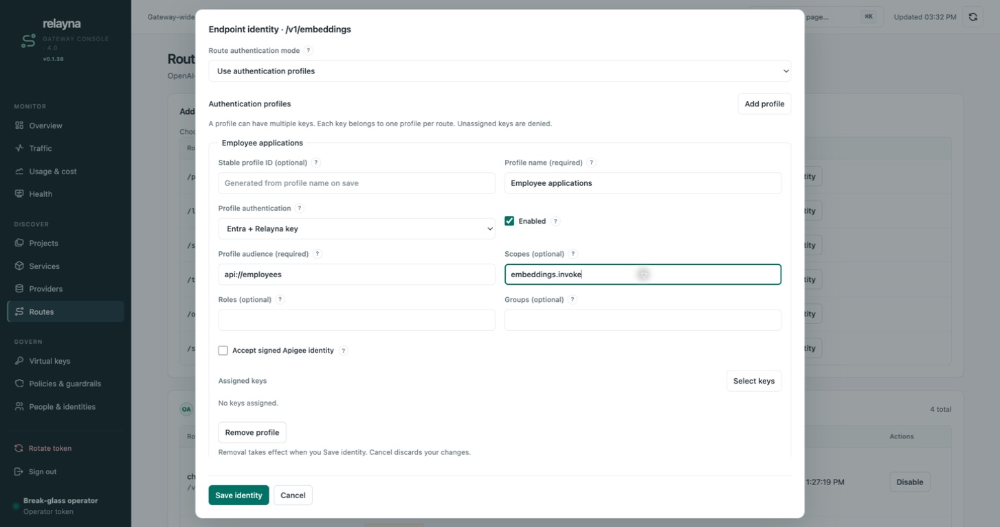
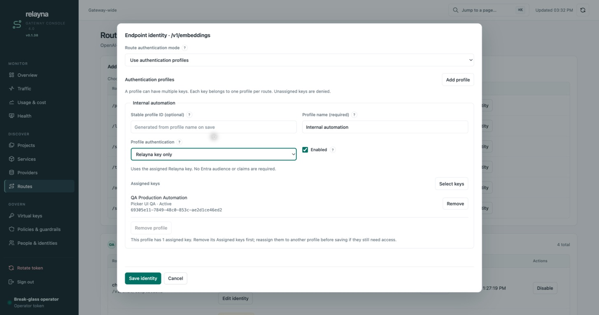
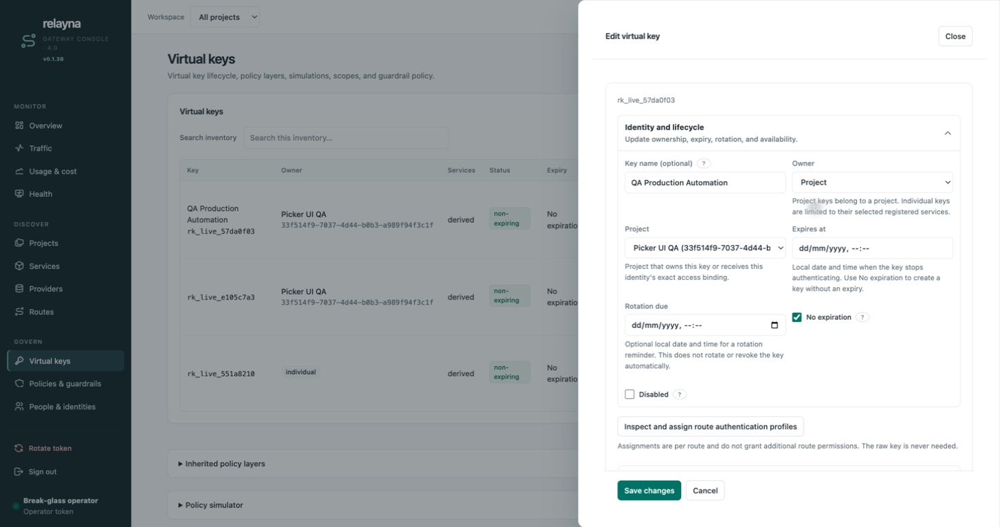
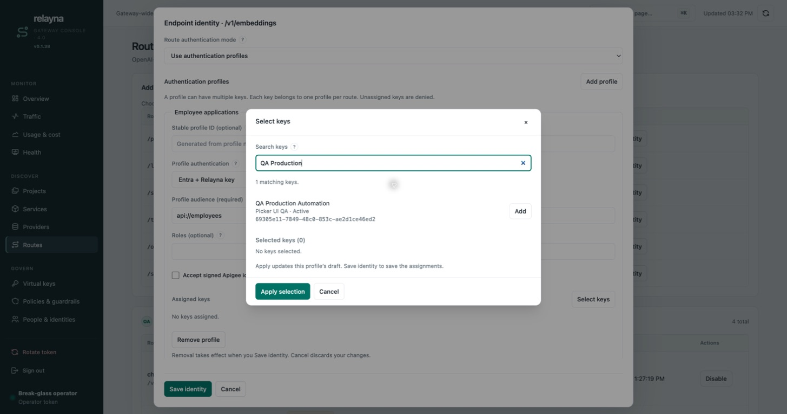
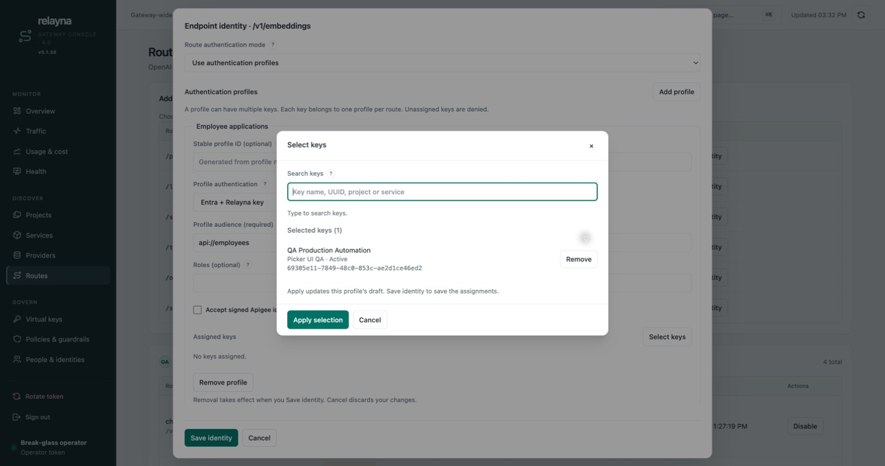
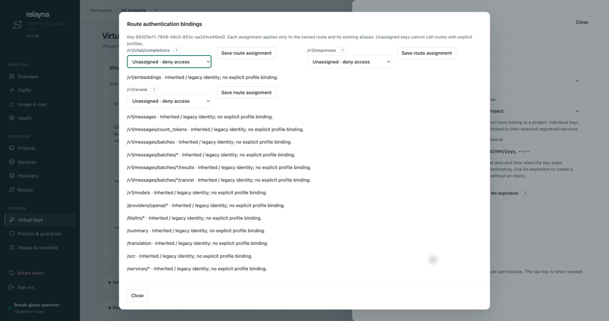
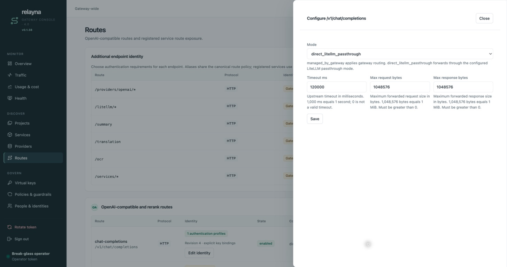
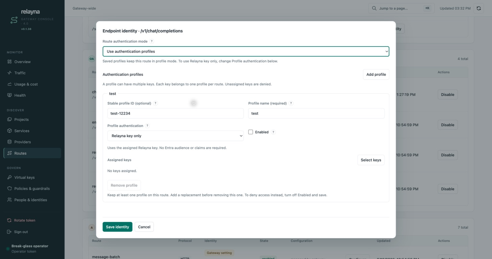
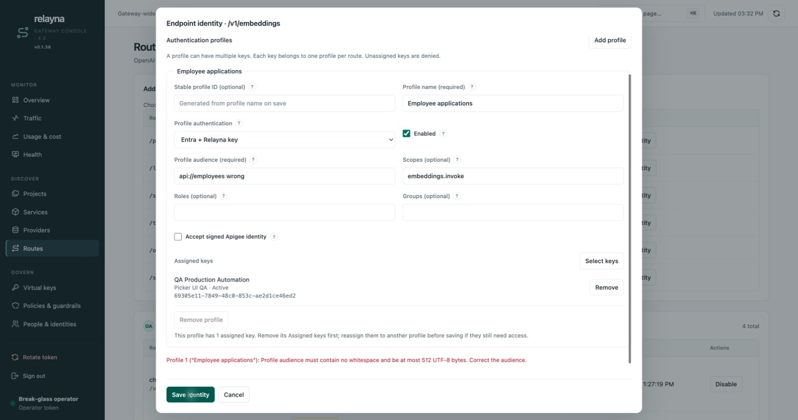

# Authentication profiles: setup and maintenance

Authentication profiles let one route accept different groups of callers with
different authentication requirements. For example, employee applications can
require **Entra + Relayna key**, while an internal automation client uses
**Relayna key only** on the same endpoint.

This guide covers gateway **0.1.39** and **Admin UI 4.0**. The screenshots show
local sample data and unsaved setup drafts, not production credentials. Setup
examples use `/v1/embeddings`; the same controls apply to `/v1/chat/completions`,
`/v1/responses` and supported registered services. Click an image to view it at
full size.

Screenshots use local sample data captured during development. Some show the
previous 0.1.38 version label or older background actions; follow the current
steps below for the 0.1.39 controls.

## Understand the three settings

| Setting | Where to find it | What it controls |
| --- | --- | --- |
| **Route authentication mode** | Routes → Edit identity | Whether the route inherits gateway settings, uses one Entra policy, skips Entra, or selects an authentication profile by the caller's Relayna key. |
| **Profile authentication** | Inside each authentication profile | Whether that profile requires **Entra + Relayna key** or **Relayna key only**. You can edit this after saving profiles. |
| **Mode** (forwarding) | Routes → Configure | Whether accepted traffic uses `managed_by_gateway` or `direct_litellm_passthrough`. It does not disable profile authentication. |

The route authentication choices are:

| Route authentication mode | Meaning |
| --- | --- |
| **Use existing gateway setting** | Inherit the existing gateway-wide authentication behavior. |
| **Require Entra** | Apply one endpoint-specific Entra audience/claim policy to callers, retaining the route's credential checks. |
| **No Entra** | Skip Entra verification while retaining the route's other credential and policy checks. This is not the same as a key-only profile. |
| **Use authentication profiles** | Authenticate a Relayna key, find its explicit assignment on this route, then enforce that profile's requirements. Unassigned keys are denied. |

**A profile can have multiple keys. Each key can belong to at most one profile
per route.** The same key can select a different profile on another route.
Canonical aliases share their route's assignments. A disabled profile denies
all its assigned keys; callers do not fall back to another profile.

## Before you begin

1. Upgrade every gateway replica to **0.1.39 or newer** before saving profiles.
   See [rollout and rollback](#rollout-compatibility-and-rollback).
2. Sign in as an administrator and identify the route and its intended callers.
3. Create or choose active Relayna virtual keys. Check their permitted routes,
   models, providers and any project/service restrictions. Assigning a profile
   does **not** grant a route permission that the key's effective policy denies.
4. For Entra profiles, configure the gateway's Entra verifier under
   **Settings → Entra ID and Apigee front door**. Tenant, issuer, discovery/JWKS
   and accepted signing algorithms are shared; profile audiences and claims
   are configured separately. See [Entra setup](../entra-id-auth.md).

Once profiles have been saved on a route, switching that route back to gateway
defaults, Require Entra or No Entra is unavailable. Plan key assignments before
opting in. You can continue changing individual profile requirements, names,
enabled state and assignments.

## Configure a route

1. Open **Discover → Routes**.
2. Find the endpoint and select **Edit identity**.
3. Set **Route authentication mode** to **Use authentication profiles**.
4. Select **Add profile**, then follow one of the two setup paths below.

[](../assets/screenshots/authentication-profiles/01-route-profile-mode.jpg)

*Selecting profile mode starts a draft. At least one profile is required before
Save identity can succeed.*

### Type 1: Entra + Relayna key

Use this type when callers must prove an Entra identity as well as possession of
an assigned Relayna key.

1. Enter a **Profile name**, such as `Employee applications`.
2. Leave **Stable profile ID** blank to generate it on save, or enter a custom ID.
3. Choose **Profile authentication → Entra + Relayna key** and keep **Enabled**
   checked if this profile should accept requests.
4. Set **Profile audience** to the exact expected `aud` claim in the caller's
   access token. `api://employees` in the screenshot is an example, not a value
   to copy for every deployment. Use the actual audience issued for your API.
5. Configure **Scopes**, **Roles** and **Groups** only where needed. Use commas
   between entries. Every listed scope and role is required; at least one listed
   group must match. Blank lists add no requirement of that kind.
6. Leave **Accept signed Apigee identity** off for direct JWT callers. Enable it
   only for a configured HMAC-verified Apigee identity path; the same audience,
   expiry and claim requirements still apply. Unsigned identity headers are not
   trusted. See [Apigee configuration](../apigee-gateway-path.md).
7. [Select the caller keys](#select-and-assign-keys), apply the selection, then
   select **Save identity**. Reopen the editor to confirm the saved profile.

[](../assets/screenshots/authentication-profiles/02-entra-profile.jpg)

*Entra fields appear for this type. Audience is required; the claim lists are
optional. The illustrated draft has not yet assigned its caller keys.*

Call the configured endpoint with both credentials:

```bash
# Use your proxy listener, an assigned Relayna key, a valid access token,
# and an embedding model enabled by your provider/key policy.
curl "$GATEWAY_PROXY_URL/v1/embeddings" \
  -H "Authorization: Bearer $ENTRA_ACCESS_TOKEN" \
  -H "X-Relayna-Key: $RELAYNA_API_KEY" \
  -H 'Content-Type: application/json' \
  -d '{"model":"your-embedding-model","input":"Profile setup check"}'
```

Use the configured key header if your gateway has renamed `X-Relayna-Key`.
A missing/invalid JWT does not fall back to key-only authentication.

### Type 2: Relayna key only

Use this type when the assigned Relayna key is the caller credential and no
Entra identity is required. Accessa does not support this type.

1. Add a profile and enter a name, such as `Internal automation`.
2. Leave **Stable profile ID** blank to generate it on save, or enter a custom ID.
3. Choose **Profile authentication → Relayna key only**.
4. Keep **Enabled** checked if callers should have access.
5. [Select the caller keys](#select-and-assign-keys) and select **Apply selection**.
6. Select **Save identity**. Reopen the editor to confirm the saved assignment.

[](../assets/screenshots/authentication-profiles/05-key-only-profile.jpg)

*Key-only profiles require assigned Relayna keys. Entra audience, scopes, roles,
groups and signed-Apigee controls are hidden and omitted from the save.*

Send only the Relayna key:

```bash
curl "$GATEWAY_PROXY_URL/v1/embeddings" \
  -H "Authorization: Bearer $RELAYNA_API_KEY" \
  -H 'Content-Type: application/json' \
  -d '{"model":"your-embedding-model","input":"Profile setup check"}'
```

Alternatively send the key in the configured Relayna key header and omit
Authorization. Do not send the key in both headers, and do not add an Entra JWT
to a key-only request. See the [credential contract](#credential-contract).

### Profile field reference

| Field | How to use it |
| --- | --- |
| **Profile name** | Required display name, unique on the route ignoring case and surrounding whitespace; up to 120 UTF-8 bytes. Renaming preserves assignments. |
| **Stable profile ID** | Optional in the UI for new profiles. Blank generates a name-derived ID plus a random suffix, e.g. `internal-automation-a1b2c3d4`. Custom IDs use 1–64 ASCII letters, numbers, hyphens or underscores and must be unique on the route. |
| **Enabled** | Off denies all keys assigned to this profile. It does not move them elsewhere. |
| **Profile audience** | Required for Entra profiles; exact JWT audience, no whitespace, at most 512 UTF-8 bytes. |
| **Scopes / Roles** | Optional comma-separated lists. All listed scopes and all listed roles must be present. |
| **Groups** | Optional comma-separated group IDs. At least one listed group must match. |
| **Assigned keys** | Existing Relayna keys that select this profile on this route. Empty means the profile has no callers. |

Names without an ASCII slug use `profile` as the generated ID prefix. Renaming a
saved profile or clearing its ID input preserves its existing ID. Keep saved IDs
unchanged after assigning keys. API clients still supply IDs explicitly. Claim
lists allow at most 64 entries, each at most 512 bytes without whitespace.

## Select and assign keys

### Give keys recognizable names

Open **Govern → Virtual keys → Edit → Identity and lifecycle**. Enter a **Key name
(optional)** and select **Save changes**. You can also name a key when creating it.
Use names such as `Production automation` so administrators can find a caller
without remembering its UUID. Clearing the field removes the alias. A name is
metadata: it does not rotate the credential or change its UUID or assignments.

[](../assets/screenshots/authentication-profiles/08-key-name.jpg)

*The name shown here is also searchable in the profile's Select keys popup.
The displayed prefix is not a usable API key.*

### Search, select, apply, then save

1. In the profile, choose **Assigned keys → Select keys**.
2. Search by key name, prefix, UUID, project name/ID or service.
3. Check the result's project, lifecycle status and UUID, then select **Add**.
   Repeat to assign several keys to the same profile.
4. Review **Selected keys**. Use **Remove** for any unwanted selection.
5. Select **Apply selection** to update this profile's draft.
6. Select **Save identity** in the parent editor to persist the assignments.

[](../assets/screenshots/authentication-profiles/03-search-keys.jpg)

*Results identify the key and its owner. Keys already selected or assigned to
another profile on this route are excluded. Service profiles also enforce the
service's project boundary.*

[](../assets/screenshots/authentication-profiles/04-apply-key-selection.jpg)

*Adding a key clears the search. An empty search shows no results; it does not
clear your selected keys. Apply selection updates the draft; Save identity
commits it. Cancel or Escape in the popup discards that popup's edits.*

To move a key between profiles, remove its assignment from the old profile's
**Assigned keys**, add it to the destination profile, and save the entire identity
form once. A key cannot belong to both profiles on the same route.

### Inspect assignments from Virtual keys

Open **Virtual keys → Edit → Inspect and assign route authentication profiles**.
The **Route assignments** dialog identifies the key by name and prefix. Routes
using profiles appear first; use **Find a route** to narrow the list by path.

1. Choose an **Authentication profile** for a route. The explanation below shows
   whether the selection requires Entra, accepts the Relayna key only, or denies
   access. A changed selection is marked **Unsaved** and previews its effect
   **after saving**.
2. Click that row's **Save**. **Saved** confirms the assignment took effect. Each
   route saves independently of other rows and **Save changes** in the key editor.
3. Select **Unassigned — deny access** and save to remove this key's assignment.
   Assigning a disabled profile also denies access.
4. Expand **Routes using existing settings** to inspect routes without profiles.
   They require no profile assignment; their existing authentication and access
   rules still apply.

**Done** closes the dialog. If selections are unsaved, choose **Keep editing** or
**Discard changes**; assignments already saved remain in effect. Failed saves keep
the selection and show the problem beside that route. If another operator changed
the route, close and reopen the dialog to load the latest configuration before
choosing and saving again.

[](../assets/screenshots/authentication-profiles/09-key-route-assignments.jpg)

*This view edits one key's assignments across routes, including their aliases.
It never displays or requires the raw key and does not grant additional route
permissions.*

## Profiles and direct LiteLLM passthrough

**Yes: a profile-enabled direct LiteLLM route still requires a Relayna key.**
An enabled key-only profile means an assigned Relayna key is sufficient for the
profile authentication step; an Entra profile additionally requires verified
identity. Other applicable policies still apply. Native LiteLLM credentials
alone cannot authenticate either profile type.

[](../assets/screenshots/authentication-profiles/10-forwarding-mode.jpg)

*Routes → Configure controls forwarding and proxy limits. Routes → Edit identity
controls authentication. Changing forwarding mode does not disable profiles.*

After authentication, Gateway strips client credentials and resolves the upstream
LiteLLM credential through its existing key/project/provider mapping. Direct
forwarding retains its status-only usage behavior and does not add managed
body rewriting or token accounting. Native LiteLLM bearer delegation remains
available only on appropriate direct routes **without** authentication profiles.
See [LiteLLM passthrough](../litellm-passthrough.md).

## Change, disable or remove a profile

| Task | Steps and effect |
| --- | --- |
| Change Entra to key-only (or back) | Edit **Profile authentication** inside the profile. For Entra, fill the audience and review claims; for key-only, Entra fields disappear. Save identity. Inactive field values survive switching within the open draft, but are omitted from a key-only save. |
| Rename a profile | Change **Profile name**, keep the stable ID, and save. Key assignments stay attached. |
| Temporarily deny callers | Uncheck **Enabled** and save. All assigned keys are denied; there is no fallback. Re-enable and save to restore the profile's access. |
| Remove a profile with keys | Move or remove its assignments first. If it is the last saved profile, add a replacement. Select **Remove profile**, then Save identity. |
| Undo an unsaved removal | **Undo removal** restores the most recently removed profile and its draft values. **Cancel** discards all identity edits. |
| Stop using the last saved profile | Keep at least one profile. Disable it to deny access, or add a replacement and migrate assignments. Switching the route back to legacy authentication is unsupported. |

[](../assets/screenshots/authentication-profiles/07-saved-profile-maintenance.jpg)

*The illustrated saved profile is disabled and unassigned, so it accepts no
callers. The route mode restriction does not prevent changing Profile authentication.*

Registered services use the same editor under **Endpoint identity and Accessa**.
Keys assigned to project-owned services must belong to that project. Accessa
profiles must use **Entra + Relayna key**, even when disabled. Service presets
retain saved profiles. Profile editing requires administrator access; service
ownership alone does not grant admin API access.

## Troubleshoot a failed save or request

[](../assets/screenshots/authentication-profiles/06-validation-recovery.jpg)

*This example contains a space in `api://employees wrong`. Correct that field;
the error identifies the affected profile and the draft remains open.*

| Symptom or message | Cause | What to do |
| --- | --- | --- |
| No authentication profiles / at least one needed | The route is in profile mode with an empty draft. | Select Add profile, enter its settings and assign callers before Save identity. |
| Missing/duplicate name or invalid audience | A named profile field failed validation. | Correct the field identified in the message. Use unique names and an exact, nonblank Entra audience without whitespace. |
| Key missing from search results | Search is blank, the key is selected/assigned elsewhere, or it is ineligible for the service's project. | Enter a query, check Selected keys and other profiles, and check project ownership. Use Retry loading keys after a lookup failure. |
| Selection was not applied | A selected key became ineligible or is assigned elsewhere. | Resolve the named key conflict, or cancel and reopen the selector to refresh it. |
| Authentication settings changed after opening | Another write changed the saved revision. | Copy changes you want to keep, close without saving, reopen the latest configuration and reapply. Do not blindly retry a stale revision. |
| Gateway cannot access saved settings | The backing settings store is unavailable. | Keep the draft open and retry when available. If a save result is uncertain, reopen to check the saved state before retrying. |
| Legacy route mode options unavailable | This route already has saved profiles. | Edit Profile authentication instead. Reloading does not remove the restriction. |
| Remove profile unavailable | Keys remain assigned or this is the last saved profile. | Move/remove assignments and add a replacement if needed; disable the profile to deny callers. |
| 401 on a request | The required credential is missing, malformed, invalid, expired or disabled. | Check key lifecycle and the headers for the chosen profile type; Entra profiles also require a valid verified identity. |
| 403 `authentication_profile_denied` | No valid enabled profile assignment was selected. | Confirm the key UUID is assigned to an enabled profile on this exact canonical route. |
| 403 after Entra verification | Required claims or another policy deny access. | Inspect the recorded reason; correct token scopes/roles/groups or the relevant route/key policy. |

Check **Traffic → Inspect** or **Usage & cost → Debug** for the selected profile,
revision, binding source and outcome. Do not infer successful authentication from
an upstream error alone. A successful save should be followed by checks with an
assigned key, an unassigned key, and an invalid credential. For Entra, also check
wrong-audience and missing-required-claim tokens. See
[Traffic diagnostics](#diagnostics-and-socket-lifecycle).

## API and revisions

The existing route API is `PUT /admin-ui/admin/route-identities`. Service create
and PATCH APIs accept the same `access` object. GET route identities and service
responses provide the effective saved configuration and revision. For example:

```json
{
  "route": "/v1/responses",
  "access": {
    "authentication_profiles": {
      "revision": 0,
      "profiles": [
        {
          "id": "employees",
          "name": "Employee applications",
          "enabled": true,
          "type": "entra_and_relayna_key",
          "entra": {
            "audience": "api://employees",
            "required_scopes": ["responses.invoke"],
            "required_roles": [],
            "allowed_groups": []
          }
        },
        {
          "id": "automation",
          "name": "Internal automation",
          "enabled": true,
          "type": "relayna_key_only"
        }
      ],
      "bindings": []
    }
  }
}
```

The empty bindings above deliberately deny every key. Add objects containing
`key_id` and `profile_id` for the approved callers before enabling production
traffic. Revision zero is used for initial opt-in. Subsequent writes submit the
revision returned by GET or the last successful write. PostgreSQL atomically
checks and increments revisions for changed access configuration. A stale write
returns 409 `authentication_profile_conflict`; reload and reconcile instead of
blindly retrying. An unchanged policy may retain its revision. Invalid profile
references, duplicate bindings and unknown key UUIDs reject the entire save.

There are at most 32 profiles and 1,024 key assignments per route. IDs are 1–64
ASCII letters, digits, hyphens or underscores; names are at most 120 bytes and
unique ignoring case and surrounding whitespace. Each claim list has at most
64 entries, each at most 512 bytes. IDs preserve bindings across name changes.
Legacy `entra` and `skip_entra` are mutually exclusive with explicit profiles.

## Credential contract

For Entra + key, put the JWT in `Authorization: Bearer <JWT>` and the Relayna
key in the configured key header (normally `x-relayna-key`). Signed Apigee
requests use that same key header and existing signed identity headers.

For key-only, use either the configured key header **or**
`Authorization: Bearer <Relayna key>`. Sending both is rejected, even when the
keys match. Duplicate Authorization/key headers, extra bearer/JWT credentials
with a dedicated key, or Apigee headers on a key-only profile are rejected.
Missing or rejected Entra credentials never fall back to key-only. There is no
client profile selector; caller-controlled selector or identity hints cannot
change the profile selected by the authenticated key.

The gateway preserves existing upstream credential mapping, strips the client
key/JWT, and strips caller-supplied internal admission credentials. Only eligible
Accessa paths receive a gateway-issued admission context.

## Diagnostics and socket lifecycle

Traffic **Inspect** and Usage **Debug** show profile ID/name, revision,
authentication type, route-key binding source and outcome. Entra requirements
and successfully verified claims appear alongside the profile. Key-only traffic
says **Entra not required by selected profile**. Credential failures, selection
failures and identity failures remain distinct. Missing or ambiguous bindings
return a sanitized 403 `authentication_profile_denied`; invalid credentials use
existing 401 errors, and insufficient verified claims use 403. Storage failures
remain unavailable errors and never select weaker access.

Snapshots retain the name and revision at request time; later edits cannot
rewrite past events. Old records without profile fields remain readable. No JWT,
key, admission token or payload is recorded, and no profile identifiers are
added to metrics labels.

Accessa handshakes save the full profile configuration and selected profile in
the existing Redis admission session. Each fresh turn rechecks the key and reads
the current service policy. Disabling, rebinding, renaming or editing any part
of that route's identity configuration blocks subsequent admission on existing
sockets. Reconnect to select a fresh profile; the gateway never silently changes
identity mid-session. Already admitted work is not retroactively cancelled.

## Rollout, compatibility and rollback

Gateway 0.1.39 startup applies migration
`20260919000100_authentication_profile_revisions.sql`. Apply it before
using profiles. It adds write guards to the existing route/service access JSON;
no legacy rows are rewritten. Existing inherited Entra, explicit single-policy,
No Entra and native direct LiteLLM routes retain released v0.1.37 behavior until
explicitly opted in. Inherited routes still follow later gateway-setting edits.

Upgrade every replica to 0.1.39 or newer before opting in. Effective policy is read from PostgreSQL
for every new request and Accessa turn, with no profile cache. Committed edits
therefore affect the next policy read; requests already past that read may finish
under their recorded snapshot. Store failures fail closed. Gateway-wide Entra
settings use a separate five-second refresh loop; see [saved settings and
multiple replicas](../entra-id-auth.md#saved-settings-and-multiple-replicas).

v0.1.37's strict access deserializer rejects the new profile field. The database
write guards also reject old writers attempting to erase an opted-in policy.
Mixed-version deployments can therefore deny affected routes on old replicas;
they cannot safely serve the new feature. This is an availability consideration,
not a migration path for keeping old replicas active.

For application rollback, keep the migration and write guards installed and
leave opted-in routes unavailable on old binaries. Do not drop the guards or
rewrite access JSON to bypass rejection. Restore the upgraded binary to regain
access. To avoid disruption, complete an all-replica upgrade and validate a
nonproduction route before opting in. Shared profile templates, native LiteLLM
key profiles and multiple issuer trust authorities are deferred.

### Moving a key to another project

A key assigned to a project-owned service profile cannot move to another project
or become an individual key while that assignment remains. Remove its service
profile assignments first, change the key project, then assign it to appropriate
profiles in the new project. A rejected move leaves both ownership and assignments
unchanged. Built-in route assignments are route-local and do not impose this
service-project restriction.
