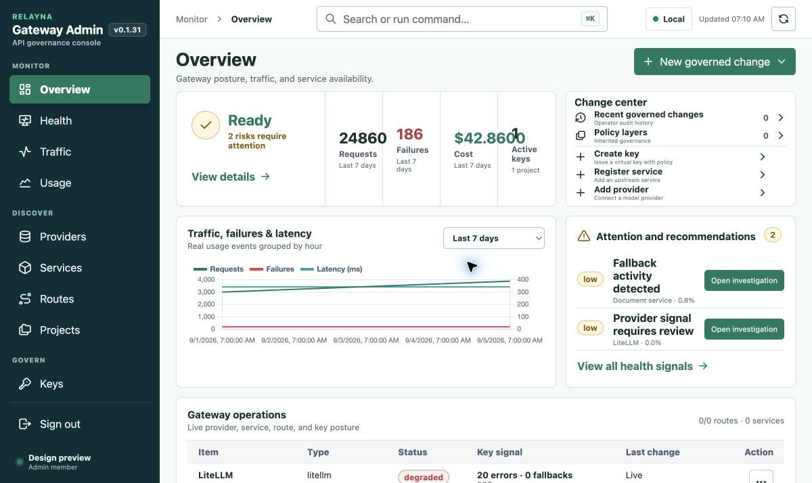
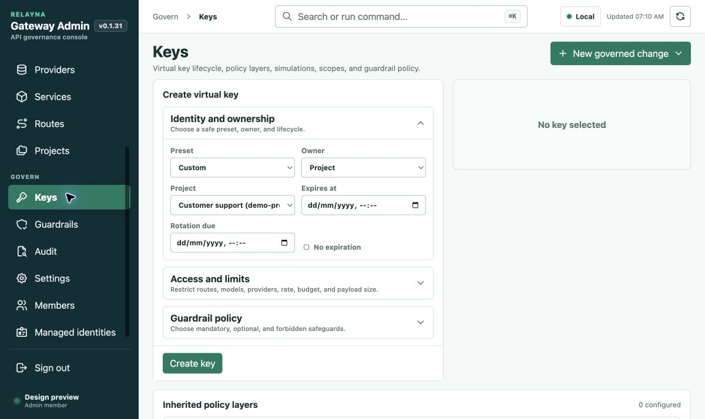
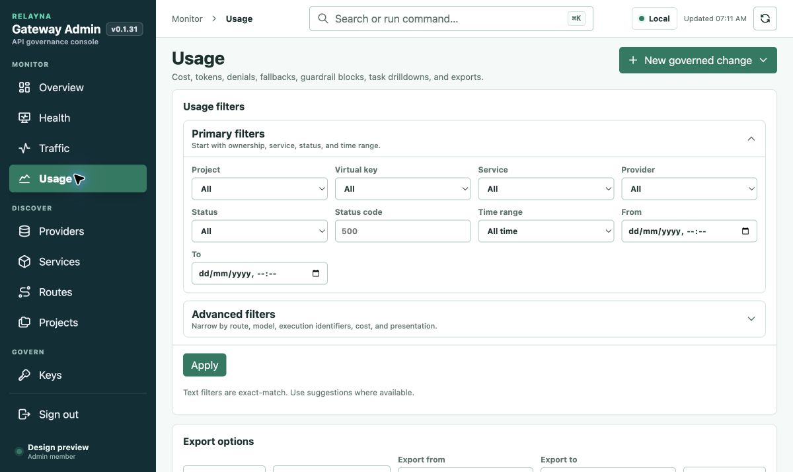
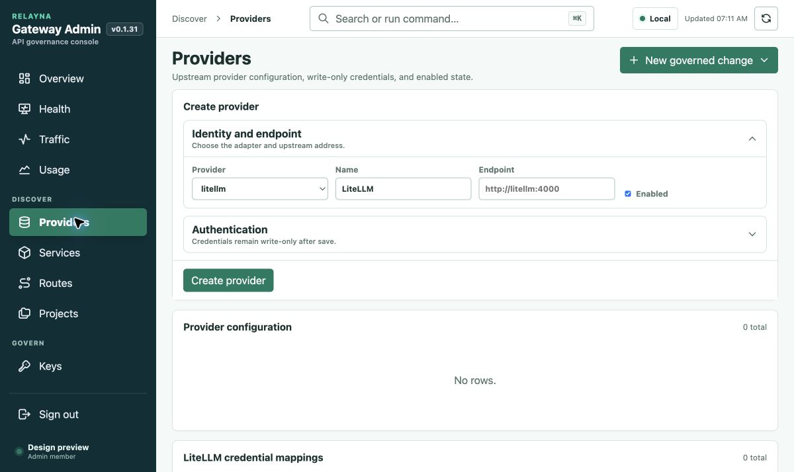
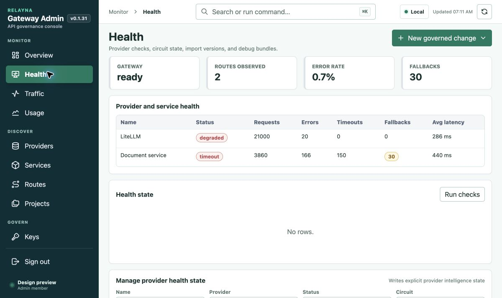
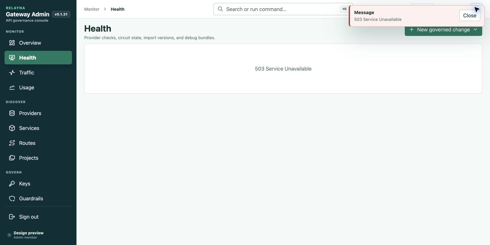
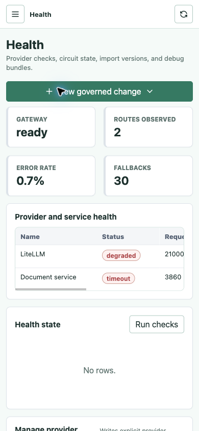

# Admin UI 2.0 audit → Admin UI 3.0

Reviewed 5 September 2026. Scope: current source, unchanged shipped assets, all 18 declared navigation surfaces, and representative rendered workflows. This review identifies 30 findings; it cannot guarantee discovery of every possible bug.

## Verdict

UI 2.0 already contains substantial functionality: scoped owner dashboards, key lifecycle and presets, inherited policies and simulation, guardrails, service import and pricing, provider configuration, live/history diagnostics, usage exports, audit history and identity bindings. Its main weakness is organizing that functionality around forms and backend resources instead of an operator's task. Correctness and resilience fixes should precede the visual migration.

UI 3.0 keeps the dark navigation, restrained teal, Monitor / Discover / Govern groups, write-only credentials and scrollable tables. Operational data comes first, creation is contextual, and project context follows the operator into usage and request investigation.

## Evidence and limits

Computer Use listed running apps, but two attempts to read Chrome timed out. After the user authorized opening a new Chrome tab, the Chrome browser integration captured and exercised the UI. No production session or credentials were accessed.

The user confirmed there was no running gateway. The local `serve.py` fixture serves unchanged checked-in UI 2 assets against synthetic read-only API responses. The fixture deliberately contains an expired key and nonzero error/timeout counters. It supports the captured workflows, not every gateway endpoint. Findings about real authentication, persistence, streaming or provider behavior require a real gateway environment.

**Reproduced** means observed in the compiled UI with the fixture. **Source** means supported by code, without an end-to-end gateway reproduction. **UX** is a design judgment supported by captured behavior or view markup. Proposals do not imply that the backend already supports the proposed feature.

## Captured flow

| Step | Workflow | Assessment | Screenshot |
|---|---|---|---|
| 1 | Overview | Misleading active-key count; crowded metrics and conflicting health semantics | 01-overview.png |
| 2 | Keys | Inventory displaced by creation, empty editor and policy forms | 02-keys.png |
| 3 | Usage | Filters and exports push results below the first screen | 03-usage.png |
| 4 | Providers | Creation-first; generic empty-state guidance | 04-providers.png |
| 5 | Health | Useful table; mixed observed and persisted state concepts | 05-health.png |
| 6 | Readiness failure | Broken: monitoring body disappears after 503 | 06-readiness-failure.png |
| 7 | Mobile Health, 390 × 844 | Contained horizontal table scroll; excessive generic action and empty-state space | 08-mobile-health.png |

### 1. Overview

The chart has a textual accessible summary and the design language is consistent. However, four-decimal cost crowds the adjacent metric at this width, creation shortcuts compete with monitoring, and the expired fixture key is counted as active. Health severity differs between recommendations and the table.

### 2. Keys

An operator must pass creation, a vacant editor and policy editing to reach existing keys. Keep presets and inheritance, but place the inventory first and open creation/editing on demand.

### 3. Usage

The first viewport contains no usage results. Export options and task lookup also precede the metrics. Use a compact filter bar, applied-filter summary, immediate metrics and separate breakdown tabs.

### 4. Providers

Connection creation precedes the inventory, while credential mapping and ingress exposure extend the same page. Group these concerns in provider details and explain empty states with a relevant action.

### 5. Health

Recent error counters and persisted health are different concepts with similar labels. Manual overrides, debug lookup and import versions extend the page. Separate current availability from reliability over a stated window.

### 6. Readiness failure

A 503 readiness response removes unrelated monitoring information. The page and a toast repeat the generic error without a useful recovery path. This is the highest-priority reproduced defect.

### 7. Mobile Health

The document fits 390px and the table scrolls within its panel. The global creation action occupies a full row on a monitoring page and an empty panel occupies substantial space. The accessibility snapshot still exposes offscreen navigation; keyboard/screen-reader validation is needed.

## 30 prioritized findings

Source references below refer to `crates/gateway-api/admin-ui/src/main.ts` unless another path is given. Line numbers are from the unchanged source at review time.

| ID | Priority / evidence | Finding | Source / evidence | Implementation |
|---|---|---|---|---|
| B01 | P1 · Reproduced | Readiness 503 erases Health; Overview shares the same failure mechanism. | `json:192`, `refresh:572`, `overview:614`, `health:3271`; backend `crates/gateway-api/src/app.rs:733` returns 503 with `not_ready`. Step 6. | Treat not-ready as domain state; load panels independently; retain timestamped last-known data and retry. |
| B02 | P1 · Source | Most admin views can render late responses after a new view or newer refresh. Late catches/finally can also affect the new page. | `refresh:572`, unguarded post-await rendering in `projects:848`, `keys:928`, `overview:614`. Owner dashboards already use generations at 4545/4663. | Shared navigation generation and cancellation, including error/finally handlers. Test deliberately reordered responses. |
| B03 | P2 · Reproduced | “Active keys” includes expired keys. | Overview filters disabled/revoked only around 630; `keyStatus:3815` checks expiration. One expired fixture key yields active count 1. | Shared lifecycle classifier for badges, counts, filters and alerts. Test exact expiration boundaries. |
| B04 | P2 · Reproduced + Source | One historical timeout makes the badge timeout; any error/fallback makes it degraded regardless of sample size or current state. | `healthBadge:3375` versus `overviewRisks:721`; Steps 1/5. | Separate current availability and windowed reliability; shared thresholds and minimum sample sizes. |
| B05 | P2 · Source + fixture | Any nonzero error score can create an actionable risk below thresholds; the displayed percentage can be the wrong metric. | `overviewRisks:721`, `overviewRiskRow:760`; LiteLLM's 20/21000 errors display “Provider signal requires review · 0.0%” using fallback rate. | Store explicit signal type/value and threshold actionable risks. |
| B06 | P2 · Source | Resource-specific Investigate/Inspect labels navigate to a generic page without selecting the resource. | `overviewRiskRow:760`, `overviewOperationsTable:769`, `data-overview-nav`. | Deep-links preserving resource, request and filter context. |
| B07 | P2 · Source | Key Usage is a temporary toast rather than a durable scoped view. | `keyAction:1415`, usage branch. | Open Usage/Traffic with key ID and return context. |
| B08 | P2 · Source | Refresh reconstructs forms and loses unsaved input. Usage recreates default filters while pagination may remain in state. | `refresh:572`, `usage:2634`, `usagePagination`, `resetUsagePagination:2781`. | Persistent query state; reset offsets with filters; dirty-form handling before rerender. |
| B09 | P2 · Source | Overview range listener calls `overview()` without error handling or cancellation; old data may remain under a new selected range. | Range listener around 686. | Pending/error state, cancellation and atomic range/data updates. |
| B10 | P2 · Source | Fetch timeout clears after headers, before JSON/text body consumption; caller signals are overwritten. | `fetchWithTimeout:198`, `api:167`. | Cover body consumption and compose caller cancellation; test stalled bodies. |
| B11 | P2 · Source + accessibility snapshot | Closed mobile nav is translated offscreen but not inert; opening/closing does not constrain focus. | `app.css:2051`, `openNavigation:420`, `closeNavigation:427`. | Inert closed nav, focus containment when open, Escape and focus return; screen-reader verification. |
| B12 | P3 · Source | “Search or run command” only filters navigation pages. | `showCommandPalette:447`. | Relabel Jump to a page; resource search/commands require explicit implementation. |
| B13 | P3 · Source | Environment is hardcoded Local; release strings are repeated. | `index.html` environment chip, `settings:2220`. | Authoritative deployment name/version separate from session identity. |
| B14 | P3 · UX | High-precision cost crowds metric columns. | `money:4830`, Step 1. | Adaptive number formatting, tabular figures, high precision in details. |
| B15 | P3 · Source | Recent-change count is a capped fetched sample but resembles a general total. | Overview fetches `audit-events?limit=8`, displays array length. | Label latest sample or fetch a real total. |
| B16 | P3 · Source | Updated timestamp represents refresh completion rather than panel-source freshness and remains from a previous success after failure. | `refresh` around 602. | Per-panel freshness and stale indicators separate from live status. |
| U01 | P2 · UX | Creation-first Keys/Services/Providers/Projects and vacant edit panels obstruct repeat operations. | `keys:928`, `services:1886`, `providers:1441`, `projects:848`; Steps 2/4. | Inventory first; contextual creation/editing. |
| U02 | P2 · UX | Keys mixes lifecycle, inherited policy editing, simulation and guardrail assignment. | `keys:928–1048`. | Policies home; effective inherited policy on key details. |
| U03 | P2 · UX | Usage's many filters, exports and task lookup precede results; breakdowns form one long vertical stream. | `usage:2634`, `loadUsage:2723`; Step 3. | Results-first layout, compact filters, breakdown tabs, export dialog. |
| U04 | P2 · Source / UX | Traffic requires raw project/key UUIDs and renders eleven columns with details below the list. | `traffic.ts:59` onward. | Name selectors, compact defaults, configurable columns and inspector drawer; preserve live/history semantics. |
| U05 | P2 · UX | Health combines monitoring, manual state writes, debug bundles and import rollback. | `health:3271`; Step 5. | Resource-scoped overrides; request debug; service versions under services. |
| U06 | P2 · Source | Most inventories lack search, status filters, sorting and pagination controls. | `projectTable`, `keyTable`, `providerTable`, `serviceTable`, `memberAccessCard`. | Shared inventory controls; decide server pagination contract before scaling. |
| U07 | P2 · UX | New governed change, Change center and per-page forms duplicate creation without distinct review semantics. | Shell/Overview/forms; Steps 1/2/4/7. | One contextual workflow reused by shortcuts. Do not imply unimplemented approval semantics. |
| U08 | P3 · UX | Provider connection, per-key/project credential mapping and ingress exposure share a long page. | `providers:1441–1510`. | Provider details grouped by connection, mapping and advanced exposure; preserve credential boundaries. |
| U09 | P3 · UX | Generic No rows does not distinguish unconfigured, filtered-empty or unavailable states. | `table` helper; Steps 4/5. | Domain-specific states with one next action. |
| U10 | P3 · Source | Audit has a limit but no visible date-range or next-page controls; raw actor IDs and JSON snapshots impair review. | `audit:1366–1408`. | Actor/date filters, paging where supported, target links and redacted field diffs. |
| U11 | P3 · Source / UX | Managed identity forms repeat tenant/client/object/role inputs for service and project targets. | `managedIdentities:4184–4231`. | One scope-aware editor, retaining exact service/project binding contracts. |
| U12 | P3 · UX | Every member card repeats large access-management forms. | `members:4068`, `memberAccessCard:4087`. | Searchable people list, pending filter and effective-access drawer. |
| U13 | P3 · UX | Settings mixes routine operator setup and internal implementation/repository references. | `settings:2220–2294`. | Separate authentication, ingress and Studio; put release/debug references in About. |
| U14 | P2 · Verification gap | Current tests pass despite reproduced UX defects; many shell tests match source patterns. | `tests/admin-ui.test.mjs`, `tests/admin-ui-design-system.test.mjs`. Traffic tests do exercise transport behavior. | Browser regressions for dependency failures, navigation races, lifecycle counts, query persistence and keyboard focus. |

The delayed-navigation browser attempt did not reproduce B02 because the interaction timing allowed responses to finish. B02 is explicitly source evidence, not a reproduced race claim. B10 similarly needs a stalled-body runtime test.

## Duplication map

| Current overlap | Recommended ownership |
|---|---|
| Overview and Health | Overview summarizes; Health investigates using shared status semantics. |
| Traffic, Usage requests, Health debug, owner request details | One inspector reachable with preserved scope; keep transient live traffic distinct from durable usage. |
| Keys policy fields, inherited layers, simulator, guardrail assignment | Policies owns definitions/simulation; key details show effective values and source. |
| Services and Routes | Services owns upstream/configuration; Routes indexes exposure and links to its owner. |
| Providers and Services credential/reliability inputs | Shared presentation components, distinct credential models and ownership. |
| My services / Service dashboard and My projects / Project dashboard | Resource list → scoped workspace, shared chart/filter/inspector components, distinct authorized APIs. |
| Member and managed-identity service/project binding forms | Shared resource picker; separate human/workload flows and exact permissions. |
| Global create, Overview shortcuts, page forms | Same contextual create flow. |
| Usage time range and separate export dates | Export active query by default; visibly summarized overrides. |

These overlaps do not justify merging admin/owner permissions, live records/billing events, or provider secrets/client keys. Those are real domain boundaries.

## Coverage of all current surfaces

All 18 entries from `src/design-system/view-meta.ts` are represented. Source-only means no populated visual fixture or real success path was exercised in this run.

| Surface | Existing capability | Coverage | Next implementation |
|---|---|---|---|
| Overview | Summary, chart, risks, actions | Rendered + source | Partial failures, truthful metrics, targeted drilldowns. |
| Health | Counters, state, checks, debug, versions | Rendered + 503 + phone + source | Availability/reliability model and scoped controls. |
| Traffic | Bounded live feed, saved history, attempts/timeline | Source + existing transport tests | Name filters, compact table, drawer; real reconnect testing. |
| Usage | Filters, breakdowns, events, tasks, exports | Rendered + source | Results first and persistent query scope. |
| Projects | Create/delete, service links, usage | Source; navigation visited | Project workspace with related keys/services/access/usage. |
| Providers | Config, credentials, mappings, passthrough | Rendered empty state + source | Provider inventory and detail tabs. |
| Services | Edit, pricing, OpenAPI, import/sync/lifecycle | Source only | Service workspace, validation, import and version review. |
| Routes | OpenAI, Anthropic, registered-service tables | Source only | Unified searchable index with protocol filter. |
| Keys | Presets, lifecycle, policy, simulation | Rendered + source | Inventory, expiration correctness, reviewed creation/rotation. |
| Guardrails | Catalog editor, summary, executions | Source only | Definitions/executions under policy workspace. |
| Audit | Actor/target filtering and snapshots | Source only | Date range, paging and readable diffs. |
| Settings | Studio, Entra, Apigee, references | Source only | Task-based groups and authoritative deployment context. |
| Members | Approval/admin controls and bindings | Source only | People inventory and effective access. |
| Managed identities | Exact monitoring bindings | Source only | Workload tab and reusable scope editor. |
| My services | Authorized resource list | Source only | Shared list leading to scoped workspace. |
| Service dashboard | Scoped chart, incidents and events | Source only | Shared presentation, preserved service API permissions. |
| My projects | Authorized resource list | Source only | Project selection into scoped workspace. |
| Project dashboard | Scoped metrics, chart, events/details | Source only | Shared filters and inspector, exact project permissions. |

Real login, pending/blocked membership, role transitions, populated import diffs, large datasets, writes, recovery, live streaming and secret show-once paths remain untested against a gateway. Source shows these controls exist; this review does not claim their backend success paths work.

## Implementation order and acceptance

1. **Correctness:** B01–B11. Simulate readiness 503, a single subrequest failure, reversed response order, stalled bodies and expired keys. Healthy panels remain usable; headers/content agree; invalid scopes never broaden access.
2. **Shared shell:** persistent URL state, deployment context, common lifecycle/status definitions, contextual actions, accessible navigation/dialogs, loading/empty/error/stale states and list controls.
3. **Monitoring:** results-first Overview/Usage/Traffic and one inspector. Chart aggregates reconcile to summary metrics. Live retained counts never masquerade as full traffic totals. Export previews show the exact query.
4. **Governance:** key inventory/create/rotate, effective policy/simulation, people and workloads. Keep write-only/show-once secrets and destructive confirmation; preserve exact owner/viewer/admin distinctions.
5. **Resources:** project/service/provider workspaces, route index, import/version history, settings grouping and readable audit diffs. Confirm backend capability before presenting unsupported editing as available.
6. **Release:** implement in Vite/TypeScript, regenerate assets, preserve `/admin-ui`, `/admin-ui/app.js`, `/admin-ui/app.css` and API contracts unless a release compatibility review changes them. Run required frontend and repository checks and browser tests at phone/tablet/desktop widths with realistic data and permissions.

## UI 3.0 prototype coverage

`index.html` is standalone HTML with embedded Chart.js and the repository's Tabler font. Open directly or serve at `http://127.0.0.1:18430/`. All data is synthetic and changes reset on reload. It does not replace production assets.

Functional: 13 destinations, project scope, overview/usage time range, request filtering and inspector, key tabs/search/details, key creation with validation → review → nonfunctional demo credential, page search and Enter/Escape, resource preview drawers, CSV export and phone navigation.

Concept-only: resource editing, real policy simulation, guardrail mutation, permission changes, audit paging/real diffs, settings writes, live traffic/reconnect, production pagination and partial loading states. The preview panels say these still need implementation. The sample budgets and policy examples are design proposals, not claims about existing backend support.

## Verification

Existing `npm test` passed. No production source/static assets changed. Standalone application script passed `node --check`. Chrome verified scoped failure drilldown, request detail and Escape, demo key review/create, page search, mobile layout and closed navigation inertness. A keyboard default-action issue in page search was found and fixed during QA. See `qa.md` for final checks.

Rust verification and production asset rebuild were not required for these additive design artifacts, which do not change runtime, production frontend, tests or build configuration.
