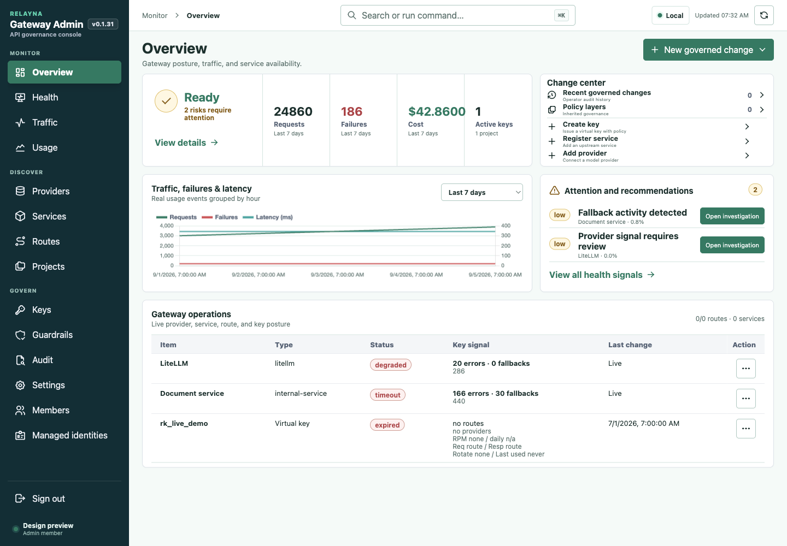
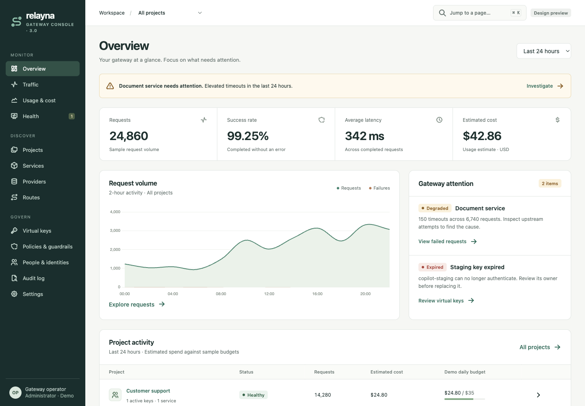
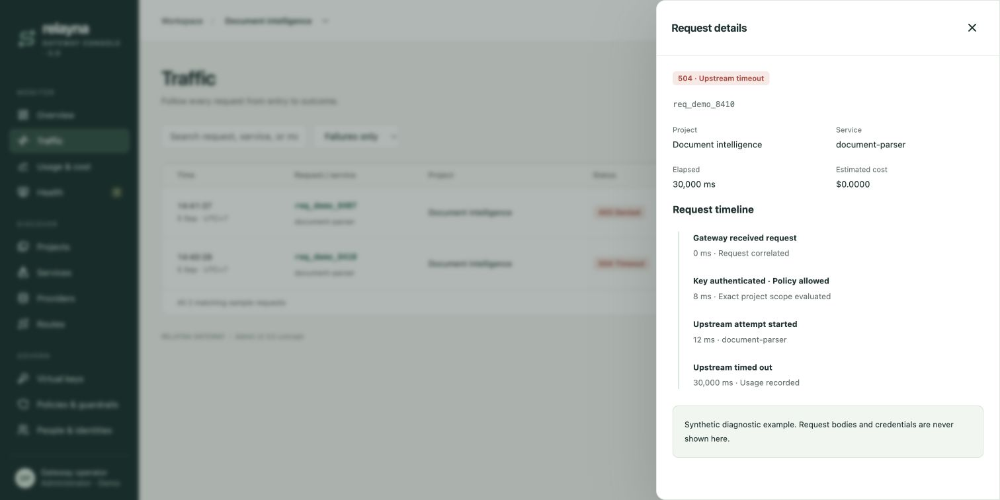
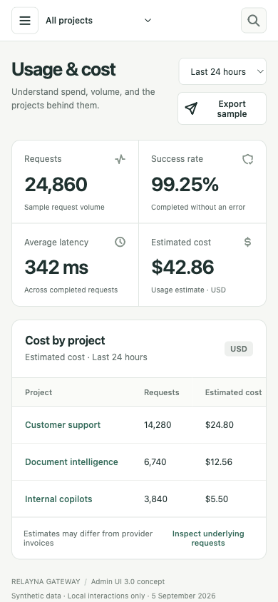
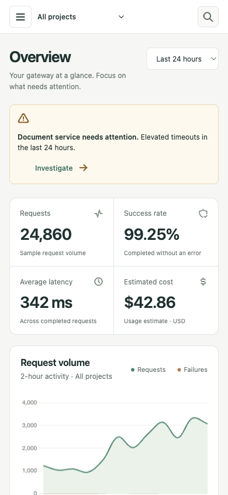

# Prototype QA — 5 September 2026

## Result

The standalone HTML loads in Chrome without console errors in the final fresh session. It uses embedded assets and makes no gateway API calls. All changes are local demo state.

## Checks completed

- All 13 destinations were exercised across the Chrome smoke checks: Overview, Traffic, Usage & cost, Health, Projects, Services, Providers, Routes, Virtual keys, Policies & guardrails, People & identities, Audit log, Settings.
- Overview failure drilldown selected Document intelligence and failures, returning two matching example requests. The 504 request opened its project, service, elapsed time and attempt timeline.
- Request drawer closed with Escape.
- Demo key creation completed name/project/preset/expiry → policy review → sample creation. The record appeared in the list. The shown value is explicitly nonfunctional.
- Search filtered page destinations; Enter navigated with zero open dialogs. An Enter default-action issue was found and fixed before this check.
- An unmatched request search rendered a specific no-match state; clearing the field restored rows.
- CSV action produced the download-success state. File-content parsing was not separately verified in the browser; CSV construction quotes fields and uses the current filtered collection.
- Project scope changed list/usage results. Overview and Usage range selectors update sample aggregates. Chart buckets now normalize to the selected sample request/failure totals.
- At 390 × 844, document scroll width is exactly 390. Wide data tables scroll within their own region. Closed mobile navigation has zero non-inert link tab stops. Open navigation and selection were exercised.
- Desktop comparison used UI 2 and UI 3 at 1440 × 1000. UI 3 removes the generic creation cluster, makes metrics readable, uses clear incident drilldowns and prioritizes one chart. It intentionally uses more whitespace; the project inventory continues below the first viewport.
- Existing repository `npm test` passed. Application script passed `node --check`; Python preview script compiled. No production asset rebuild or Rust verification was needed for additive design artifacts.

## Captures

## Limits

This is an interaction/design prototype, not backend feature parity. Real auth, persistence, mutation recovery, live streaming, admin/owner authorization, large-list pagination, policy execution and full screen-reader compliance were not tested. Prototype-only resource panels are labeled accordingly. No real secrets are accepted or issued.

Computer Use state capture timed out; Chrome browser integration was used with the user's approval. One long smoke-test tool call timed out and detached its debugger; verification continued in a fresh Chrome tab. This was a tool-session interruption, not a demonstrated application failure. The final session had no console errors. Temporary viewport overrides were reset before handoff.
