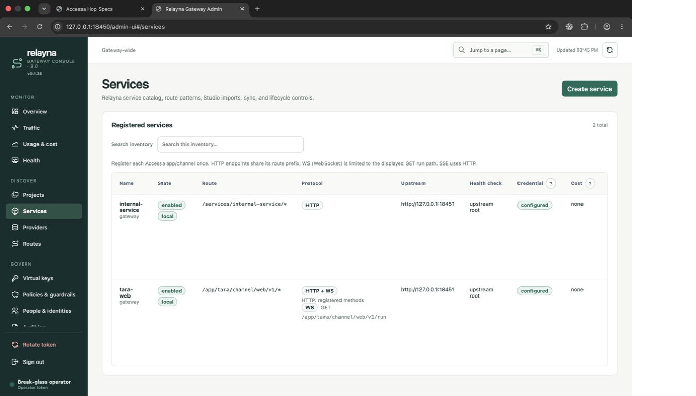
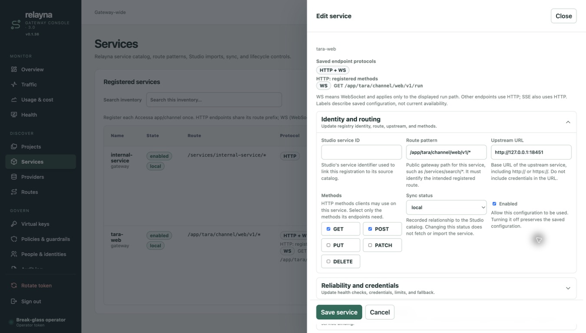

# Accessa verification evidence

## Computer Use — 2026-09-16

Used the Computer Use plugin (`@oai/sky` through Node REPL), Chrome, and the local
gateway at `127.0.0.1:18450`. PostgreSQL/Redis were disposable Docker services.

- Logged in using a disposable local operator token.
- Opened Services and edited an Accessa fixture.
- Expanded Endpoint identity and Accessa; inspected audience, scopes, roles,
  groups, signed Apigee toggle, channel binding and transport controls through
  the accessibility tree.
- Changed audience from `api://accessa` to `api://accessa-ui-verified`, saved,
  observed “Service updated”, reopened and verified the saved audience.
- Inspected the rendered identity fields and guidance. Screenshot:
  [endpoint-settings.png](endpoint-settings.png).
- The first save failed because a concurrent integration suite rotated the test
  database's operator token. Restored the disposable bootstrap token and repeated
  successfully. No production settings were involved.
- Missing-audience rejection and form serialization are covered by the automated
  Admin UI regression test. They are not claimed as a successful manual UI check.

## Automated checks

**Changed production Rust line coverage: 611 / 615 (99.35%)**, against base
`8ee95a6`. Exact uncovered mappings are retained in `coverage.json`.
The instrumented workspace suite passed with live PostgreSQL/Redis. The reusable gate is
`scripts/check-changed-rust-coverage.py`; it requires strictly greater than 98%
coverage for added/changed executable production Rust, excludes test items, and
includes production failure paths. UI serialization has separate Node tests.

Reproduce from a checkout with disposable `DATABASE_URL` and `REDIS_URL`:

```sh
SSL_CERT_FILE=/etc/ssl/cert.pem cargo llvm-cov --workspace --all-features --lcov --output-path /tmp/accessa.lcov
python3 scripts/check-changed-rust-coverage.py /tmp/accessa.lcov 8ee95a6
npm run build:admin-ui
npm test
bash .codex/skills/code-change-verification/scripts/run.sh
```

## Final local verification

- `code-change-verification/scripts/run.sh`: all ten commands passed in sequence
  on 2026-09-16 with disposable PostgreSQL/Redis enabled.
- Nextest: 357 passed, zero skipped, with no leak warnings in the final run.
- The committed patch was rescanned for secrets. A dummy unit-test prefix was
  replaced with the repository's documented fixture; no new scanner exceptions
  were added.
- Trivy: zero HIGH/CRITICAL findings. Gitleaks: no leaks. Semgrep: zero findings
  from the repository's two configured rules.
- Dependency audit and policy checks passed under the repository's existing
  exceptions. Rustls/webpki and event-listener were updated to patched versions.
- `npm run build:admin-ui`, `npm test`, strict MkDocs build, workflow YAML parsing,
  release metadata validation, and `git diff --check` passed.

## Protocol label follow-up

Computer Use verified the rebuilt Services inventory, Routes inventory and saved
service editor. Ordinary services and provider routes show HTTP; the Accessa
registration shows HTTP + WS and labels the exact GET run path WS.
Regression tests cover discovery, missing GET, mismatched prefixes, disabled
registrations and escaped display values. The Admin UI build and npm tests pass.




This follow-up changes presentation only; the production Rust coverage report
remains 611/615 changed executable lines (99.35%).

The full mandatory verification stack passed again for this follow-up, including
357 Nextest tests with zero skipped and all configured security checks.
