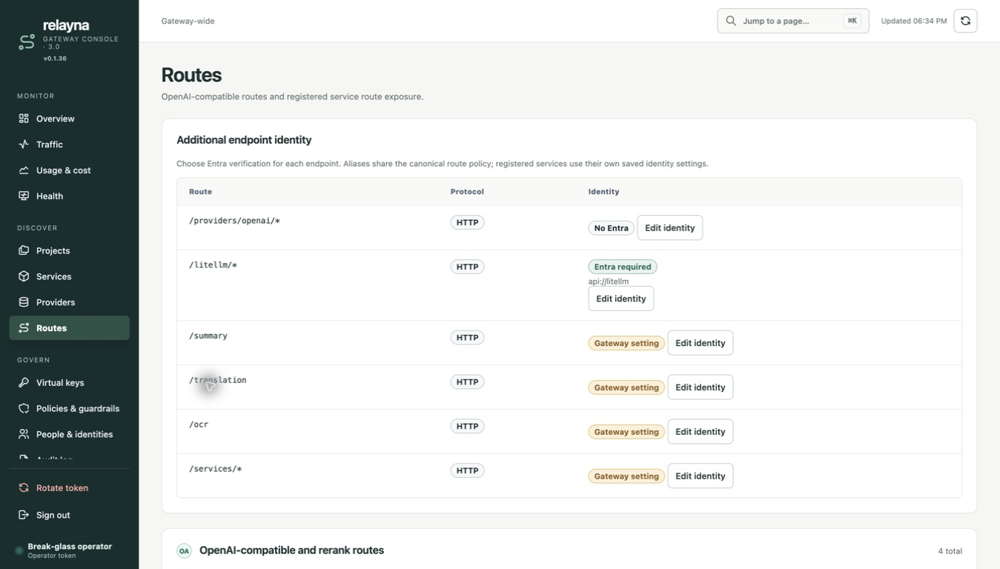
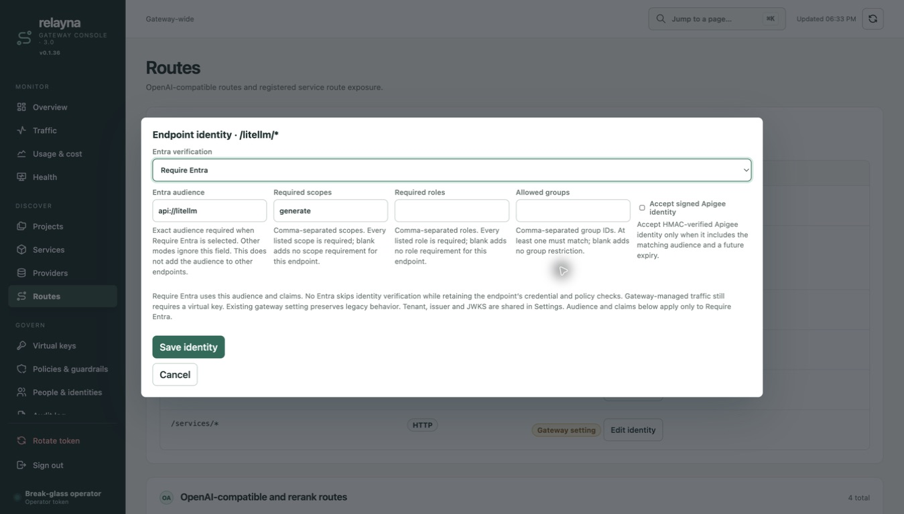
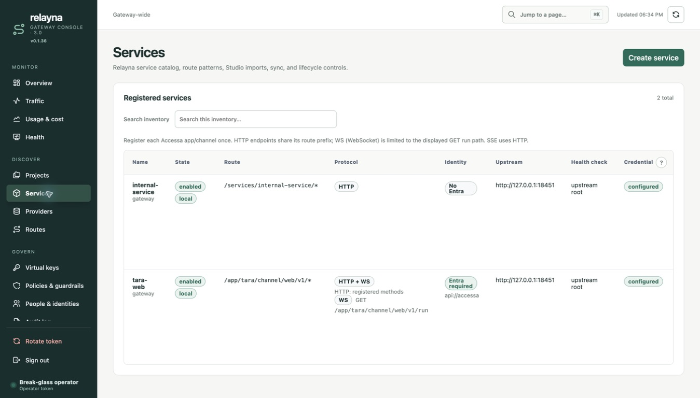

# Accessa verification evidence

## Computer Use — 2026-09-16

Used the Computer Use plugin (`@oai/sky` through Node REPL), Chrome, and the local
gateway at `127.0.0.1:18450`. PostgreSQL/Redis were disposable Docker services.

- Logged in using a disposable local operator token.
- Opened Services and edited an Accessa fixture.
- Expanded Endpoint identity and Accessa; inspected audience, scopes, roles,
  groups, signed Apigee toggle, channel binding and transport controls through
  the accessibility tree.
- Changed audience from `api://accessa` to `api://accessa-ui-verified`, saved,
  observed “Service updated”, reopened and verified the saved audience.
- Inspected the rendered identity fields and guidance. Screenshot:
  [endpoint-settings.png](endpoint-settings.png).
- The first save failed because a concurrent integration suite rotated the test
  database's operator token. Restored the disposable bootstrap token and repeated
  successfully. No production settings were involved.
- Missing-audience rejection and form serialization are covered by the automated
  Admin UI regression test. They are not claimed as a successful manual UI check.

## Automated checks

**Changed production Rust line coverage: 675 / 679 (99.41%)**, against base
`8ee95a6`. Exact uncovered mappings are retained in `coverage.json`.
The instrumented workspace suite passed with live PostgreSQL/Redis. The reusable gate is
`scripts/check-changed-rust-coverage.py`; it requires strictly greater than 98%
coverage for added/changed executable production Rust, excludes test items, and
includes production failure paths. UI serialization has separate Node tests.

Reproduce from a checkout with disposable `DATABASE_URL` and `REDIS_URL`:

```sh
SSL_CERT_FILE=/etc/ssl/cert.pem cargo llvm-cov --workspace --all-features --lcov --output-path /tmp/accessa.lcov
python3 scripts/check-changed-rust-coverage.py /tmp/accessa.lcov 8ee95a6
npm run build:admin-ui
npm test
bash .codex/skills/code-change-verification/scripts/run.sh
```

## Final local verification

- `code-change-verification/scripts/run.sh`: all ten commands passed in sequence
  on 2026-09-16 with disposable PostgreSQL/Redis enabled.
- Nextest: 359 passed, zero skipped, with no leak warnings in the final run.
- The committed patch was rescanned for secrets. A dummy unit-test prefix was
  replaced with the repository's documented fixture; no new scanner exceptions
  were added.
- Trivy: zero HIGH/CRITICAL findings. Gitleaks: no leaks. Semgrep: zero findings
  from the repository's two configured rules.
- Dependency audit and policy checks passed under the repository's existing
  exceptions. Rustls/webpki and event-listener were updated to patched versions.
- `npm run build:admin-ui`, `npm test`, strict MkDocs build, workflow YAML parsing,
  release metadata validation, and `git diff --check` passed.

## Protocol label follow-up

Computer Use verified the rebuilt Services inventory, Routes inventory and saved
service editor. Ordinary services and provider routes show HTTP; the Accessa
registration shows HTTP + WS and labels the exact GET run path WS.
Regression tests cover discovery, missing GET, mismatched prefixes, disabled
registrations and escaped display values. The Admin UI build and npm tests pass.


The protocol-label follow-up changed presentation only. The later Entra extension
is included in the current coverage report above.

The full mandatory verification stack passed again for this follow-up, including
357 Nextest tests with zero skipped and all configured security checks.

## Per-endpoint Entra extension

The full instrumented workspace suite passed with live PostgreSQL/Redis.
New extension: 64/64 LLVM-mapped changed executable production lines (100%),
relative to 1045bdf. Full PR: 675/679 (99.41%), relative to 8ee95a6.
LLVM emits sparse source-line mappings for async-trait methods; this percentage
describes emitted executable mappings, not branch coverage. Real proxy E2E tests
exercise mixed identity modes, canonical aliases, direct passthrough, trusted
ingress, wrong audience, missing tokens and invalid key rejection. They also check
corrupt or unavailable policy storage and stripped credentials. Admin API tests cover scopes, validation and audit/store
failures. No production error paths are excluded from the coverage calculation.

Computer Use saved Require Entra on `/litellm/*` with audience `api://litellm`
and scope `generate`, reopened the editor, and verified values after full reload.
It separately saved No Entra on `/providers/openai/*` and verified both modes
side by side after reload. Service inventory shows a key-only internal service
alongside Entra-protected Accessa. At 390px, inspected the horizontally scrollable
service inventory and the service editor's No Entra selector; Escape dismisses
the route dialog. Demo database is isolated from integration-test token rotation.





Final extension verification: all mandatory commands passed in sequence, 359
Nextest tests passed with zero skipped, npm build/tests passed, and strict MkDocs
build passed using `uvx --with mkdocs-material mkdocs build --strict`. Computer Use
also checked Monitor/Discover/Govern navigation at desktop and mobile widths.

## Multi-turn chatbot E2E follow-up

`accessa_mock_chain_and_endpoint_regressions` now exercises:

- Five successful itinerary-planning turns over one BFF WebSocket, with follow-up
  messages about trip duration, vegetarian meals, weather changes and a summary.
- Per-turn accepted, two token events and completed, with ordered sequence numbers,
  matching conversation/turn IDs, distinct admission IDs and exact prior messages.
- Disabled-key and exhausted-budget attempts on the same socket, with no additional
  agent dispatches or conversation-history changes; four heartbeat exchanges.
- Reconnect and exact replay of all five completed turns without agent reexecution.
- A sixth successful turn after reconnect that retains all five earlier messages.

The gateway, PostgreSQL and Redis are real test instances. BFF, channel adapters,
Router and agent are mocks. The deterministic agent records user messages and
returns prior context; this verifies transport and lifecycle behavior, not language
model reasoning. Memory belongs to the mock agent and replay to the mock Router.
No production code changed, so the previously measured 99.41% production-line
coverage is unchanged; coverage was not remeasured for this test-only follow-up.

Verification passed: focused Accessa E2E, full mandatory verification stack, and
359 Nextest tests with zero skipped. The full run used live disposable PostgreSQL
and Redis services. All configured security checks passed.

## Routes alignment follow-up

Route configuration now places Mode on its own row, aligns numeric controls at
the top, and places Save beneath the fields. Identity controls have consistent
spacing and badges do not wrap. Service timeout forms no longer reserve the
full provider-configuration width. Narrow layouts retain horizontal scrolling.

The Admin UI build, npm tests, and gateway rebuild pass. Computer Use visual
verification remains pending: the session returned changing-window errors,
noWindowsAvailable, and a clipboard timeout. A separate local preview runs on
port 18460; no replacement screenshot has been claimed as verified.
